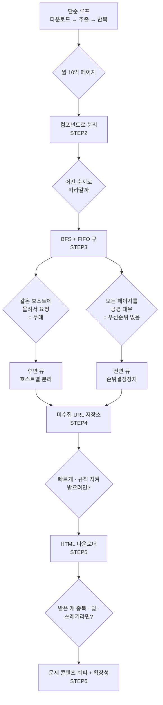

# 웹 크롤러 — 왜 / 무엇을 / 그래서 어떻게

> STEP에 들어가기 전에 잡고 갈 큰 그림.
> "크롤러는 링크 따라가는 프로그램" 에서 "월 10억 페이지를 예의 바르게 수집하는 분산 시스템" 으로 넘어가는 지점을 본다.

---

## 1. 왜 — 크롤러가 왜 필요한가

웹 크롤러(web crawler)는 **로봇(robot)**, **스파이더(spider)** 라고도 부른다.
목적은 **웹에 새로 올라오거나 갱신된 콘텐츠를 찾아내는 것**이다.
여기서 콘텐츠는 웹 페이지일 수도, 이미지·비디오·PDF일 수도 있다.

| 용례 | 설명 | 사례 |
| --- | --- | --- |
| **검색 엔진 인덱싱** | 웹 페이지를 모아 검색 엔진용 **로컬 인덱스**를 만든다. 가장 보편적인 용례 | Googlebot |
| **웹 아카이빙** | 장기 보관 목적으로 웹 정보를 수집 | 미국 국회 도서관, EU 웹 아카이브 |
| **웹 마이닝** | 웹에서 유용한 지식을 도출 | 금융사가 주주총회 자료·연차 보고서를 수집해 기업 사업 방향 분석 |
| **웹 모니터링** | 저작권·상표권 침해 사례 감시 | 디지마크(Digimarc)의 해적판 탐지 |

> **핵심:** 이번 설계의 용례는 **검색 엔진 인덱싱**이다. 용례가 정해져야 규모·저장 기간·중복 정책이 정해진다.

### 크롤러의 복잡도는 "규모"가 결정한다

같은 "크롤러"라도 **몇 시간이면 끝나는 학급 프로젝트**일 수도 있고,
**전담 엔지니어링 팀이 지속적으로 관리·개선해야 하는 초대형 프로젝트**일 수도 있다.
그래서 설계에 들어가기 전에 **감당해야 할 데이터의 규모와 기능**부터 확정해야 한다(→ [STEP 1](01_STEP1_요구사항_규모추정.md)).

---

## 2. 무엇을 — 무엇을 만족해야 하는가

### 2-1. 기능 요구사항 (면접 질문으로 확정한 것)

| 질문 | 답 | 설계에 미치는 영향 |
| --- | --- | --- |
| 주된 용도는? | **검색 엔진 인덱싱** | 텍스트 HTML 중심, 인덱스 품질 = 우선순위 필요 |
| 매달 몇 페이지? | **10억 개** | QPS·저장용량 추정의 출발점 |
| 새로 만들어지거나 수정된 페이지도? | **그렇다** | **신선도(freshness)** → 재수집 전략 필요 |
| 수집한 페이지를 저장? | **5년간 저장** | 30PB 규모 저장소 설계 |
| 중복 콘텐츠는? | **무시해도 된다** | 중복 탐지 자료 구조 필요(해시·체크섬) |

### 2-2. 비기능 요구사항 — 좋은 크롤러의 4대 속성

이 네 단어가 이 장 전체의 **판단 기준**이다. 뒤에 나오는 모든 결정은 이 중 하나를 위해 존재한다.

| 속성 | 무엇을 요구하나 | 어긋나면 생기는 일 | 어디서 다루나 |
| --- | --- | --- | --- |
| **규모 확장성(scalability)** | 수십억 페이지를 **병행성(parallelism)** 으로 처리 | 한 대로는 영원히 못 끝남 | STEP 4·5 |
| **안정성(robustness)** | 잘못된 HTML, 무응답 서버, 장애, 악성 링크에 대응 | 크롤러가 멈추거나 무한 루프 | STEP 5·6 |
| **예의(politeness)** | 한 사이트에 짧은 시간 동안 **너무 많은 요청 금지** | DoS 공격으로 간주, 차단당함 | STEP 4 |
| **확장성(extensibility)** | 새 콘텐츠 타입(이미지 등)을 **모듈 추가로** 지원 | 전체 재설계 | STEP 6 |

> ⚠️ **규모 확장성(scalability)** 과 **확장성(extensibility)** 은 한국어로 헷갈린다.
> 전자는 **"더 많이"**(용량·처리량), 후자는 **"더 다양하게"**(새 콘텐츠 타입)다.

---

## 3. 그래서 어떻게 — 결정의 연쇄

### 3-1. 단순 루프가 무너지는 지점

```text
1. URL 집합 → 웹 페이지 다운로드
2. 다운받은 페이지에서 URL 추출
3. 추출된 URL을 목록에 추가하고 반복
```

이 세 줄에 규모를 대입하면 각 줄이 전부 깨진다.

| 단순 루프의 줄 | 규모를 대입하면 | 필요한 결정 |
| --- | --- | --- |
| "URL 집합이 주어지면" | 전체 웹의 **시작점**을 어떻게 고르나 | 시작 URL 전략 (STEP 2) |
| "다운로드한다" | 초당 **800건**을, 대상 서버를 죽이지 않으면서 | 분산 다운로더 + 예의 (STEP 4·5) |
| "URL을 추출한다" | 상대 경로 변환, 잘못된 HTML, **덫** | 파서·필터·덫 회피 (STEP 2·6) |
| "목록에 추가하고 반복" | 수억 개 URL을 메모리에? **이미 방문했나?** | 미수집 URL 저장소 + 블룸 필터 (STEP 4·6) |

### 3-2. 결정의 연쇄



### 3-3. 4대 속성 ↔ 설계 결정 매핑

| 속성 | 설계 결정 | STEP |
| --- | --- | --- |
| 규모 확장성 | 분산 크롤링(URL 공간 분할), 다중 스레드, 무상태 서버, 디스크+메모리 하이브리드 큐 | 4·5 |
| 안정성 | 안정 해시로 서버 증감, 크롤링 상태 저장, 예외 처리, 데이터 검증, 짧은 타임아웃 | 5 |
| 예의 | 호스트↔작업 스레드 1:1, 후면 큐, 다운로드 사이 지연, robots.txt 준수 | 4·5 |
| 확장성 | 플러그인 모듈(PNG 다운로더, 웹 모니터) | 6 |

---

## 4. 이 장을 한 문장으로

> 웹 크롤러 설계는 **"링크를 따라가는 루프"를 예의 · 우선순위 · 신선도 · 안정성이라는 네 가지 제약 아래
> 분산 시스템으로 다시 쓰는 작업"** 이며, 그 제약이 가장 촘촘히 모이는 곳이 **미수집 URL 저장소(URL Frontier)** 다.

➡️ 시작: [STEP 1 — 요구사항과 규모 추정](01_STEP1_요구사항_규모추정.md)
