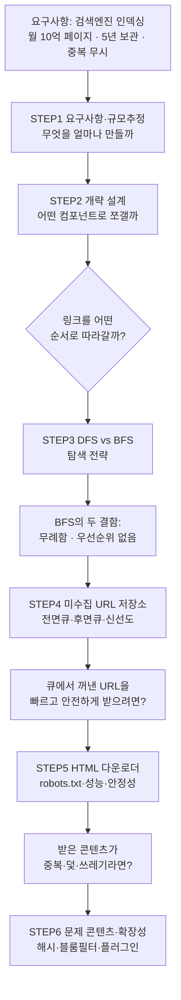

# 웹 크롤러 설계 — STEP별 정리 노트

> 『가상 면접 사례로 배우는 대규모 시스템 설계 기초』 9장(141~163p) 학습 노트
> 설계를 시작하기 전에 알아야 할 개념을 STEP 순서대로 정리한다.

---

## 이 노트의 목적

웹 크롤러의 기본 알고리즘은 **세 줄**이면 끝난다.

```text
1. URL 집합이 주어지면 그 URL들이 가리키는 웹 페이지를 전부 다운로드한다.
2. 다운받은 페이지에서 URL들을 추출한다.
3. 추출된 URL을 다운로드 목록에 추가하고 1번으로 돌아간다.
```

문제는 이 루프를 **매달 10억 페이지 규모**로 돌리는 순간, 이 세 줄이 하나도 그대로 성립하지 않는다는 것이다.

각 STEP은 *기능 추가*가 아니라 **"앞 단계가 만든 문제를 푸는 다음 결정"** 이다.

> 📌 STEP으로 들어가기 전에 **"왜 / 무엇을 / 그래서 어떻게"** 큰 그림이 필요하면
> 먼저 **[00_왜_무엇_어떻게](00_왜_무엇_어떻게.md)** 를 읽고 오자.

---

## 왜 "세 줄 루프"로 끝나지 않는가

| 벽 | 무엇이 막히나 | 9장 요구사항과 충돌 |
| --- | --- | --- |
| **규모** | 월 10억 페이지 = **평균 400 QPS / 최대 800 QPS**, 5년치 **30PB** | "규모 확장성" ❌ |
| **예의(politeness)** | 한 페이지의 링크 대부분은 **같은 호스트**로 되돌아감 → 병렬 다운로드하면 대상 서버가 **DoS 수준 과부하** | "예의" ❌ |
| **함정** | 잘못된 HTML, 무응답 서버, **거미 덫(무한 URL)**, 악성 링크, 광고·스팸 노이즈 | "안정성" ❌ |
| **중복** | 웹 콘텐츠의 **약 29~30%가 중복** → 그냥 저장하면 저장소·시간 낭비 | (요구사항) 중복 페이지 무시 ❌ |
| **우선순위/신선도** | 표준 BFS는 모든 페이지를 **공평하게** 대우 / 이미 받은 페이지도 계속 변함 | "새 페이지·수정 페이지 고려" ❌ |
| **확장성(extensibility)** | 이미지·PNG 등 새 콘텐츠 타입을 지원하려고 **전체를 재설계**해야 하면 곤란 | "확장성" ❌ |

> 그래서 **무엇을 만들지 정하고(STEP1) → 컴포넌트로 쪼개고(STEP2) → 어떤 순서로 탐색하고(STEP3) →
> URL 큐를 예의·우선순위·신선도까지 다루도록 설계하고(STEP4) → 다운로더를 빠르고 안전하게 만들고(STEP5) →
> 중복·덫·확장성을 처리한다(STEP6)** 는 6개의 결정이 이어진다.

---

## 설계 로드맵



---

## STEP 목록

| STEP | 주제 | 핵심 키워드 | 푸는 문제 |
|:---:|------|-----------|----------|
| [STEP 1](01_STEP1_요구사항_규모추정.md) | 요구사항 · 규모 추정 | 규모확장성·안정성·예의·확장성, 400/800 QPS, 30PB | 무엇을 얼마나 만들 것인가 |
| [STEP 2](02_STEP2_개략설계_컴포넌트_작업흐름.md) | 개략 설계 | 9개 컴포넌트, 11단계 작업 흐름 | 크롤링 루프를 어떻게 쪼갤까 |
| [STEP 3](03_STEP3_그래프탐색_DFS_BFS.md) | 탐색 전략 | 유향 그래프, DFS·BFS, FIFO 큐 | 링크를 어떤 순서로 따라갈까 |
| [STEP 4](04_STEP4_미수집URL저장소_예의_우선순위.md) | 미수집 URL 저장소 | 전면 큐·후면 큐, 순위결정장치, 신선도, 하이브리드 저장 | 예의·우선순위·신선도를 어떻게 |
| [STEP 5](05_STEP5_HTML다운로더_robots_성능최적화.md) | HTML 다운로더 | robots.txt, 분산 크롤링, DNS 캐시, 지역성, 타임아웃 | 빠르고 안전하게 어떻게 받을까 |
| [STEP 6](06_STEP6_문제콘텐츠_안정성_확장성.md) | 문제 콘텐츠 · 확장성 | 해시·체크섬, 블룸 필터, 거미 덫, 플러그인 모듈 | 쓰레기·함정·진화를 어떻게 |

### 각 STEP에서 깊게 다루는 것

| STEP | 세부 내용 |
| --- | --- |
| STEP 1 | 면접관에게 던질 질문 목록, **좋은 크롤러의 4대 속성**, 규모 추정 계산(400/800 QPS, 500TB/월, 30PB), 추정치가 설계로 이어지는 경로 |
| STEP 2 | 시작 URL 집합 선정 전략(지역별/주제별), 9개 컴포넌트 각각의 역할과 존재 이유, **11단계 작업 흐름**, 중복 판정이 두 군데(콘텐츠·URL) 있는 이유 |
| STEP 3 | 웹 = 유향 그래프, DFS가 부적합한 이유, BFS = FIFO 큐, **BFS의 두 결함**(무례함, 우선순위 부재)과 그것이 STEP4를 부르는 흐름 |
| STEP 4 | **예의**: 호스트↔스레드 1:1 매핑, 큐 라우터/큐 선택기/작업 스레드 · **우선순위**: 순위결정장치, 전면 큐 · **전면+후면 큐 통합 구조** · **신선도**: 재수집 최적화 · 디스크+메모리 버퍼 하이브리드 |
| STEP 5 | robots.txt 규칙과 캐싱, 성능 최적화 4종(분산 크롤링·DNS 캐시·지역성·짧은 타임아웃), **DNS가 병목인 이유**, 안정성 4종(안정 해시·상태 저장·예외 처리·데이터 검증) |
| STEP 6 | 중복 탐지(문자열 비교 → 해시/체크섬), 블룸 필터 vs 해시 테이블, **거미 덫**과 URL 길이 제한, 데이터 노이즈, 플러그인식 확장(PNG 다운로더·웹 모니터), 마무리 논의 5종 |

---

## 학습 우선순위

1. **먼저 잡을 것**: STEP 1의 **좋은 크롤러 4대 속성**(규모확장성·안정성·예의·확장성). 이후 모든 설계 결정이 이 네 단어 중 하나로 정당화된다.
2. **가장 많이 투자**: **STEP 4(미수집 URL 저장소)**. 이 장의 본체이자 면접의 핵심이다. "전면 큐 = 우선순위, 후면 큐 = 예의" 를 그림 없이 설명할 수 있어야 한다.
3. **그다음**: STEP 5(성능 최적화 4종 + robots.txt), STEP 6(중복 탐지·거미 덫).
4. STEP 2·3은 **말로 흐름을 설명**할 수 있으면 충분.
5. 레퍼런스:
   - **Mercator** (Heydon & Najork, 1999) — 확장 가능한 크롤러의 고전 설계
   - **Web Crawling** (Olston & Najork) — 미수집 URL 저장소 설계의 표준 서베이
   - **IRLbot** — 60억 페이지 규모 크롤링 사례
   - **PageRank** (Page & Brin, 1998) — URL 우선순위 척도
   - **Bloom Filter** (Bloom, 1970) — 방문 URL 판별 자료 구조
   - **robots.txt / Google Dynamic Rendering** — 실무 규약

---

## 빠른 복습 — 5문장 요약

> 크롤러는 **시작 URL → 다운로드 → 파싱 → URL 추출 → 다시 큐**의 루프다(STEP2).
> 이 루프는 **BFS**로 돌리는데, 표준 BFS는 **무례하고 우선순위가 없다**(STEP3).
> 그래서 **미수집 URL 저장소**를 전면 큐(우선순위) + 후면 큐(호스트별 예의)로 설계한다(STEP4).
> 다운로더는 **robots.txt를 지키고 DNS 캐시·지역성·짧은 타임아웃**으로 최적화한다(STEP5).
> 마지막으로 **중복·거미 덫·노이즈를 걸러내고 플러그인 구조로 확장성**을 확보하면 완성이다(STEP6).
