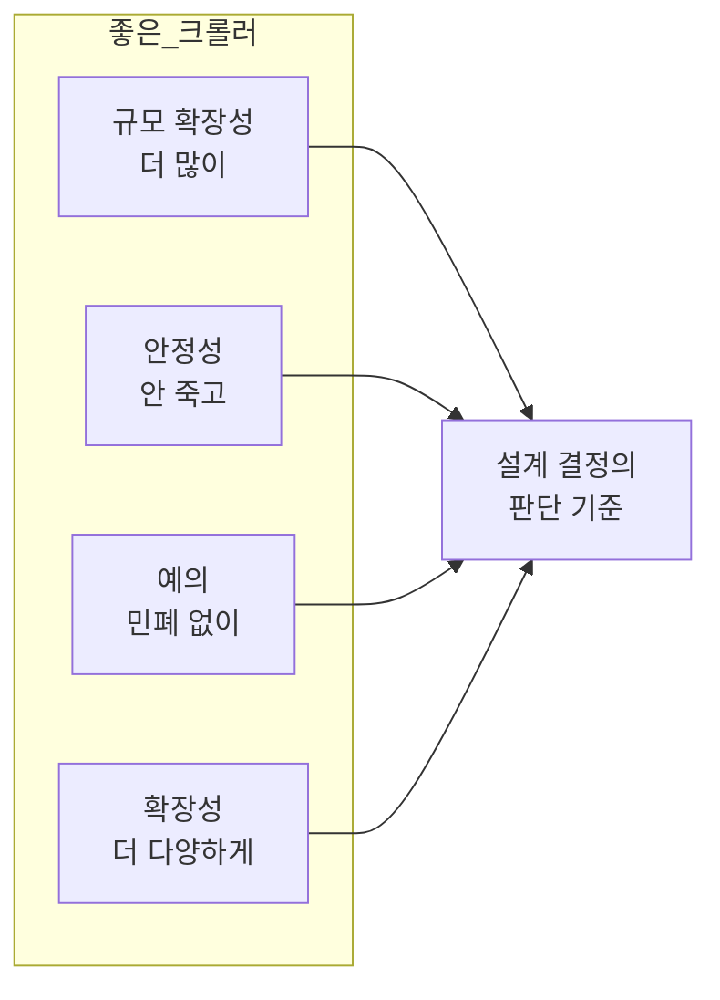

# STEP 1. 요구사항과 규모 추정 — 무엇을 얼마나 만들 것인가

> 설계의 출발점. 크롤러는 **규모가 복잡도를 결정**하는 시스템이라, 범위를 좁히지 않으면 설계 자체가 불가능하다.
> 이 STEP은 **면접에서 던져야 할 질문 → 좋은 크롤러의 4대 속성 → 숫자로 환산한 규모**를 정리한다.

---

## 0. 먼저: 왜 요구사항 확정이 유독 중요한가

웹 크롤러의 기본 알고리즘은 **세 줄**이다.

```text
1. URL 집합이 입력으로 주어지면, 해당 URL들이 가리키는 모든 웹 페이지를 다운로드한다.
2. 다운받은 웹 페이지에서 URL들을 추출한다.
3. 추출된 URL들을 다운로드할 URL 목록에 추가하고 위 과정을 반복한다.
```

직관적으로 이해하기 쉬운 제품이다 보니, **면접자와 면접관이 서로 다른 가정을 품은 채 진행되기 쉽다**.
그런데 실제 복잡도는 **처리해야 하는 데이터 규모**에 따라 극단적으로 갈린다.

| 규모 | 성격 |
| --- | --- |
| 작은 학급 프로젝트 | 몇 시간이면 끝남 |
| 대규모 크롤러 | **별도 엔지니어링 팀**이 지속적으로 관리·개선해야 하는 초대형 프로젝트 |

> **핵심:** "엄청난 규모 확장성을 갖는 웹 크롤러"는 면접 시간 안에 완성 불가능하다. **질문으로 범위를 좁히는 것이 1단계의 전부다.**

---

## 1. 면접에서 던질 질문과 확정된 요구사항

| # | 질문 | 답변 | 이 답이 결정하는 것 |
| :-: | --- | --- | --- |
| 1 | 크롤러의 주된 용도는? (검색 인덱싱 / 데이터 마이닝 / 기타) | **검색 엔진 인덱싱** | 수집 대상 = HTML 중심, 품질·우선순위 중요 |
| 2 | 매달 몇 개의 웹 페이지를 수집? | **10억 개** | QPS·대역폭·저장용량 전부 |
| 3 | 새로 만들어졌거나 수정된 페이지도 고려? | **그렇다** | **신선도(freshness)** → 재수집 전략 ([STEP 4](04_STEP4_미수집URL저장소_예의_우선순위.md)) |
| 4 | 수집한 페이지를 저장해야 하나? | **5년간 저장** | 콘텐츠 저장소 30PB |
| 5 | 중복된 콘텐츠는? | **무시해도 된다** | 중복 탐지 자료 구조 ([STEP 6](06_STEP6_문제콘텐츠_안정성_확장성.md)) |

> 이 질문들은 사례일 뿐이다. 중요한 것은 **질문을 통해 모호한 부분을 제거**하는 행위 자체다.

---

## 2. 좋은 웹 크롤러가 만족시켜야 할 4대 속성

기능 요구사항을 명확히 하는 한편, 아래 **비기능 속성**에 주의를 기울이는 것이 바람직하다.
이 네 단어는 이후 모든 설계 결정의 **정당화 근거**가 된다.

| 속성 | 원문 정의 | 왜 어려운가 | 대응 설계 |
| --- | --- | --- | --- |
| **규모 확장성**<br/>(scalability) | 웹에는 수십억 페이지가 있으므로 **병행성(parallelism)** 을 활용해야 한다 | 순차 처리로는 영원히 못 끝냄 | 분산 크롤링, 다중 스레드, URL 공간 분할 |
| **안정성**<br/>(robustness) | 웹은 **함정으로 가득**하다 — 잘못 작성된 HTML, 무응답 서버, 장애, 악성 코드가 붙은 링크 | 비정상 입력 하나가 전체를 멈출 수 있음 | 예외 처리, 데이터 검증, 짧은 타임아웃, 상태 저장 |
| **예의**<br/>(politeness) | 수집 대상 사이트에 **짧은 시간 동안 너무 많은 요청**을 보내지 않는다 | 링크의 상당수가 같은 호스트 → 자연스럽게 몰림 | 호스트별 후면 큐, 다운로드 간 지연, robots.txt |
| **확장성**<br/>(extensibility) | 새로운 형태의 콘텐츠(예: 이미지)를 **쉽게** 지원 | 전체 재설계는 곤란 | 플러그인 모듈 구조 |



> ⚠️ **scalability(규모 확장성)** vs **extensibility(확장성)** 혼동 주의.
> 전자는 **양**(수십억 페이지), 후자는 **종류**(HTML → 이미지·PDF)다. 면접에서 둘 다 언급하면 좋다.

---

## 3. 개략적 규모 추정

아래 추정치는 **많은 가정**으로부터 나온 것이며, 그 가정을 면접관과 합의해 두는 것이 중요하다.

### 3-1. 계산 과정

| 항목 | 계산 | 결과 |
| --- | --- | --- |
| 월 수집 페이지 수 | (가정) | **10억 페이지 / 월** |
| 평균 QPS | 1,000,000,000 ÷ 30일 ÷ 24시간 ÷ 3,600초 | **≈ 400 페이지/초** |
| 최대(Peak) QPS | 평균 QPS × 2 | **800 페이지/초** |
| 페이지 평균 크기 | (가정) | **500 KB** |
| 월 저장 용량 | 10억 × 500KB | **500 TB / 월** |
| 5년 저장 용량 | 500TB × 12개월 × 5년 | **30 PB** |

```text
QPS  = 1,000,000,000 / (30 × 24 × 3600)
     = 1,000,000,000 / 2,592,000
     ≈ 385.8  →  약 400
Peak = 400 × 2 = 800
저장 = 10^9 × 500KB = 5 × 10^14 B = 500TB (월)
     → 500TB × 60개월 = 30,000TB = 30PB
```

> 저장 단위(KB/MB/GB/TB/PB)가 익숙하지 않다면 2장 **'2의 제곱수'** 를 다시 보자.

### 3-2. 이 숫자가 설계로 이어지는 경로

| 추정치 | 그래서 어떤 설계가 필요한가 |
| --- | --- |
| **800 peak QPS** | 서버 한 대로 불가 → **분산 크롤링**(URL 공간 분할) + 서버당 다중 스레드 ([STEP 5](05_STEP5_HTML다운로더_robots_성능최적화.md)) |
| **800 QPS × DNS 조회** | DNS 응답이 10~200ms → 동기 조회 시 **병목** → **DNS 캐시** 필수 |
| **30 PB** | 단일 저장소 불가 → 다중화·샤딩, 대부분 **디스크** 저장 + 인기 콘텐츠만 메모리 |
| **수억 개 URL** | 미수집 URL 저장소를 전부 메모리에 못 둠 → **디스크 + 메모리 버퍼 하이브리드** ([STEP 4](04_STEP4_미수집URL저장소_예의_우선순위.md)) |
| **중복 29~30%** | 30PB 중 상당량이 낭비 → **해시/체크섬 기반 중복 탐지** ([STEP 6](06_STEP6_문제콘텐츠_안정성_확장성.md)) |
| **신선도 요구** | 이미 받은 페이지도 주기적 재수집 → 전체 재수집은 불가능하므로 **변경 이력·우선순위 기반 선별 재수집** |

---

## 4. 요구사항 ↔ 설계 결정 매핑 (미리 보기)

| 요구사항 | 유리한 선택 | 이유 |
| --- | --- | --- |
| 규모 확장성 | 분산 크롤링 + 다중 스레드 + 무상태 서버 | 수평 확장 가능 |
| 예의 | 호스트별 FIFO 후면 큐 + 다운로드 지연 | 한 사이트에 동시 요청 1건 보장 |
| 우선순위 | 순위결정장치 + 우선순위별 전면 큐 | 중요한 페이지 먼저 |
| 신선도 | 변경 이력 활용 + 중요 페이지 잦은 재수집 | 전체 재수집 비용 회피 |
| 안정성 | 안정 해시, 상태 저장, 예외 처리, 타임아웃 | 장애 후 재시작 가능 |
| 확장성 | 플러그인 모듈 | 새 콘텐츠 타입 = 모듈 추가 |
| 중복 제거 | 콘텐츠 해시 + 방문 URL 블룸 필터 | 문자열 비교는 10억 규모에서 불가 |

---

## ✅ STEP 1 체크리스트

- [ ] 웹 크롤러의 기본 알고리즘 3단계를 한 줄로 말할 수 있다
- [ ] 크롤러의 4가지 용례(검색 인덱싱·아카이빙·마이닝·모니터링)를 안다
- [ ] 면접에서 먼저 던져야 할 질문 5가지를 기억한다
- [ ] 좋은 크롤러의 4대 속성(규모확장성·안정성·예의·확장성)을 각각 한 줄로 설명할 수 있다
- [ ] scalability와 extensibility의 차이를 설명할 수 있다
- [ ] 10억 페이지/월 → 400 QPS, 800 peak QPS를 직접 계산할 수 있다
- [ ] 500TB/월 → 30PB(5년) 계산을 직접 할 수 있다
- [ ] 각 추정치가 어떤 설계 결정으로 이어지는지 연결해 말할 수 있다

---

## 💬 예상 면접 질문

**Q1. 웹 크롤러 설계를 시작할 때 가장 먼저 무엇을 하겠나?**
> **용도와 규모를 질문으로 확정**한다. 크롤러는 규모가 복잡도를 결정하기 때문에, 검색 인덱싱용인지·월 몇 페이지인지·보관 기간·중복 정책을 합의하지 않으면 설계 범위 자체가 잡히지 않는다.

**Q2. 좋은 웹 크롤러가 갖춰야 할 속성은?**
> **규모 확장성**(병행성으로 수십억 페이지 처리), **안정성**(잘못된 HTML·무응답 서버·악성 링크 대응), **예의**(한 사이트에 과도한 요청 금지), **확장성**(새 콘텐츠 타입을 모듈 추가로 지원).

**Q3. 월 10억 페이지면 QPS는 얼마인가?**
> 10억 ÷ (30일 × 24시간 × 3600초) ≈ **400 QPS**, 최대는 2배인 **800 QPS**로 잡는다. 페이지 평균 500KB면 월 500TB, 5년이면 **30PB**다.

**Q4. 규모 확장성과 확장성은 어떻게 다른가?**
> 규모 확장성(scalability)은 **양**의 문제 — 페이지 수·트래픽이 늘어도 버티는가. 확장성(extensibility)은 **종류**의 문제 — 이미지·PDF 같은 새 콘텐츠 타입을 전체 재설계 없이 추가할 수 있는가.

**Q5. 왜 크롤러에 '예의'가 요구사항으로 들어가나?**
> 한 페이지에서 추출한 링크의 상당수는 **같은 호스트**로 되돌아간다. 이를 병렬로 다운로드하면 대상 서버가 과부하에 걸리고, 초당 수천 건이면 사실상 **DoS 공격**으로 간주된다. 크롤러가 차단당하면 수집 자체가 불가능해진다.

➡️ 다음: [STEP 2 — 개략 설계와 작업 흐름](02_STEP2_개략설계_컴포넌트_작업흐름.md)
