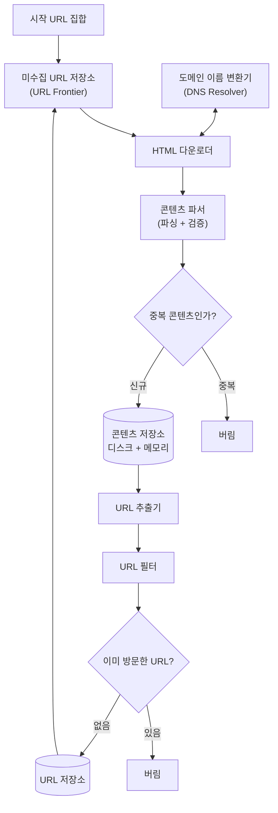
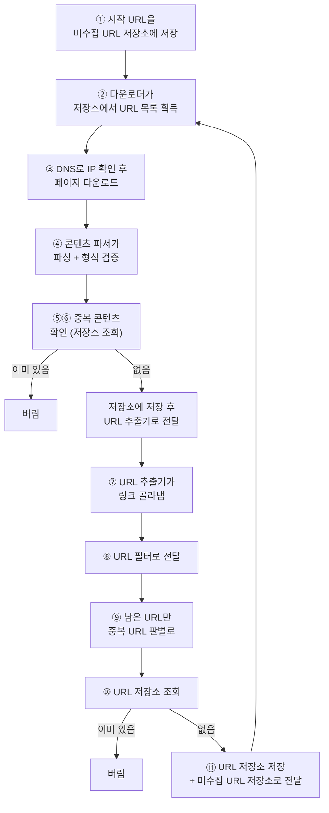

# STEP 2. 개략 설계 — 크롤링 루프를 어떻게 쪼갤까

> STEP 1에서 "월 10억 페이지"라는 규모가 확정됐다. 이제 **세 줄짜리 루프를 독립 컴포넌트로 분해**한다.
> 분해의 기준은 "이 일을 따로 떼어내야 할 이유가 있는가"이며, 그 이유는 대부분 **성능·중복 제거·안정성**이다.

---

## 0. 먼저: 왜 컴포넌트로 쪼개는가

단순 루프를 그대로 구현하면 다운로드·파싱·중복 검사·저장이 **한 프로세스 안에서 직렬로** 벌어진다.
그러면 파싱이 느려지는 순간 다운로드까지 멈춘다. 그래서 각 단계를 **독립 컴포넌트**로 분리한다.

| 분리 이유 | 해당 컴포넌트 |
| --- | --- |
| **성능** — 크롤링 서버 안에서 처리하면 크롤링이 느려짐 | 콘텐츠 파서 |
| **중복 제거** — 10억 규모에선 문자열 비교 불가 | 중복 콘텐츠 판별, 이미 방문한 URL? |
| **정책 분리** — 예의·우선순위를 큐 하나가 전담 | 미수집 URL 저장소 |
| **성능 병목 격리** — DNS는 동기적이라 블로킹 | 도메인 이름 변환기 |

---

## 1. 전체 구조 한눈에



---

## 2. 컴포넌트별 역할

### 2-1. 시작 URL 집합 (seed URLs)

크롤링의 **출발점**. 무엇을 고르냐에 정답은 없지만, **가능한 한 많은 링크를 탐색할 수 있는 URL**이 좋다.

| 상황 | 전략 |
| --- | --- |
| 특정 대학 사이트 전체 | 해당 **도메인이 붙은 모든 페이지 URL**을 시작점으로 |
| **전체 웹** | URL 공간을 작은 부분집합으로 분할 |
| ├ 지역적 특색 활용 | **나라별로 인기 있는 사이트**가 다르다는 점에 착안 |
| └ 주제별 분할 | 쇼핑 / 스포츠 / 건강 등 주제마다 다른 시작 URL |

> 면접관도 완벽한 답을 기대하지 않는다. **"많은 링크를 커버하도록 공간을 나눈다"는 의도**만 정확히 전달하면 된다.

### 2-2. 미수집 URL 저장소 (URL Frontier)

현대적 크롤러는 크롤링 상태를 **두 가지**로 나눠 관리한다.

| 상태 | 담당 컴포넌트 |
| --- | --- |
| ① **다운로드할 URL** | **미수집 URL 저장소 (URL Frontier)** |
| ② **다운로드된 URL** | URL 저장소 |

개략 설계 단계에선 **FIFO 큐**라고 생각하면 된다. 하지만 이 컴포넌트가 사실상 이 장의 본체이며,
예의·우선순위·신선도가 전부 여기에 들어간다 → [STEP 4](04_STEP4_미수집URL저장소_예의_우선순위.md).

### 2-3. HTML 다운로더

인터넷에서 웹 페이지를 다운로드한다. 받을 URL은 **미수집 URL 저장소가 제공**한다.
→ 상세는 [STEP 5](05_STEP5_HTML다운로더_robots_성능최적화.md).

### 2-4. 도메인 이름 변환기 (DNS Resolver)

URL을 **IP 주소로 변환**한다. 다운로더는 이걸 통해 접속할 IP를 알아낸다.
(예: `www.wikipedia.org` → `198.35.26.96`)
DNS 조회는 **동기적**이라 크롤러 성능의 대표적 병목이다 → STEP 5에서 캐시로 해결.

### 2-5. 콘텐츠 파서

다운로드한 페이지를 **파싱(parsing)하고 검증(validation)** 한다.

- 이상한 웹 페이지는 **문제를 일으키고 저장 공간만 낭비**하므로 걸러야 한다.
- 크롤링 서버 안에 구현하면 **크롤링이 느려지므로 독립 컴포넌트**로 분리했다.

### 2-6. 중복 콘텐츠인가?

웹 페이지 콘텐츠의 **약 29%가 중복**이라는 연구 결과가 있다.
같은 콘텐츠를 여러 번 저장하지 않도록 자료 구조를 도입한다.

| 방법 | 평가 |
| --- | --- |
| 두 HTML 문서를 **문자열로 비교** | 가장 단순하지만 문서 수가 10억이면 **느리고 비효율적** ❌ |
| 웹 페이지의 **해시 값 비교** | 효과적 ✅ |

### 2-7. 콘텐츠 저장소

HTML 문서를 보관하는 시스템. 저장 기술 선택 시 고려 요소는
**데이터 유형 · 크기 · 접근 빈도 · 유효 기간**이다. 본 설계안은 **디스크 + 메모리 하이브리드**를 택한다.

| 배치 | 대상 | 이유 |
| --- | --- | --- |
| **디스크** | 대부분의 콘텐츠 | 데이터 양이 너무 많음(30PB) |
| **메모리** | 인기 있는 콘텐츠 | 접근 **지연시간 감소** |

### 2-8. URL 추출기

HTML 페이지를 파싱해 **링크를 골라낸다**.
**상대 경로(relative path)는 전부 절대 경로(absolute path)로 변환**한다.

```text
페이지: https://en.wikipedia.org/wiki/Cat
발견:   /wiki/Kitten          (상대 경로)
변환:   https://en.wikipedia.org/wiki/Kitten   (절대 경로)
```

### 2-9. URL 필터

크롤링 **대상에서 배제**할 URL을 걸러낸다.

- 특정 **콘텐츠 타입**이나 **파일 확장자**를 갖는 URL
- 접속 시 **오류가 발생**하는 URL
- **접근 제외 목록(deny list)** 에 포함된 URL

### 2-10. 이미 방문한 URL?

이미 방문했거나 미수집 URL 저장소에 들어 있는 URL을 추적하는 자료 구조.

| 얻는 것 | 설명 |
| --- | --- |
| 같은 URL의 중복 처리 방지 | 서버 **부하 감소** |
| 무한 루프 방지 | 시스템이 사이클에 빠지지 않음 |

자료 구조로는 **블룸 필터(bloom filter)** 또는 **해시 테이블**이 널리 쓰인다 → [STEP 6](06_STEP6_문제콘텐츠_안정성_확장성.md).

### 2-11. URL 저장소

**이미 방문한 URL**을 보관하는 저장소.

---

## 3. 컴포넌트 요약표

| # | 컴포넌트 | 한 줄 역할 | 왜 따로 있나 |
| :-: | --- | --- | --- |
| 1 | 시작 URL 집합 | 크롤링 출발점 | 탐색 커버리지 결정 |
| 2 | 미수집 URL 저장소 | 다운로드할 URL 보관(FIFO) | 예의·우선순위·신선도 전담 |
| 3 | HTML 다운로더 | 페이지 다운로드 | 성능 최적화 대상 |
| 4 | 도메인 이름 변환기 | URL → IP | DNS 병목 격리 |
| 5 | 콘텐츠 파서 | 파싱·검증 | 크롤링 속도 저하 방지 |
| 6 | 중복 콘텐츠 판별 | 해시로 중복 탐지 | 콘텐츠의 29%가 중복 |
| 7 | 콘텐츠 저장소 | HTML 보관 | 디스크+메모리 하이브리드 |
| 8 | URL 추출기 | 링크 추출·절대경로 변환 | 루프의 "재생산" 단계 |
| 9 | URL 필터 | 배제 대상 제거 | 쓰레기·오류·금지 URL |
| 10 | 이미 방문한 URL? | 방문 여부 판별 | 무한 루프·중복 방지 |
| 11 | URL 저장소 | 방문한 URL 보관 | 10번의 근거 데이터 |

---

## 4. 작업 흐름 (11단계)



| 단계 | 내용 |
| :-: | --- |
| ① | 시작 URL들을 미수집 URL 저장소에 저장 |
| ② | HTML 다운로더가 미수집 URL 저장소에서 URL 목록을 가져옴 |
| ③ | 도메인 이름 변환기로 IP를 알아내고, 해당 IP로 접속해 페이지 다운로드 |
| ④ | 콘텐츠 파서가 HTML을 파싱하고 **올바른 형식인지 검증** |
| ⑤ | 파싱·검증이 끝나면 **중복 콘텐츠 확인** 절차 개시 |
| ⑥ | 페이지가 이미 저장소에 있는지 확인 → **있으면 버리고**, 없으면 **저장 후 URL 추출기로 전달** |
| ⑦ | URL 추출기가 HTML에서 링크를 골라냄 |
| ⑧ | 골라낸 링크를 URL 필터로 전달 |
| ⑨ | 필터링 후 남은 URL만 중복 URL 판별 단계로 전달 |
| ⑩ | URL 저장소에 있는지 확인 → **이미 있으면 버림** |
| ⑪ | 없는 URL은 **URL 저장소에 저장 + 미수집 URL 저장소에도 전달** (루프 재개) |

### ⚠️ 중복 판정이 두 번 나오는 이유

| 위치 | 무엇을 비교 | 목적 |
| --- | --- | --- |
| ⑤⑥ **중복 콘텐츠** | 다운로드한 **HTML 본문**(해시) | 같은 내용을 **저장**하지 않기 위해 (콘텐츠의 29%가 중복) |
| ⑩ **이미 방문한 URL** | **URL 문자열** | 같은 페이지를 **다시 다운로드**하지 않기 위해 (무한 루프 방지) |

> 서로 다른 URL이 **같은 콘텐츠**를 줄 수 있고(미러 사이트), 같은 URL이 여러 페이지에서 **반복 링크**될 수 있다.
> 두 가지는 다른 문제이므로 **판정도 두 군데**서 한다.

---

## 5. 이 설계가 남긴 질문

개략 설계는 "무엇이 있는가"까지만 답했다. **"어떻게"** 는 아직 비어 있다.

| 남은 질문 | 어디서 답하나 |
| --- | --- |
| 미수집 URL 저장소에서 URL을 **어떤 순서로** 꺼내나? | [STEP 3](03_STEP3_그래프탐색_DFS_BFS.md) |
| 같은 호스트에 몰리는 요청을 **어떻게 예의 있게** 다루나? | [STEP 4](04_STEP4_미수집URL저장소_예의_우선순위.md) |
| 수억 개 URL을 **어디에 저장**하나? | STEP 4 |
| 800 QPS를 **어떻게 달성**하나? robots.txt는? | [STEP 5](05_STEP5_HTML다운로더_robots_성능최적화.md) |
| 중복·덫·노이즈는 **구체적으로 어떻게** 거르나? | [STEP 6](06_STEP6_문제콘텐츠_안정성_확장성.md) |

---

## ✅ STEP 2 체크리스트

- [ ] 시작 URL 집합을 고르는 두 가지 전략(지역별·주제별)을 말할 수 있다
- [ ] 크롤링 상태가 "다운로드할 URL"과 "다운로드된 URL" 둘로 나뉜다는 것을 안다
- [ ] 11개 컴포넌트의 역할을 각각 한 줄로 설명할 수 있다
- [ ] 콘텐츠 파서를 독립 컴포넌트로 분리한 이유를 말할 수 있다
- [ ] 콘텐츠 저장소가 디스크+메모리 하이브리드인 이유를 말할 수 있다
- [ ] 상대 경로 → 절대 경로 변환이 URL 추출기의 역할임을 안다
- [ ] 작업 흐름 11단계를 순서대로 설명할 수 있다
- [ ] 중복 판정이 콘텐츠·URL 두 군데서 일어나는 이유를 구분해 말할 수 있다

---

## 💬 예상 면접 질문

**Q1. 콘텐츠 파서를 왜 별도 컴포넌트로 분리했나?**
> 파싱과 검증을 크롤링 서버 안에서 처리하면 **크롤링 과정 자체가 느려지기** 때문이다. 이상한 페이지는 문제를 일으키고 저장 공간만 낭비하므로 검증은 반드시 필요하되, 다운로드 경로를 막지 않게 떼어냈다.

**Q2. 콘텐츠 저장소를 설계할 때 무엇을 고려하나?**
> 저장할 **데이터의 유형·크기·접근 빈도·유효 기간**이다. 이 설계에선 양이 30PB로 너무 커서 **대부분 디스크**에 두고, **인기 콘텐츠만 메모리**에 올려 접근 지연시간을 줄인다.

**Q3. 중복 콘텐츠는 어떻게 판별하나?**
> 두 HTML을 문자열로 비교하는 건 문서가 10억 개면 **느리고 비효율적**이다. 대신 페이지의 **해시 값을 비교**한다. 참고로 웹 콘텐츠의 약 29%가 중복이라 이 단계의 효과가 크다.

**Q4. '이미 방문한 URL' 판별은 왜 필요한가?**
> 같은 URL을 여러 번 처리하는 것을 막아 **서버 부하를 줄이고**, 시스템이 **무한 루프**에 빠지는 것을 방지한다. 자료 구조로는 블룸 필터나 해시 테이블을 쓴다.

**Q5. 시작 URL은 어떻게 고르나?**
> 정답은 없고, **가능한 한 많은 링크를 탐색할 수 있는 URL**을 고른다. 전체 웹이 대상이면 URL 공간을 **나라별 인기 사이트**나 **주제별(쇼핑·스포츠·건강)** 로 나눠 각각 다른 시작 URL을 쓴다.

➡️ 다음: [STEP 3 — DFS vs BFS, 어떤 순서로 탐색할까](03_STEP3_그래프탐색_DFS_BFS.md)
