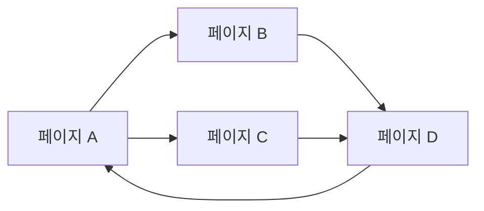
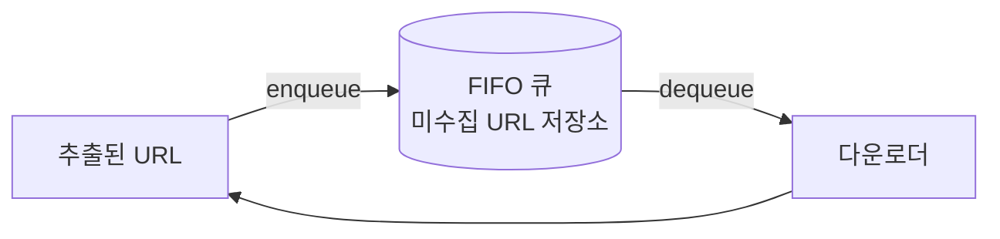
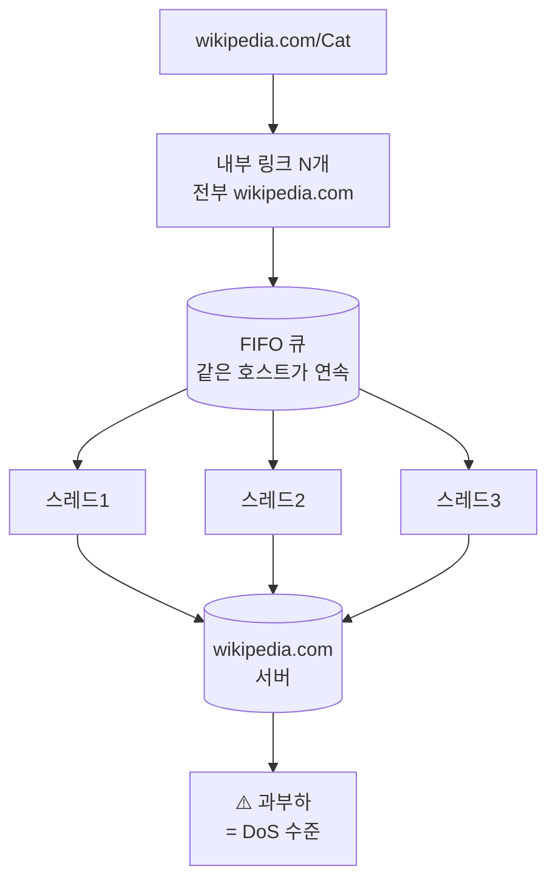
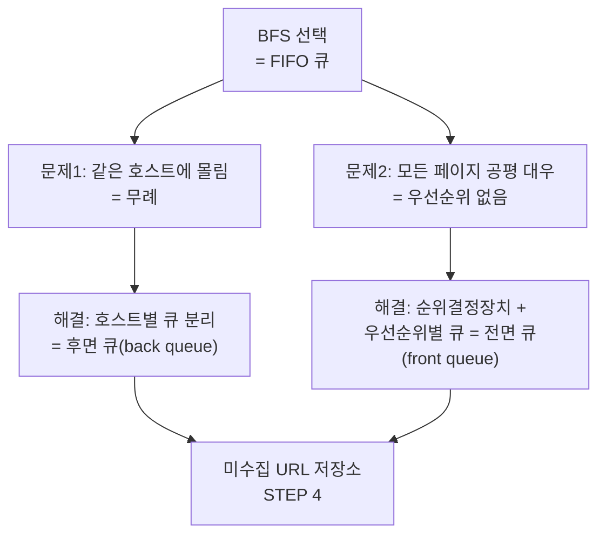

# STEP 3. DFS vs BFS — 링크를 어떤 순서로 따라갈까

> STEP 2에서 "미수집 URL 저장소에서 URL을 꺼내 다운로드한다"까지 정했다.
> 그런데 **어떤 순서로 꺼낼 것인가**는 아직 안 정했다. 이 STEP은 그 순서를 정하고,
> 그 선택이 남기는 **두 개의 결함**을 드러낸다. 그 결함이 곧 [STEP 4](04_STEP4_미수집URL저장소_예의_우선순위.md)의 존재 이유다.

---

## 0. 먼저: 웹은 유향 그래프다

| 웹의 요소 | 그래프의 요소 |
| --- | --- |
| 웹 페이지 | **노드(node)** |
| 하이퍼링크(URL) | **에지(edge)** |

즉 **크롤링 = 유향 그래프(directed graph)를 에지를 따라 탐색하는 과정**이다.
그래프 탐색에 널리 쓰이는 알고리즘은 **DFS**와 **BFS** 두 가지다.



> ⚠️ 위 그림처럼 **사이클(cycle)** 이 존재한다. 방문 여부를 추적하지 않으면 **무한 루프**에 빠진다(STEP 2의 "이미 방문한 URL?").

---

## 1. DFS vs BFS 비교

| | DFS (깊이 우선 탐색) | BFS (너비 우선 탐색) |
| --- | --- | --- |
| 자료 구조 | 스택(재귀) | **FIFO 큐** |
| 진행 방식 | 한 경로를 **끝까지** 파고듦 | 인접한 것부터 **넓게** |
| 웹 크롤링 적합성 | ❌ 부적합 | ✅ 일반적 선택 |
| 이유 | 그래프가 크면 **얼마나 깊이 들어갈지 가늠 불가** | 깊이가 제어됨, 큐로 자연스럽게 구현 |

### DFS가 부적합한 이유

웹 그래프는 **크기를 알 수 없고 사실상 무한**하다.
DFS는 한 경로를 끝까지 따라가는데, **어느 정도로 깊숙이 들어가게 될지 가늠하기 어렵다**.
(→ 한 사이트의 깊은 하위 경로에 갇혀 다른 영역을 영영 못 볼 수 있다. **거미 덫**을 만나면 특히 치명적 → [STEP 6](06_STEP6_문제콘텐츠_안정성_확장성.md))

### BFS = FIFO 큐

```text
큐:  [seed1, seed2, ...]
     한쪽으로 탐색할 URL을 집어넣고 (enqueue)
     다른 한쪽으로는 꺼내기만 한다   (dequeue)
```



> **결론:** 웹 크롤러는 보통 **BFS**를 사용한다. 미수집 URL 저장소가 FIFO 큐인 이유가 바로 이것이다.

---

## 2. ⚠️ 그런데 표준 BFS에는 두 가지 문제가 있다

### 문제 1 — 무례한 크롤러가 된다

한 페이지에서 나오는 링크의 **상당수는 같은 서버로 되돌아간다**.

```text
wikipedia.com/Cat 에서 추출한 링크:
  wikipedia.com/Kitten
  wikipedia.com/Feline
  wikipedia.com/Mammal
  wikipedia.com/Pet
  ...   ← 전부 내부 링크(같은 호스트)
```

FIFO 큐로 꺼내면 이 링크들이 **연달아 나오고**, 이를 병렬 처리하면
위키피디아 서버는 **수많은 요청으로 과부하**에 걸린다.
이런 크롤러는 **'예의 없는(impolite)' 크롤러**로 간주된다.



### 문제 2 — URL 간 우선순위가 없다

표준 BFS는 **처리 순서에 있어 모든 페이지를 공평하게 대우**한다.
하지만 모든 웹 페이지가 **같은 품질·같은 중요성**을 갖지는 않는다.

| 비교 | 예시 |
| --- | --- |
| 중요도 높음 | 애플(Apple) 공식 홈페이지 |
| 중요도 낮음 | 애플 제품 사용자 의견이 올라오는 포럼의 한 페이지 |

둘 다 'Apple'이 키워드로 등장하지만, 크롤러 입장에선 **중요한 페이지를 먼저 수집**하는 것이 바람직하다.

우선순위 척도로 쓸 수 있는 것:

| 척도 | 의미 |
| --- | --- |
| **페이지 랭크(PageRank)** | 링크 구조 기반 중요도 |
| **사용자 트래픽 양** | 실제로 얼마나 방문되는가 |
| **업데이트 빈도** | 얼마나 자주 갱신되는가 |

---

## 3. 그래서 다음 결정으로 이어진다



> **핵심:** 미수집 URL 저장소를 **단순 FIFO 큐가 아니라 다층 큐 구조**로 잘 구현하면,
> **예의(politeness)** · **우선순위(priority)** · **신선도(freshness)** 를 모두 갖춘 크롤러를 만들 수 있다.

---

## ✅ STEP 3 체크리스트

- [ ] 웹을 유향 그래프로 모델링하면 노드·에지가 각각 무엇인지 말할 수 있다
- [ ] DFS가 웹 크롤링에 부적합한 이유를 한 줄로 설명할 수 있다
- [ ] BFS가 FIFO 큐로 구현된다는 것과, 그게 미수집 URL 저장소인 것을 안다
- [ ] 표준 BFS의 두 가지 문제(무례함, 우선순위 부재)를 예시와 함께 설명할 수 있다
- [ ] 한 페이지의 링크가 같은 호스트로 몰리는 것이 왜 문제인지 설명할 수 있다
- [ ] URL 우선순위 척도 3가지(페이지랭크·트래픽·갱신 빈도)를 말할 수 있다

---

## 💬 예상 면접 질문

**Q1. 웹 크롤러는 DFS와 BFS 중 무엇을 쓰나? 왜인가?**
> **BFS**를 쓴다. 웹 그래프는 크기가 매우 커서 DFS로는 **어느 정도로 깊이 들어가게 될지 가늠하기 어렵다**. BFS는 FIFO 큐로 자연스럽게 구현되고, 이 큐가 곧 미수집 URL 저장소다.

**Q2. 표준 BFS를 그대로 쓰면 무슨 문제가 생기나?**
> 두 가지다. ① 한 페이지의 링크 상당수가 **같은 호스트**를 가리켜서 병렬 처리하면 대상 서버가 과부하에 걸린다 — **무례한 크롤러**. ② URL 간 **우선순위가 없어** 중요도가 낮은 페이지도 공평하게 처리한다.

**Q3. 그 두 문제를 어떻게 해결하나?**
> 미수집 URL 저장소를 다층 구조로 만든다. **후면 큐**를 호스트별로 분리해 같은 호스트 요청이 한 번에 하나만 나가게 하고(예의), **전면 큐**에 순위결정장치를 붙여 우선순위별로 꺼내는 빈도를 다르게 한다.

**Q4. URL 우선순위는 무엇으로 매기나?**
> **페이지랭크**, **사용자 트래픽 양**, **갱신 빈도** 등을 척도로 쓴다. 예를 들어 애플 홈페이지가 애플 제품 포럼의 한 페이지보다 먼저 수집되도록 한다.

➡️ 다음: [STEP 4 — 미수집 URL 저장소: 예의·우선순위·신선도](04_STEP4_미수집URL저장소_예의_우선순위.md)
