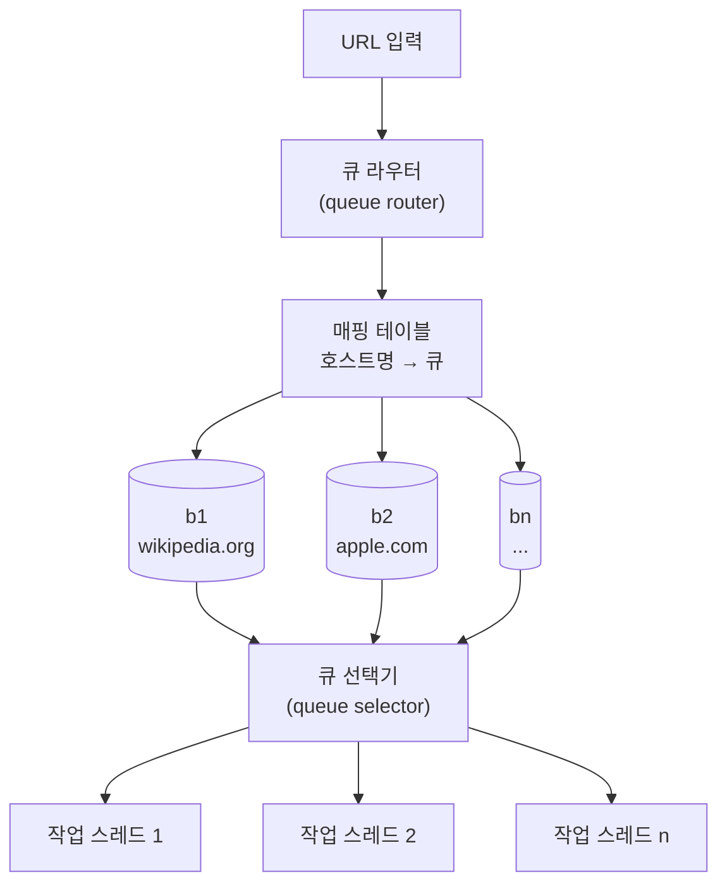
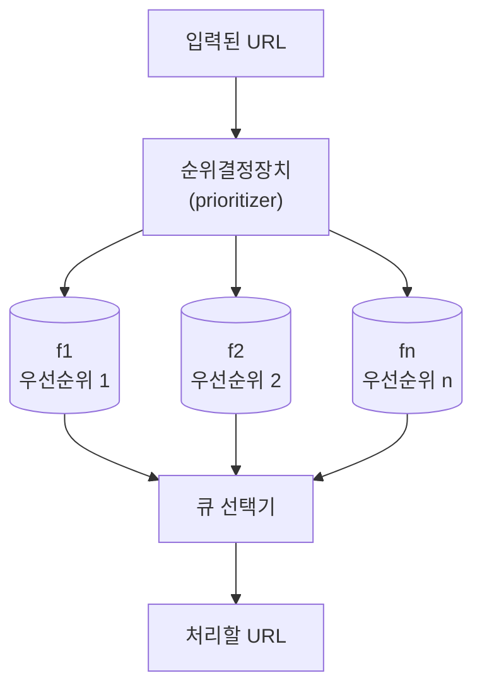
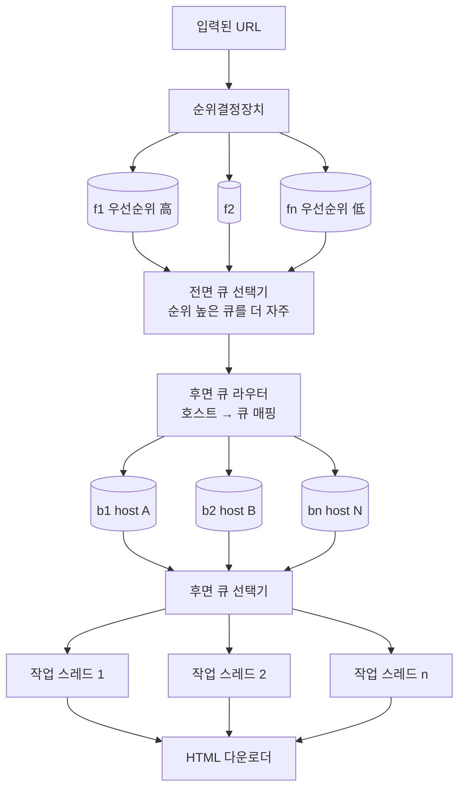
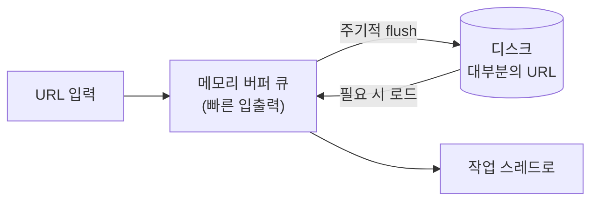
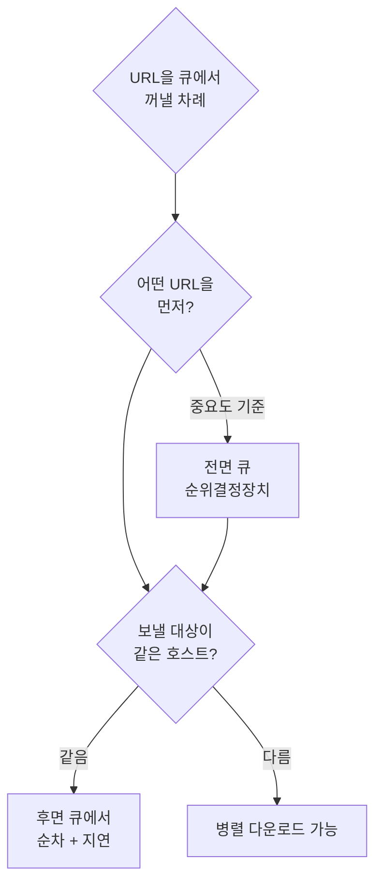

# STEP 4. 미수집 URL 저장소 — 예의·우선순위·신선도를 어떻게

> **이 장의 본체.** STEP 3에서 드러난 BFS의 두 결함(무례함·우선순위 부재)을 여기서 푼다.
> 미수집 URL 저장소(URL Frontier)를 잘 구현하면 **예의 + 우선순위 + 신선도**를 갖춘 크롤러가 된다.

---

## 0. 먼저: 이 컴포넌트가 해결해야 할 4가지

| # | 요구 | 무엇으로 푸나 |
| :-: | --- | --- |
| 1 | **예의(politeness)** — 한 사이트에 몰아치지 않기 | **후면 큐(back queue)** + 호스트↔스레드 매핑 |
| 2 | **우선순위(priority)** — 중요한 페이지 먼저 | **전면 큐(front queue)** + 순위결정장치 |
| 3 | **신선도(freshness)** — 이미 받은 페이지의 갱신 반영 | 변경 이력 + 우선순위 기반 재수집 |
| 4 | **규모** — 수억 개 URL을 어디에 두나 | 디스크 + 메모리 버퍼 **하이브리드** |

> 이 주제는 논문이 다수 나와 있다. 특히 Olston & Najork의 *Web Crawling* 서베이와 Donald Patterson의 강의 자료가 읽어둘 만하다.

---

## 1. 예의 (Politeness)

### 왜 필요한가

크롤러가 수집 대상 서버로 **짧은 시간 안에 너무 많은 요청**을 보내는 것은 **무례한(impolite)** 일이며,
때로는 **DoS(Denial-of-Service) 공격으로 간주**된다.
안전장치가 없는 크롤러는 **초당 수천 건의 요청**을 한 사이트에 보내 **사이트를 마비**시킬 수도 있다.

### 원칙

> **동일 웹 사이트에 대해서는 한 번에 한 페이지만 요청한다.**
> 같은 사이트의 페이지를 다운받는 태스크는 **시간차를 두고** 실행한다.

### 구현 아이디어 — 호스트명 ↔ 작업 스레드 관계 유지

**각 다운로드 스레드는 별도의 FIFO 큐를 가지고, 해당 큐에서 꺼낸 URL만 다운로드**한다.
같은 호스트의 URL은 언제나 같은 큐로 들어가므로, 그 호스트를 담당하는 스레드는 **하나뿐**이다.

| 컴포넌트 | 역할 |
| --- | --- |
| **큐 라우터(queue router)** | **같은 호스트에 속한 URL은 언제나 같은 큐**로 가도록 보장 |
| **매핑 테이블** | 호스트명 → 담당 큐(b1…bn) 대응 관계 |
| **FIFO 큐 b1…bn** | 큐 하나당 **호스트 하나**의 URL만 담김 |
| **큐 선택기(queue selector)** | 큐들을 **순회**하며 URL을 꺼내, 그 큐 전담 작업 스레드에 전달 |
| **작업 스레드(worker thread)** | 전달된 URL을 **순차적으로** 다운로드. 작업 사이에 **일정한 지연시간(delay)** 을 둘 수 있음 |

> **핵심:** "큐 하나 = 호스트 하나 = 스레드 하나"라는 1:1 사슬이 곧 예의다. 병렬성은 **호스트 간에만** 허용된다.

### 예의 vs 처리량의 트레이드오프

| 선택 | 결과 |
| --- | --- |
| 스레드 수 ↑ / 지연 ↓ | 처리량 ↑, 하지만 **예의 위반 위험** ↑ |
| 스레드 수 ↓ / 지연 ↑ | 안전하지만 **800 QPS 달성 어려움** |

> 그래서 처리량은 **한 호스트를 빠르게**가 아니라 **많은 호스트를 동시에**로 얻는다. → 분산 크롤링([STEP 5](05_STEP5_HTML다운로더_robots_성능최적화.md))

---

## 2. 우선순위 (Priority)

### 왜 필요한가

> 애플 제품에 대한 사용자 의견이 올라오는 **포럼의 한 페이지**가
> **애플 홈페이지**와 같은 중요도를 갖는다고 보기는 어렵다.

둘 다 'Apple'이 키워드로 등장하지만, 크롤러는 **중요한 페이지를 먼저 수집**해야 한다.

### 우선순위 척도

| 척도 | 설명 |
| --- | --- |
| **페이지랭크(PageRank)** | 링크 구조 기반 중요도 |
| **트래픽 양** | 실제 방문 규모 |
| **갱신 빈도(update frequency)** | 얼마나 자주 바뀌는가 |

### 구조

| 컴포넌트 | 역할 |
| --- | --- |
| **순위결정장치(prioritizer)** | URL을 입력받아 **우선순위를 계산** |
| **큐 f1…fn** | **우선순위별로 큐가 하나씩** 할당. 우선순위가 높으면 선택될 확률도 올라감 |
| **큐 선택기** | 임의 큐에서 URL을 꺼내되, **순위가 높은 큐에서 더 자주** 꺼내도록 프로그램됨 |

---

## 3. 전면 큐 + 후면 큐 — 통합 구조

우선순위와 예의는 **서로 다른 층**에서 처리된다. 그래서 큐를 두 겹으로 쌓는다.

| 모듈 | 담당 |
| --- | --- |
| **전면 큐(front queue)** | **우선순위 결정 과정**을 처리 |
| **후면 큐(back queue)** | 크롤러가 **예의 바르게 동작**하도록 보증 |

### 두 층의 역할 분담

| | 전면 큐 (front) | 후면 큐 (back) |
| --- | --- | --- |
| 큐를 나누는 기준 | **우선순위** | **호스트명** |
| 선택기의 규칙 | 순위 높은 큐를 **더 자주** | 큐를 **순회**하며 공평하게 |
| 보장하는 것 | 중요한 페이지 먼저 | 한 호스트에 동시 요청 1건 |
| 대응하는 요구사항 | 우선순위 · 신선도 | **예의** |

> **한 문장 정리:** **"전면 큐에서 무엇을 먼저 할지 정하고, 후면 큐에서 언제 보낼지 정한다."**

---

## 4. 신선도 (Freshness)

웹 페이지는 **수시로 추가·삭제·변경**된다.
따라서 이미 다운로드한 페이지라도 **주기적으로 재수집(recrawl)** 해야 데이터의 신선함이 유지된다.

### 문제

**모든 URL을 재수집하는 것은 많은 시간과 자원이 필요**하다.
(월 10억 페이지를 수집하는 크롤러가 기존 페이지까지 전부 다시 받으면 부하가 배로 뛴다.)

### 최적화 전략

| 전략 | 내용 |
| --- | --- |
| **변경 이력(update history) 활용** | 과거에 자주 바뀐 페이지는 자주, 안 바뀐 페이지는 드물게 |
| **우선순위 활용** | **중요한 페이지는 좀 더 자주** 재수집 |

> **핵심:** 신선도는 별도 컴포넌트가 아니라 **순위결정장치의 입력 하나**로 흡수된다. 갱신 빈도가 곧 우선순위 척도이기 때문이다.

---

## 5. 미수집 URL 저장소를 위한 지속성 저장장치

### 문제

검색 엔진용 크롤러가 처리해야 하는 URL은 **수억 개**에 달한다.

| 방식 | 문제 |
| --- | --- |
| **전부 메모리** | **안정성·규모 확장성** 측면에서 부적절 (프로세스가 죽으면 전부 소실, 용량 한계) ❌ |
| **전부 디스크** | **느려서 쉽게 성능 병목** 지점이 됨 ❌ |

### 해결 — 하이브리드(hybrid approach)

> **대부분의 URL은 디스크**에 두되, **IO 비용을 줄이기 위해 메모리에 버퍼(큐)** 를 둔다.
> 버퍼에 있는 데이터는 **주기적으로 디스크에 기록**한다.

| 얻는 것 | 설명 |
| --- | --- |
| 규모 확장성 | 수억 개 URL을 디스크가 감당 |
| 성능 | 실제 입출력은 메모리 버퍼에서 → IO 비용 감소 |
| 안정성 | 디스크에 남으므로 장애 후 재시작 가능 ([STEP 5](05_STEP5_HTML다운로더_robots_성능최적화.md)의 "크롤링 상태 저장"과 연결) |

---

## 6. 요구사항 매핑

| 요구사항 | 미수집 URL 저장소의 대응 | 이유 |
| --- | --- | --- |
| 예의 | 후면 큐(호스트별) + 작업 스레드 1:1 + 지연시간 | 한 사이트 동시 요청 1건 |
| 우선순위 | 순위결정장치 + 전면 큐 + 가중 선택 | 중요 페이지 먼저 |
| 신선도 | 변경 이력 + 우선순위 기반 선별 재수집 | 전체 재수집 비용 회피 |
| 규모 확장성 | 디스크 + 메모리 버퍼 하이브리드 | 수억 URL 감당 |
| 안정성 | 디스크 지속성 저장 | 장애 복구 후 재시작 |

### 의사결정 가이드

---

## ✅ STEP 4 체크리스트

- [ ] 미수집 URL 저장소가 해결하는 4가지(예의·우선순위·신선도·규모)를 말할 수 있다
- [ ] "동일 사이트에는 한 번에 한 페이지만 요청" 원칙과 그 구현(호스트↔스레드 매핑)을 설명할 수 있다
- [ ] 큐 라우터 / 매핑 테이블 / 큐 선택기 / 작업 스레드의 역할을 각각 말할 수 있다
- [ ] 순위결정장치와 우선순위별 큐의 동작을 설명할 수 있다
- [ ] **전면 큐 = 우선순위, 후면 큐 = 예의**를 그림 없이 설명할 수 있다
- [ ] 신선도 유지를 위한 재수집 최적화 두 가지를 말할 수 있다
- [ ] URL을 전부 메모리에도, 전부 디스크에도 못 두는 이유를 각각 말할 수 있다
- [ ] 하이브리드 방식(디스크 저장 + 메모리 버퍼 + 주기적 flush)을 설명할 수 있다

---

## 💬 예상 면접 질문

**Q1. 크롤러가 '예의 바르게' 동작한다는 게 구체적으로 무슨 뜻인가?**
> **동일 웹 사이트에 대해 한 번에 한 페이지만 요청**한다는 뜻이다. 구현은 **호스트명과 작업 스레드를 1:1로 묶는 것** — 큐 라우터가 같은 호스트 URL을 항상 같은 FIFO 큐에 넣고, 그 큐 전담 스레드가 URL을 **순차적으로, 사이에 지연시간을 두고** 다운로드한다.

**Q2. 전면 큐와 후면 큐는 각각 무엇을 담당하나?**
> **전면 큐는 우선순위 결정**을 담당한다 — 순위결정장치가 계산한 우선순위별로 큐가 나뉘고, 선택기가 높은 순위 큐에서 더 자주 꺼낸다. **후면 큐는 예의를 보증**한다 — 호스트별로 큐가 나뉘고 각 큐가 전담 스레드를 갖는다.

**Q3. 왜 큐를 두 겹으로 쌓나? 하나로 못 하나?**
> 두 목표의 **분할 기준이 다르기** 때문이다. 우선순위는 **URL의 중요도**로, 예의는 **호스트명**으로 나눠야 한다. 한 큐 집합으로는 두 기준을 동시에 만족시킬 수 없어서 "무엇을 먼저(전면) → 언제 보낼지(후면)" 로 층을 나눈다.

**Q4. 신선도는 어떻게 유지하나?**
> 이미 받은 페이지도 주기적으로 재수집한다. 다만 전체 재수집은 비용이 크므로 **웹 페이지의 변경 이력을 활용**하고, **중요한 페이지를 더 자주** 재수집하는 식으로 선별한다.

**Q5. 수억 개 URL을 어디에 저장하나?**
> 전부 메모리는 **안정성·규모 확장성** 문제로, 전부 디스크는 **느려서 병목**이 되므로 둘 다 안 된다. **하이브리드** — 대부분의 URL은 디스크에 두고 IO 비용을 줄이기 위해 **메모리 버퍼 큐**를 두며, 버퍼 내용을 주기적으로 디스크에 기록한다.

**Q6. 예의를 지키면서 800 QPS를 어떻게 달성하나?**
> 처리량을 **한 호스트를 빠르게** 받아서 얻는 게 아니라 **많은 호스트를 동시에** 받아서 얻는다. 후면 큐가 호스트 수만큼 있고 각각 별도 스레드가 붙으므로 병렬성은 호스트 간에 확보되며, 서버를 여러 대로 **분산 크롤링**해 더 늘린다.

➡️ 다음: [STEP 5 — HTML 다운로더: robots.txt·성능 최적화·안정성](05_STEP5_HTML다운로더_robots_성능최적화.md)
