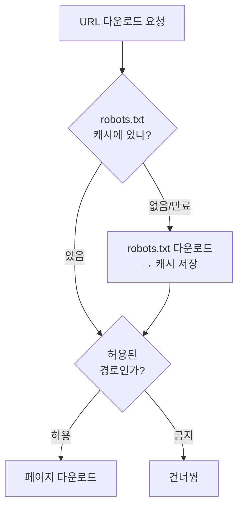
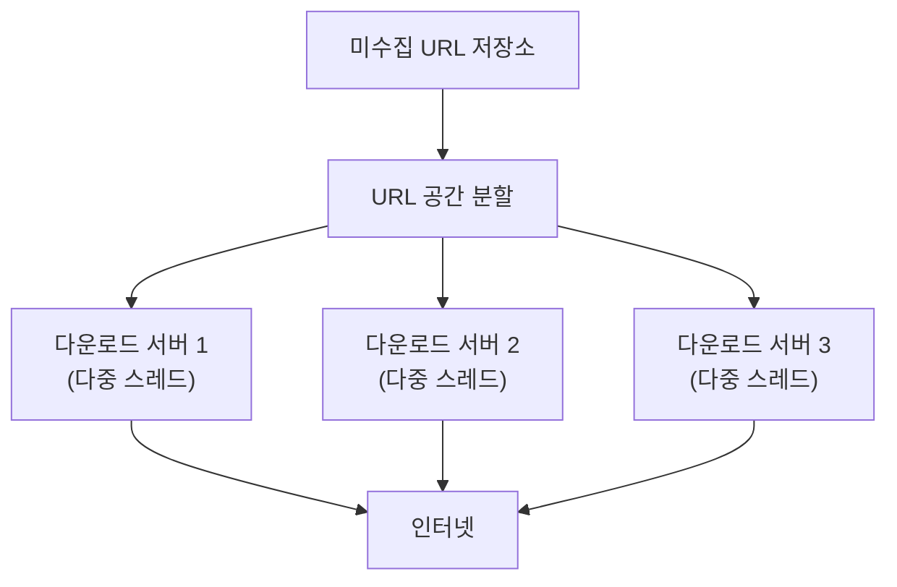
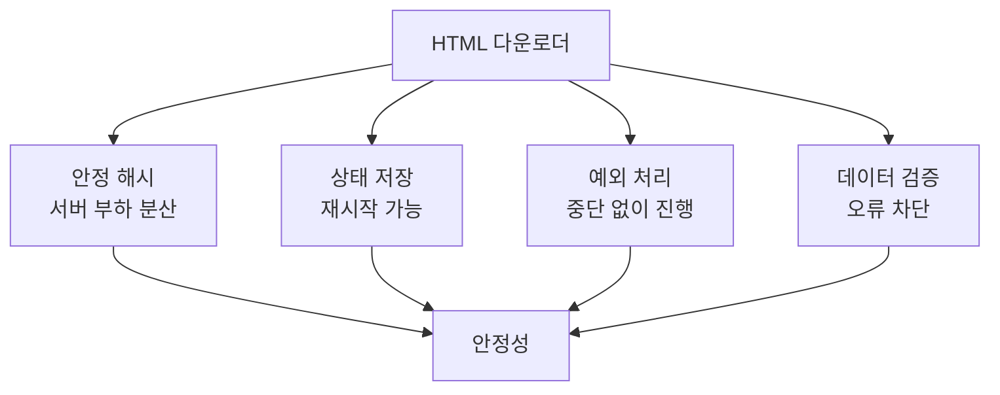
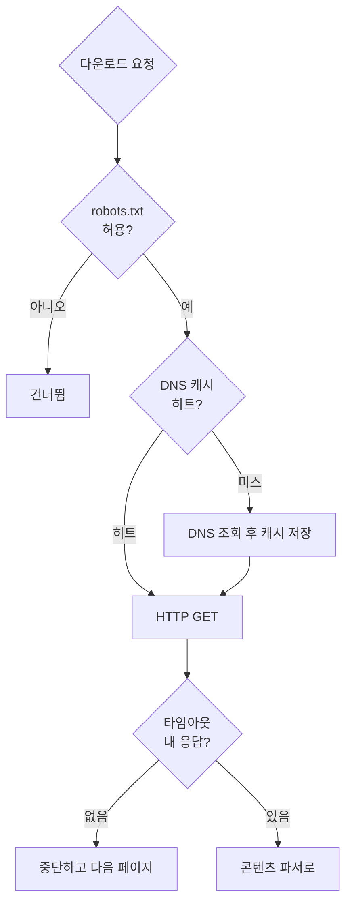

# STEP 5. HTML 다운로더 — 빠르고 안전하게 어떻게 받을까

> STEP 4에서 "무엇을, 언제 요청할지"가 정해졌다. 이제 **실제로 받아오는 컴포넌트**를 설계한다.
> 순서는 **규칙(robots.txt) → 성능 → 안정성**이다. 규칙을 먼저 보는 이유는, 아무리 빨라도 **긁으면 안 되는 걸 긁으면 끝**이기 때문이다.

---

## 0. 먼저: 다운로더가 만족해야 할 세 가지

| 축 | 질문 | 대응 |
| --- | --- | --- |
| **규칙 준수** | 이 페이지를 긁어도 되나? | robots.txt (로봇 제외 프로토콜) |
| **성능** | 800 peak QPS를 어떻게 내나? | 분산 크롤링 · DNS 캐시 · 지역성 · 짧은 타임아웃 |
| **안정성** | 서버가 죽거나 에러가 나면? | 안정 해시 · 상태 저장 · 예외 처리 · 데이터 검증 |

HTML 다운로더는 **HTTP 프로토콜을 통해 웹 페이지를 내려받는다.**

---

## 1. Robots.txt — 로봇 제외 프로토콜

### 무엇인가

**Robots.txt**(로봇 제외 프로토콜, Robot Exclusion Protocol)는
**웹사이트가 크롤러와 소통하는 표준적 방법**이다.
이 파일에는 **크롤러가 수집해도 되는 페이지 목록**이 들어 있다.

> 웹 사이트를 긁어 가기 전에 크롤러는 **반드시 이 파일의 규칙을 먼저 확인**해야 한다.

### 캐싱

Robots.txt를 **거푸 다운로드하는 것을 피하기 위해**, 이 파일은
**주기적으로 다시 다운받아 캐시에 보관**한다.



### 실제 예시 — `https://www.amazon.com/robots.txt`

```text
User-agent: Googlebot
Disallow: /creatorhub/*
Disallow: /rss/people/*/reviews
Disallow: /gp/pdp/rss/*/reviews
Disallow: /gp/cdp/member-reviews/
Disallow: /gp/aw/cr/
```

> `Creatorhub` 같은 디렉터리의 내용은 **다운받을 수 없다**는 뜻이다.
> `User-agent`로 크롤러를 지정하고, `Disallow`로 금지 경로를 나열한다.

---

## 2. 성능 최적화 4가지

### 2-1. 분산 크롤링 (Distributed Crawl)

성능을 높이기 위해 **크롤링 작업을 여러 서버에 분산**한다.

- 각 서버는 **여러 스레드**를 돌려 다운로드 작업을 처리한다.
- **URL 공간을 작은 단위로 분할**하여, 각 서버가 그중 일부의 다운로드를 담당한다.



> [STEP 4](04_STEP4_미수집URL저장소_예의_우선순위.md)의 예의 제약과 맞물린다 — **한 호스트는 한 스레드**, 대신 **호스트·서버 수를 늘려** 처리량을 확보한다.

### 2-2. 도메인 이름 변환 결과 캐시 (DNS Cache)

**DNS Resolver는 크롤러 성능의 병목 중 하나다.**

| 왜 병목인가 |
| --- |
| DNS 요청은 **동기적(synchronous)** 특성을 갖는다 — 결과를 받기 전까지 다음 작업 진행 불가 |
| DNS 요청 처리에 보통 **10ms ~ 200ms** 소요 |
| 크롤러 스레드 중 **어느 하나라도** 이 작업을 하고 있으면 **다른 스레드의 DNS 요청은 전부 블록(block)** 된다 |

**해결:** 도메인 이름 ↔ IP 주소 관계를 **캐시에 보관**하고,
**크론 잡(cron job)** 등으로 **주기적으로 갱신**한다.

```text
캐시 미스: URL → DNS 조회(10~200ms 대기, 다른 스레드도 블록) → IP
캐시 히트: URL → 로컬 캐시 조회(≈0ms) → IP
```

> 800 QPS × 최대 200ms 동기 대기 = DNS만으로 시스템이 멈춘다. **캐시는 선택이 아니라 필수.**

### 2-3. 지역성 (Locality)

**크롤링 서버를 지역별로 분산**한다.
크롤링 서버가 **대상 서버와 지역적으로 가까우면** 페이지 다운로드 시간이 줄어든다.

> 지역성 전략은 다운로드 서버뿐 아니라 **크롤 서버·캐시·큐·저장소 등 대부분의 컴포넌트**에 적용 가능하다.

### 2-4. 짧은 타임아웃 (Short Timeout)

어떤 웹 서버는 **응답이 느리거나 아예 응답하지 않는다**.
**최대 얼마나 기다릴지를 미리 정해** 두고, 그 시간 안에 응답이 없으면
**해당 페이지 다운로드를 중단하고 다음 페이지로 넘어간다.**

### 요약

| 기법 | 무엇을 줄이나 | 핵심 |
| --- | --- | --- |
| 분산 크롤링 | 서버당 부하 | URL 공간 분할 + 다중 스레드 |
| DNS 캐시 | **동기 대기 시간** | 10~200ms → 캐시 조회, 크론으로 갱신 |
| 지역성 | 네트워크 왕복 시간 | 대상 서버와 가까운 곳에 배치 |
| 짧은 타임아웃 | **무응답 서버 대기** | 상한 정하고 다음으로 |

---

## 3. 안정성 (Robustness)

최적화된 성능뿐 아니라 **안정성**도 다운로더 설계의 핵심이다.

| 접근법 | 내용 | 얻는 것 |
| --- | --- | --- |
| **안정 해시(consistent hashing)** | 다운로더 서버들에 부하를 분산할 때 적용. 서버를 **쉽게 추가·삭제** 가능 (→ 5장 "안정 해시 설계") | 탄력적 규모 조정 |
| **크롤링 상태 및 수집 데이터 저장** | 장애 시 쉽게 복구하도록 **크롤링 상태와 수집 데이터를 지속적 저장장치에 기록**. 저장된 데이터를 로딩하면 **중단된 크롤링을 재시작** 가능 | 장애 복구 |
| **예외 처리(exception handling)** | 대규모 시스템에서 에러는 **불가피하고 흔하다**. 예외가 나도 전체 시스템이 중단되지 않고 **우아하게(gracefully) 이어나가야** 함 | 부분 실패 격리 |
| **데이터 검증(data validation)** | 시스템 오류를 방지하는 중요 수단 | 잘못된 입력 차단 |



> 💡 **안정 해시**가 여기 등장하는 이유: 다운로더 서버를 늘리거나 줄일 때 **URL 공간 재분배**가 필요한데,
> 단순 모듈러 해시는 서버 수가 바뀌면 **거의 모든 매핑이 흔들린다**. 안정 해시는 이동량을 최소화한다.

---

## 4. 요구사항 매핑

| 요구사항 | 다운로더의 대응 | 이유 |
| --- | --- | --- |
| 예의 | robots.txt 준수 + 캐싱 | 사이트가 명시한 금지 경로 회피 |
| 규모 확장성 | 분산 크롤링 + 다중 스레드 + 안정 해시 | 수평 확장 |
| 성능(800 QPS) | DNS 캐시 + 지역성 | 동기 대기·네트워크 지연 제거 |
| 안정성 | 짧은 타임아웃 + 예외 처리 + 데이터 검증 | 비정상 서버·입력에 안 죽음 |
| 장애 복구 | 크롤링 상태 지속 저장 | 중단 지점부터 재시작 |

### 의사결정 가이드



---

## ✅ STEP 5 체크리스트

- [ ] robots.txt가 무엇이고 왜 캐싱하는지 설명할 수 있다
- [ ] `User-agent` / `Disallow` 형식을 읽을 수 있다
- [ ] 성능 최적화 4가지(분산 크롤링·DNS 캐시·지역성·짧은 타임아웃)를 말할 수 있다
- [ ] **DNS가 왜 병목인지**(동기 특성, 10~200ms, 다른 스레드 블록) 설명할 수 있다
- [ ] 지역성 전략이 다운로더 외 어떤 컴포넌트에도 적용되는지 안다
- [ ] 안정성 확보 4가지(안정 해시·상태 저장·예외 처리·데이터 검증)를 말할 수 있다
- [ ] 안정 해시가 왜 여기서 쓰이는지 5장과 연결해 설명할 수 있다

---

## 💬 예상 면접 질문

**Q1. robots.txt는 무엇이고 크롤러는 어떻게 다루나?**
> 웹사이트가 크롤러와 소통하는 **표준적 방법**(로봇 제외 프로토콜)으로, 수집해도 되는/안 되는 페이지 목록이 담겨 있다. 사이트를 긁기 전에 **반드시 먼저 확인**하고, 반복 다운로드를 피하기 위해 **주기적으로 갱신하며 캐시**에 보관한다.

**Q2. HTML 다운로더의 성능 병목은 무엇이고 어떻게 푸나?**
> 대표적으로 **DNS 조회**다. DNS 요청은 **동기적**이라 결과를 받기 전엔 다음 작업을 못 하고, 처리에 10~200ms가 걸리며, 한 스레드가 조회 중이면 **다른 스레드의 DNS 요청까지 블록**된다. 도메인↔IP 매핑을 **캐시**에 두고 **크론 잡**으로 주기 갱신해 해결한다.

**Q3. 성능 최적화 기법을 나열해보라.**
> ① **분산 크롤링** — URL 공간을 분할해 여러 서버·스레드가 나눠 받음. ② **DNS 캐시** — 동기 조회 제거. ③ **지역성** — 크롤 서버를 대상 서버와 가까운 지역에 배치(캐시·큐·저장소에도 적용). ④ **짧은 타임아웃** — 무응답 서버를 오래 기다리지 않고 다음 페이지로.

**Q4. 크롤러의 안정성은 어떻게 확보하나?**
> **안정 해시**로 다운로더 서버를 유연하게 증감하고, **크롤링 상태와 수집 데이터를 지속적 저장장치에 기록**해 장애 후 중단 지점부터 재시작하며, **예외 처리**로 에러가 나도 전체가 멈추지 않게 하고, **데이터 검증**으로 잘못된 입력을 차단한다.

**Q5. 왜 하필 안정 해시인가?**
> 다운로더 서버를 추가·삭제할 때 URL 공간을 재분배해야 하는데, 단순 모듈러 해시는 서버 수가 바뀌면 **거의 모든 매핑이 재배치**된다. 안정 해시는 **이동량을 최소화**해 서버를 쉽게 늘리고 줄일 수 있다(5장 참고).

➡️ 다음: [STEP 6 — 문제 있는 콘텐츠, 안정성과 확장성](06_STEP6_문제콘텐츠_안정성_확장성.md)
