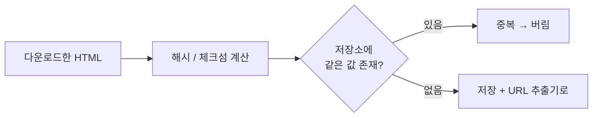
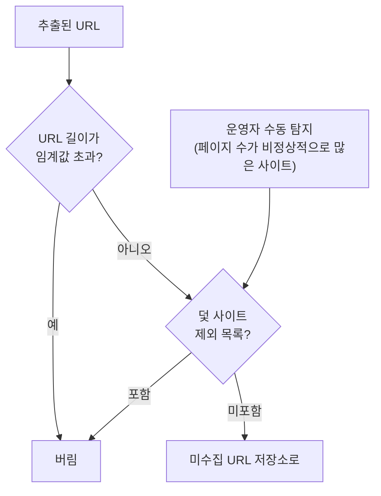
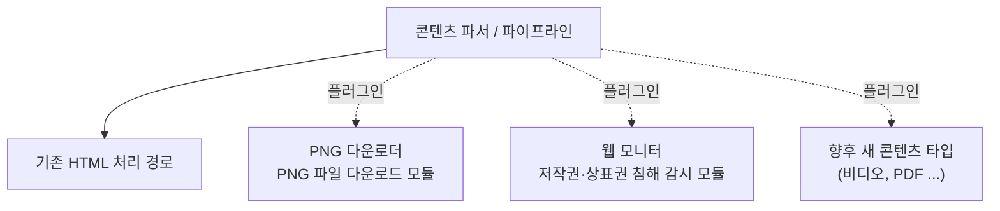
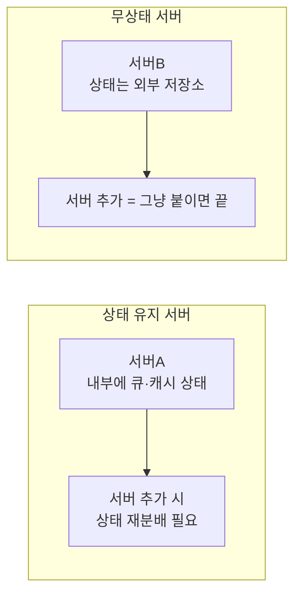

# STEP 6. 문제 있는 콘텐츠와 확장성 — 쓰레기·함정·진화를 어떻게

> 여기까지 오면 크롤러는 "빠르고 예의 바르게 잘 받는다". 남은 문제는 **받아온 것이 쓸모없거나 위험할 때**다.
> 중복·덫·노이즈를 걸러내고, 마지막으로 **새로운 콘텐츠 타입을 어떻게 흡수할지**(확장성)를 정한다.

---

## 0. 먼저: 웹은 함정으로 가득하다

STEP 1에서 안정성(robustness)의 정의가 **"웹은 함정으로 가득하다"** 였다.
그 함정을 구체적으로 나열하면 세 종류다.

| 문제 | 무엇이 나쁜가 | 해결 방향 |
| --- | --- | --- |
| **중복 콘텐츠** | 웹 콘텐츠의 **약 30%가 중복** → 저장소·처리 시간 낭비 | 해시 / 체크섬 |
| **거미 덫(spider trap)** | 크롤러를 **무한 루프**에 빠뜨림 | URL 길이 제한 + 수동 제외 |
| **데이터 노이즈** | 광고·스크립트 코드·스팸 URL 등 **가치 없는 콘텐츠** | 가능하면 제외 |

---

## 1. 중복 콘텐츠

### 규모

> 웹에 공개된 연구 결과에 따르면 **웹 페이지 콘텐츠의 29~30% 가량이 중복**이다.

30PB짜리 저장소에서 30%면 **약 9PB가 낭비**된다. 그냥 넘길 수 없는 크기다.

### 탐지 방법

| 방법 | 평가 |
| --- | --- |
| 두 HTML 문서를 **문자열로 직접 비교** | 가장 단순하지만, 비교 대상 문서가 **10억 개**면 **느리고 비효율적** ❌ |
| **해시(hash)** 또는 **체크섬(checksum)** 비교 | 문서를 고정 길이 값으로 줄여 비교 → 효과적 ✅ |



> 📎 원문 참고문헌은 Rabin의 **fingerprinting by random polynomials** (랜덤 다항식 기반 지문)를 인용한다.
> 문서 전체가 아니라 **지문(fingerprint)** 만 비교하면 되므로 10억 규모에서도 성립한다.

---

## 2. 방문 URL 판별 — 블룸 필터 vs 해시 테이블

(STEP 2의 "이미 방문한 URL?" 컴포넌트의 구현 선택지)

| 자료 구조 | 특성 |
| --- | --- |
| **해시 테이블** | 정확하지만 **URL 원문을 전부 보관** → 메모리 부담 |
| **블룸 필터(bloom filter)** | 비트 배열 + 여러 해시 함수. **메모리 매우 적음**, 단 **오탐(false positive)** 가능 |

### 💡 보강 — 왜 블룸 필터인가 (표준 배경지식)

| 항목 | 해시 테이블 | 블룸 필터 |
| --- | --- | --- |
| 10억 URL 저장 시 | URL 평균 100B라면 **≈100GB+** | 오탐률 1% 기준 원소당 약 9.6bit → **≈1.2GB** |
| 오탐(있다고 잘못 판단) | 없음 | **있음** → 아직 안 본 URL을 "봤다"고 판단해 **수집 누락** |
| 누락(없다고 잘못 판단) | 없음 | **없음** (한 번 넣은 건 반드시 "있음") |

> 크롤러 맥락에서 오탐의 대가는 **"페이지 하나를 안 받는 것"** 이라 감당 가능하다.
> 반대로 누락(같은 URL 재처리)은 **무한 루프 위험**인데, 블룸 필터는 그쪽 오류가 **구조적으로 없다**. 그래서 잘 맞는다.

---

## 3. 거미 덫 (Spider Trap)

### 무엇인가

**크롤러를 무한 루프에 빠뜨리도록 설계한 웹 페이지**다.
예를 들어 무한히 깊은 디렉터리 구조를 포함하는 링크:

```text
spidertrapexample.com/foo/bar/foo/bar/foo/bar/...
```

크롤러는 계속 새로운 URL을 발견하므로 **영원히 이 사이트를 벗어나지 못한다.**
(STEP 3에서 DFS를 배제한 이유와 직결된다.)

### 회피 전략

| 전략 | 내용 | 한계 |
| --- | --- | --- |
| **URL 최대 길이 제한** | 위 예시 같은 덫은 회피 가능 | **만능 해결책은 없음** ⚠️ |
| **탐지 후 수동 제외** | 덫이 있는 사이트를 크롤러 탐색 대상에서 제외하거나 **URL 필터 목록에 등록** | 사람의 개입 필요 |

> 덫이 설치된 사이트를 **알아내는 것은 어렵지 않다** — **기이할 정도로 많은 웹 페이지**를 가지고 있는 것이 일반적이기 때문이다.
> 하지만 **덫을 자동으로 피해 가는 알고리즘을 만드는 것은 까다롭다.**



---

## 4. 데이터 노이즈

**거의 가치가 없는 콘텐츠** — 광고, 스크립트 코드, 스팸 URL 등.
크롤러에게 도움 될 것이 없으므로 **가능하다면 제외**한다.
(STEP 2의 **URL 필터**와 마무리 단계의 **스팸 방지 컴포넌트**가 이 역할을 맡는다.)

---

## 5. 확장성 (Extensibility)

> **진화하지 않는 시스템은 없다.**
> 그러니 **새로운 형태의 콘텐츠를 쉽게 지원**할 수 있도록 설계해야 한다.

본 설계는 **새로운 모듈을 끼워 넣는(plug-in) 방식**으로 확장성을 확보한다.



| 플러그인 예시 | 역할 |
| --- | --- |
| **PNG 다운로더** | PNG 파일을 다운로드하는 플러그인 모듈 |
| **웹 모니터(web monitor)** | 웹을 모니터링하여 **저작권·상표권 침해**를 막는 모듈 |

> **핵심:** 확장성은 "미리 다 지원하는 것"이 아니라 **"나중에 끼워 넣을 자리를 만들어 두는 것"** 이다.

---

## 6. 마무리 — 추가로 논의하면 좋은 주제

시간이 허락한다면 면접관과 아래 주제를 더 논의하면 좋다.

| 주제 | 내용 | 왜 중요한가 |
| --- | --- | --- |
| **서버 측 렌더링**<br/>(server-side rendering) | 많은 사이트가 **JavaScript·AJAX**로 링크를 즉석에서 생성한다. 페이지를 그대로 받아 파싱하면 **동적 생성 링크를 발견할 수 없다**. 파싱 전에 서버 측 렌더링(= **동적 렌더링**)을 적용해 해결 | 수집 **커버리지** |
| **원치 않는 페이지 필터링** | 저장 공간 등 자원은 유한하므로 **스팸 방지(anti-spam) 컴포넌트**를 두어 품질이 조악하거나 스팸성인 페이지를 걸러냄 | 자원 절약 · 인덱스 품질 |
| **데이터베이스 다중화 및 샤딩** | **다중화(replication)** · **샤딩(sharding)** 으로 데이터 계층의 **가용성·규모 확장성·안정성** 향상 | 30PB 저장 계층 |
| **수평적 규모 확장성** | 대규모 크롤링은 다운로드 서버가 **수백~수천 대** 필요. 핵심은 서버가 **상태정보를 유지하지 않도록**, 즉 **무상태(stateless) 서버**로 만드는 것 | 서버 증설의 자유 |
| **가용성·일관성·안정성** | 성공적인 대형 시스템의 필수 고려사항 (1장 참고) | 시스템 품질 전반 |
| **데이터 분석 솔루션(analytics)** | 데이터를 수집·분석해야 **시스템을 세밀히 조정**할 수 있음 | 운영·튜닝 |

### 왜 "무상태"가 수평 확장의 핵심인가



> 크롤링 상태(미수집 URL 저장소·방문 URL·콘텐츠)를 **외부 저장소**에 두면, 다운로드 서버는 순수 계산 노드가 되어 **수백~수천 대까지 자유롭게 증설**할 수 있다.
> 이는 STEP 5의 **"크롤링 상태 및 수집 데이터 저장"** 과 같은 이야기다.

---

## 7. 전체 요구사항 회수

이 장에서 세운 4대 속성이 최종적으로 어떻게 충족되었는지 정리한다.

| 속성 | 충족한 설계 | STEP |
| --- | --- | --- |
| **규모 확장성** | 분산 크롤링, 다중 스레드, 디스크+메모리 하이브리드 큐, 무상태 서버, DB 다중화·샤딩 | 4·5·6 |
| **안정성** | 안정 해시, 크롤링 상태 저장, 예외 처리, 데이터 검증, 짧은 타임아웃, 거미 덫 회피 | 5·6 |
| **예의** | 호스트별 후면 큐 + 전담 스레드 + 지연, robots.txt 준수 | 4·5 |
| **확장성** | 플러그인 모듈(PNG 다운로더, 웹 모니터) | 6 |

---

## ✅ STEP 6 체크리스트

- [ ] 웹 콘텐츠의 약 30%가 중복이라는 사실과, 문자열 비교 대신 해시/체크섬을 쓰는 이유를 안다
- [ ] 블룸 필터와 해시 테이블의 트레이드오프(메모리 vs 오탐)를 설명할 수 있다
- [ ] 블룸 필터의 오탐이 크롤러 맥락에서 감당 가능한 이유를 말할 수 있다
- [ ] 거미 덫이 무엇이고, URL 길이 제한이 왜 완전한 해결책이 아닌지 설명할 수 있다
- [ ] 덫 사이트를 알아내는 힌트(비정상적으로 많은 페이지 수)를 안다
- [ ] 데이터 노이즈의 예(광고·스크립트·스팸 URL)를 말할 수 있다
- [ ] 플러그인 방식으로 확장성을 확보하는 구조를 설명할 수 있다
- [ ] 서버 측 렌더링이 왜 필요한지(JS·AJAX 동적 링크) 설명할 수 있다
- [ ] 수평 확장의 핵심이 무상태 서버인 이유를 말할 수 있다

---

## 💬 예상 면접 질문

**Q1. 중복 콘텐츠는 어떻게 탐지하나?**
> 웹 콘텐츠의 약 **30%가 중복**이라 반드시 걸러야 한다. 두 HTML을 문자열로 비교하면 문서가 10억 개일 때 **느리고 비효율적**이므로, **해시나 체크섬**으로 문서를 고정 길이 지문으로 줄여 비교한다.

**Q2. 방문한 URL을 추적하는 자료 구조로 무엇을 쓰겠나?**
> **블룸 필터** 또는 해시 테이블. 10억 URL이면 해시 테이블은 URL 원문 보관만으로 100GB급인데, 블룸 필터는 1% 오탐 기준 1GB대다. 블룸 필터의 오탐은 "안 본 페이지를 봤다고 판단해 건너뛰는 것"이라 감당 가능하고, **누락(재처리로 인한 무한 루프)은 구조적으로 발생하지 않는다.**

**Q3. 거미 덫이 무엇이고 어떻게 대응하나?**
> 크롤러를 **무한 루프에 빠뜨리도록 설계된 페이지**다. 예: `spidertrapexample.com/foo/bar/foo/bar/...` 처럼 무한히 깊은 디렉터리 구조. **URL 최대 길이를 제한**하면 이런 유형은 피할 수 있지만 **만능 해결책은 없다**. 실무적으로는 페이지 수가 기이할 정도로 많은 사이트를 사람이 확인해 **탐색 대상에서 제외하거나 URL 필터 목록에 등록**한다.

**Q4. 새로운 콘텐츠 타입(이미지, 비디오)을 지원하려면?**
> **플러그인 모듈을 끼워 넣는** 방식으로 설계한다. 예를 들어 PNG를 받으려면 **PNG 다운로더** 모듈을, 저작권 침해를 감시하려면 **웹 모니터** 모듈을 추가한다. 전체 시스템을 재설계하지 않는 것이 확장성(extensibility)의 요구사항이다.

**Q5. JavaScript로 링크를 생성하는 사이트는 어떻게 크롤링하나?**
> 페이지를 그대로 받아 파싱하면 **동적으로 생성되는 링크를 발견할 수 없다**. 파싱 전에 **서버 측 렌더링(동적 렌더링)** 을 적용해 실제 렌더링 결과에서 링크를 추출해야 한다.

**Q6. 크롤러를 수평 확장하려면 무엇이 가장 중요한가?**
> **서버를 무상태(stateless)로 만드는 것**이다. 크롤링 상태를 서버 내부가 아니라 외부 지속적 저장장치에 두면 다운로드 서버를 수백~수천 대까지 자유롭게 증설할 수 있고, 장애가 나도 상태를 로딩해 재시작할 수 있다.

---

## 📚 레퍼런스 (원문 참고문헌 중 읽을 만한 것)

| 문헌 | 왜 읽나 |
| --- | --- |
| **Mercator: A scalable, extensible web crawler** (Heydon & Najork, 1999) | 확장 가능한 크롤러 설계의 고전. 이 장 구조의 원형 |
| **Web Crawling** (Olston & Najork) | 미수집 URL 저장소 · 우선순위 · 신선도의 표준 서베이 |
| **IRLbot: Scaling to 6 billion pages and beyond** (2008) | 60억 페이지 규모 실전 사례 |
| **The PageRank citation ranking** (Page, Brin et al., 1998) | URL 우선순위 척도의 원조 |
| **Space/time trade-offs in hash coding with allowable errors** (Bloom, 1970) | 블룸 필터 원논문 |
| **Fingerprinting by random polynomials** (Rabin, 1981) | 중복 콘텐츠 탐지의 이론적 기반 |
| **Google Dynamic Rendering** | 서버 측 렌더링 실무 가이드 |

---

📖 처음으로: [00_인덱스](00_인덱스.md) · [00_왜_무엇_어떻게](00_왜_무엇_어떻게.md)
