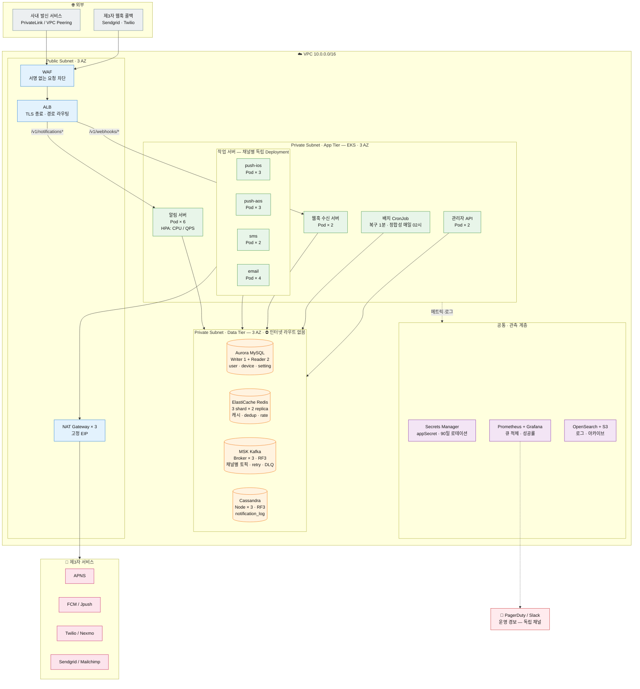
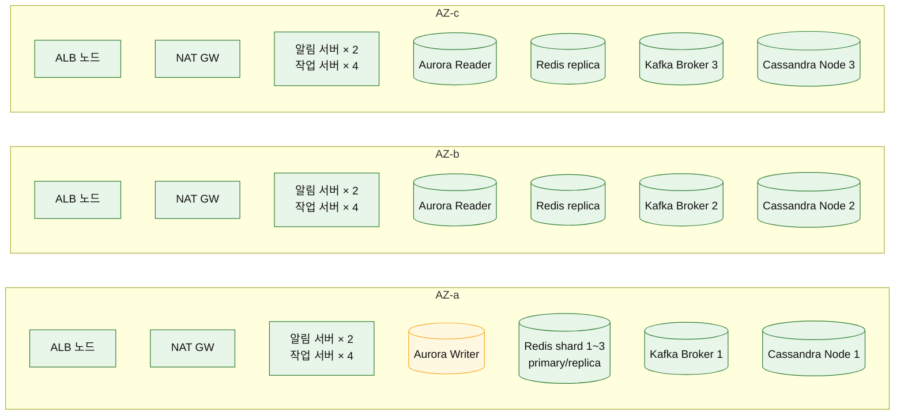
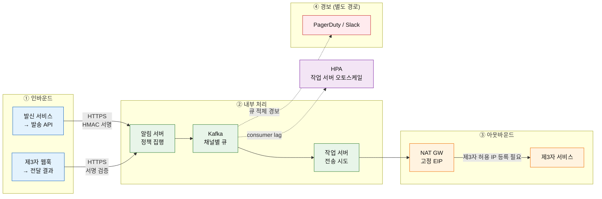

# 알림 시스템 (Notification System) 통합 설계서

> **문서 목적**: 알림 시스템 설계 문서 5종의 결론을 한 문서로 종합한다. 상세는 각 문서를 참조한다.
> **대상**: 『가상 면접 사례로 배우는 대규모 시스템 설계 기초』 10장 (165~181p)
> **작성 기준**: 하루 1,600만 건 발송 · 3채널(푸시/SMS/이메일) · 연성 실시간 · 알림 무손실

---

## 0. 문서 맵

| # | 문서 | 다루는 것 |
| :-: | --- | --- |
| 01 | [요구사항 정의서](01-notification-requirements.md) | 설계 범위, 기능/비기능 요구사항, 규모 추정, 트레이드오프 |
| 02 | [시스템 아키텍처](02-notification-architecture.md) | 계층 구조, 알림 서버 파이프라인, 큐 구성, 작업 서버, 제공자 어댑터 |
| 03 | [데이터 모델](03-notification-data-model.md) | MySQL/Cassandra/Redis 스키마, 상태 머신, 접근 패턴, 수명주기 |
| 04 | [API 명세](04-notification-api-spec.md) | 발송/조회/설정/단말/템플릿/웹훅 API, 인증, 에러 코드 |
| 05 | [안정성 설계](05-notification-reliability.md) | 무손실 3중 방어선, 재시도, 중복 방지 3단, 장애 격리, 정합성 검증 |
| 06 | [운영 설계](06-notification-operations.md) | 템플릿, 수신 설정, 전송률 제한, 보안, 모니터링, 이벤트 추적, 관리자 도구 |

> **인프라 구성도·사이징·장애 도메인**은 이 문서의 **[§3.2~§3.6](#32-인프라-구성도-배포-관점)** 에 있다.
> 논리 아키텍처(무엇이 무엇을 호출하는가)는 [02 아키텍처](02-notification-architecture.md), 배포 구조(어디에 얼마나 띄우는가)는 이 문서다.

> 📌 개념 학습이 목적이라면 **[정리노트](../정리노트/00_인덱스.md)** 를 먼저 볼 것.
> 이 문서 세트는 정리노트의 개념을 **구현 가능한 수준의 결정**으로 옮긴 것이다.

---

## 1. 한 장 요약

| 항목 | 결론 |
| --- | --- |
| **문제** | 3개 채널로 하루 1,600만 건을 **한 건도 잃지 않고** 발송한다 |
| **핵심 제약** | 지연·순서 뒤바뀜은 허용, **소실은 불허**, 중복은 최소화만 가능 |
| **핵심 구조** | **접수(동기) / 전송(비동기)** 분리 — 알림 로그 기록 후 채널별 큐 적재 |
| **핵심 결정 1** | 알림 로그를 **큐보다 먼저** 기록한다 (단일 진실 원천) |
| **핵심 결정 2** | 큐를 **채널별로 분리**한다 (장애 격리 · 독립 확장) |
| **핵심 결정 3** | **at-least-once** + 3단 중복 탐지 (exactly-once는 불가능) |
| **핵심 결정 4** | 채널과 제공자를 분리하는 **어댑터 계층** (FCM 중국 미지원 대응) |
| **한 문장** | **소실을 금지했기에 재시도하고, 재시도하기에 중복이 생기며, 그 중복을 3단으로 눌러 실용적 신뢰성을 만든다** |

---

## 2. 요구사항 요약

### 2.1 기능

| ID | 요구사항 |
| --- | --- |
| FR-1 | 푸시·SMS·이메일 **3채널 통합 발송** (호출자는 `user_id`만 전달) |
| FR-2 | 한 사용자의 **모든 활성 단말로 팬아웃** |
| FR-3 | 채널·카테고리별 **수신 설정(opt-out)**, 발송 전 필수 확인 |
| FR-4 | **알림 템플릿** (인자 치환, 버저닝) |
| FR-5 | 알림 ID로 **전송 상태 조회** |
| FR-6 | 실패 시 **재시도**, 한도 초과 시 운영자 통지 |
| FR-7 | 사용자별 **전송률 제한** |
| FR-8 | 생성~클릭까지 **이벤트 추적** |

### 2.2 비기능

| ID | 요구사항 | 목표 |
| --- | --- | --- |
| NFR-1 | **알림 무손실** | 미결 건수 0 |
| NFR-2 | 중복 최소화 | ≤ 0.01% |
| NFR-3 | 연성 실시간 | API P99 200ms / 전송 P95 5초 |
| NFR-4 | 수평 확장 | 무상태, 채널별 독립 증설 |
| NFR-5 | 장애 격리 | 채널 간 전파 없음 |
| NFR-6 | 보안 | 인증된 클라이언트만 발송 |
| NFR-7 | 관측성 | 큐 적체 상시 감시 |
| NFR-8 | 제공자 확장성 | 어댑터 추가로 통합 |

### 2.3 규모

| 항목 | 값 |
| --- | ---: |
| 일 발송 요청 | 16,000,000 (푸시 1,000만 / SMS 100만 / 이메일 500만) |
| 요청 QPS | 평균 185 · 피크 370 |
| **큐 이벤트** (팬아웃 반영, 단말 2대 가정) | **26,000,000 / 일** |
| **이벤트 QPS** | **평균 301 · 피크 602** |
| 알림 로그 | 26 GB/일 · 30일 780GB · 1년 9.5TB |
| Redis | ≈ 7.2 GB |

---

## 3. 아키텍처 요약

```text
발신 서비스 1~N
      │  POST /v1/notifications  (appKey + HMAC 서명, event_id 멱등키)
      ▼
API Gateway  ── appKey별 호출량 제한
      ▼
알림 서버 (무상태 · 오토스케일)
  ① 인증 → ② 요청 중복탐지 → ③ 검증 → ④ 메타데이터 조회
  → ⑤ 수신설정 확인 → ⑥ 전송률 제한 → ⑦ 템플릿 렌더
  → ⑧ 팬아웃 → ⑨ 알림 로그 기록(CREATED) → ⑩ 큐 적재(QUEUED)
      │                         ▲
      │              Redis 캐시 / MySQL / Cassandra(알림 로그)
      ▼
채널별 Kafka 토픽   push.ios │ push.android │ sms │ email
      ▼
채널별 작업 서버 풀  ── 전송직전 중복탐지 → 제공자 어댑터
      ▼
제공자 어댑터  ── 지역·가용성 기반 라우팅 + 서킷 브레이커 + 폴백
      ▼
APNS │ FCM/Jpush │ Twilio/Nexmo │ Sendgrid/Mailchimp
      ▼
사용자 단말        (전달 결과는 웹훅으로 회신 → DELIVERED/OPENED/CLICKED)

실패 → notif.retry.{5s,1m,10m,1h} → 한도 초과 → notif.dlq.{channel} → 경보
```

### 3.1 컴포넌트 책임

| 컴포넌트 | 책임 | 무상태 |
| --- | --- | :---: |
| API Gateway | TLS, 라우팅, appKey 호출량 제한 | ✅ |
| **알림 서버** | 인증·검증·정책 집행·렌더·팬아웃·로그·큐 적재 | ✅ |
| Redis | 캐시 · 중복 탐지 · 전송률 카운터 | — |
| MySQL | user · device · setting · template · provider_config | — |
| Cassandra | notification_log · tracking_event | — |
| Kafka | 채널별 큐 · 재시도 큐 · DLQ | — |
| **작업 서버** | 큐 소비 · 중복 확인 · 제3자 전송 · 상태 갱신 | ✅ |
| 제공자 어댑터 | 제공자 선택 · 페이로드 변환 · 서킷 · 폴백 | ✅ |

> §3의 구성도는 **논리 구조**(무엇이 무엇을 호출하는가)다.
> 실제로 어디에 배포되고 무엇이 장애 도메인을 나누는지는 아래 **§3.2 인프라 구성도**를 본다.

---

### 3.2 인프라 구성도 (배포 관점)

> **표기 기준**: AWS 매니지드 서비스로 표기했으나 **특정 벤더에 종속되지 않는 설계**다.
> GCP·Azure·온프레미스 등가 매핑은 [§3.4](#34-클라우드-등가-매핑) 참조.
>
> 한 장에 전부 담으면 읽히지 않으므로 **질문별로 3개의 뷰**로 나눈다.
> **① 무엇이 어디에 배포되는가 → ② AZ가 어떻게 나뉘는가 → ③ 트래픽이 어디로 흐르는가**

---

#### 뷰 ① 배포 토폴로지 — 무엇이 어느 계층에 있는가



| 색 | 계층 | 인터넷 노출 |
| --- | --- | :---: |
| 🔵 파랑 | Public Subnet — 진입·출구 | 인바운드 O / 아웃바운드 O |
| 🟢 초록 | App Tier — 무상태 워크로드 | ❌ (ALB 경유만) |
| 🟠 주황 | Data Tier — 상태 보관 | ❌ **라우트 자체가 없음** |
| 🟣 보라 | 관측·시크릿 | ❌ |
| 🔴 빨강 | 운영 경보 | 외부 (독립 채널) |

---

#### 뷰 ② AZ 분산 — 무엇이 함께 죽는가

에지 없이 **배치만** 보여준다. 각 AZ가 하나의 **장애 도메인**이다.



| 정족수 설정 | 값 | AZ 1개 손실 시 |
| --- | --- | --- |
| Kafka | RF=3, `min.insync.replicas`=2 | ✅ 2개 ISR 유지 → 쓰기 지속 |
| Cassandra | RF=3, `LOCAL_QUORUM`(=2) | ✅ 2개 응답 → 읽기·쓰기 지속 |
| Aurora | Writer 1 + Reader 2 | ✅ Writer AZ 손실 시 자동 페일오버 |
| Redis | shard별 primary/replica 분산 | ✅ 자동 승격 |

> ⚠️ **RF=3 / ISR=2 / LOCAL_QUORUM은 "AZ 1개 손실을 견디도록" 역산해서 나온 값**이다.
> AZ 2개가 동시에 죽으면 정족수가 깨지므로 **의도적으로 fail-close** 한다 ([§3.6](#36-장애-도메인)).

---

#### 뷰 ③ 트래픽 경로 — 어디로 흐르고 어디서 막히는가



| 경로 | 통제 주체 | 병목·위험 |
| --- | --- | --- |
| ① 발송 API | **우리** (appKey 제한) | 발신 서비스 폭주 → Gateway 제한으로 차단 |
| ① 웹훅 | ⚠️ **제3자** | 캠페인 직후 콜백 폭주 → **별도 Deployment로 분리** |
| ② 내부 | 우리 | 큐 적체 → HPA가 작업 서버 증설 |
| ③ 아웃바운드 | ⚠️ **제3자** | 제3자 지연·장애 → 서킷 브레이커 + 폴백 |
| ④ 경보 | 독립 | 🔁 **알림 시스템 자신으로 보내지 않는다** (순환 의존) |

---

#### 배포 관점의 핵심 포인트 5가지

| # | 포인트 | 이유 |
| :-: | --- | --- |
| 1 | **모든 계층 3-AZ 분산** | AZ 하나가 통째로 죽어도 서비스 지속. Kafka RF=3/ISR=2, Cassandra RF=3이 **AZ 1개 손실을 견디도록 설계된 값** |
| 2 | **작업 서버를 채널별 Deployment로 분리** | 채널별 독립 증설(NFR-4) + 장애 격리(NFR-5)를 **배포 단위에서** 강제. 같은 Pod에 섞으면 SMS 지연이 푸시 스레드를 잡아먹는다 |
| 3 | **작업 서버 HPA를 CPU가 아닌 consumer lag 기준으로** | 작업 서버는 **I/O 대기가 지배적**이라 CPU가 낮은 채로 적체된다. CPU 기준 오토스케일은 절대 발동하지 않는다 |
| 4 | **웹훅 수신을 별도 TG·Deployment로** | 인바운드 웹훅은 **제3자가 트래픽을 통제**한다(대량 캠페인 후 폭주). 발송 API와 스케일을 분리해 서로 밀어내지 않게 한다 |
| 5 | **NAT Gateway 고정 EIP** | 제3자 서비스의 **허용 IP 목록(allowlist)** 에 등록해야 하므로 아웃바운드 IP가 고정이어야 한다 |

> ⚠️ 3번이 실무에서 가장 자주 틀리는 지점이다. 큐가 10만 건 쌓였는데 CPU 20%라 스케일아웃이 안 되는 상황은 흔하다.
> **[06 운영 설계](06-notification-operations.md)의 큐 적체 지표가 경보용일 뿐 아니라 오토스케일 입력**이라는 점을 명시한다.

### 3.3 인프라 사이징

기준: 이벤트 **평균 301 QPS / 피크 602 QPS**, 알림 로그 **26GB/일**

| 계층 | 리소스 | 초기 구성 | 사이징 근거 |
| --- | --- | --- | --- |
| **알림 서버** | Pod (2 vCPU / 4GB) | **6** (AZ당 2) | 피크 370 요청/s ÷ 인스턴스당 100 QPS + 여유 |
| 작업 서버 push-ios | Pod (1 vCPU / 2GB) | **3** | 피크 232 evt/s × 50ms = 동시성 12 |
| 작업 서버 push-aos | Pod (1 vCPU / 2GB) | **3** | 동일 |
| 작업 서버 sms | Pod (1 vCPU / 2GB) | **2** | 피크 24 evt/s × 300ms = 동시성 8 |
| 작업 서버 email | Pod (1 vCPU / 2GB) | **4** | 피크 116 evt/s × 500ms = 동시성 58 |
| 웹훅 수신 | Pod (1 vCPU / 2GB) | **2** | 인바운드 콜백, 버스트 대응 |
| **Aurora MySQL** | db.r6g.large | Writer 1 + Reader 2 | 읽기는 캐시가 흡수, 쓰기는 낮음 |
| **ElastiCache Redis** | cache.r6g.large | 3 shard × 2 replica | 데이터 **≈7.2GB** + 여유. AZ 분산 |
| **MSK (Kafka)** | kafka.m5.large | Broker 3 | RF=3, 파티션 채널당 12, 7일 보존 |
| **Cassandra** | i3.xlarge (로컬 SSD) | Node 3 | 26GB/일 × 30일 × RF3 ÷ 3노드 ≈ **780GB/노드** |
| **NAT Gateway** | — | AZ당 1 (총 3) | AZ 장애 시 아웃바운드 유지 |

#### 오토스케일 정책

| 대상 | 지표 | 임계 | 범위 |
| --- | --- | --- | --- |
| 알림 서버 | CPU 60% 또는 요청 QPS | — | 6 ~ 24 |
| **작업 서버 (채널별)** | **Kafka consumer lag** | lag > 5,000 | 채널별 2 ~ 20 |
| 웹훅 수신 | CPU 60% | — | 2 ~ 10 |
| Cassandra | 디스크 70% | — | 수동 노드 추가 |

### 3.4 클라우드 등가 매핑

| 역할 | AWS | GCP | Azure | 온프레미스 |
| --- | --- | --- | --- | --- |
| 로드밸런서 | ALB | Cloud Load Balancing | Application Gateway | Nginx / HAProxy |
| 컨테이너 오케스트레이션 | EKS | GKE | AKS | Kubernetes |
| 관계형 DB | Aurora MySQL | Cloud SQL | Azure DB for MySQL | MySQL + Orchestrator |
| 캐시 | ElastiCache | Memorystore | Azure Cache for Redis | Redis Cluster |
| 메시지 큐 | MSK | Pub/Sub 또는 Confluent | Event Hubs | Kafka |
| 와이드 컬럼 | Keyspaces / EC2 Cassandra | Bigtable | Cosmos DB (Cassandra API) | Cassandra |
| 시크릿 | Secrets Manager | Secret Manager | Key Vault | Vault |
| 객체 스토리지 | S3 | GCS | Blob Storage | MinIO |

> ⚠️ **큐만은 신중히 고른다.** Pub/Sub·Event Hubs는 Kafka와 **오프셋·재생·파티션 순서 보장 모델이 다르다.**
> [05 안정성 설계](05-notification-reliability.md)의 무손실 설계가 `acks=all` + `min.insync.replicas=2` + **수동 오프셋 커밋**에 의존하므로, 대체 시 등가 보장이 있는지 반드시 확인해야 한다.

### 3.5 네트워크 · 보안 경계

| 경계 | 정책 |
| --- | --- |
| 발신 서비스 → ALB | VPC 내부 또는 **PrivateLink / VPC Peering**. 공개 인터넷 노출 최소화 |
| 제3자 웹훅 → ALB | 공개 엔드포인트. **WAF + 서명 검증** 필수 |
| ALB → App Tier | 보안 그룹으로 ALB SG에서만 허용 |
| App Tier → Data Tier | Data Tier SG는 **App Tier SG에서만** 인바운드 허용 |
| Data Tier → 인터넷 | ❌ **라우트 없음.** 데이터 계층은 외부로 나가지 않는다 |
| App Tier → 제3자 | NAT GW 경유, **고정 EIP** |
| 전 구간 암호화 | 전송 중 TLS 1.2+, 저장 시 KMS 암호화 (Aurora / Cassandra / S3) |
| 시크릿 | 코드·이미지에 포함 금지. **Secrets Manager 런타임 주입**, 90일 로테이션 |

### 3.6 장애 도메인

| 장애 단위 | 영향 | 복구 |
| --- | --- | --- |
| **Pod 1개** | 없음 | k8s 자동 재기동 |
| **노드 1대** | 없음 | Pod 재스케줄 |
| **AZ 1개 전체** | 용량 1/3 감소 | 나머지 2 AZ가 처리. Aurora 자동 페일오버, Kafka ISR 승계, Cassandra LOCAL_QUORUM 유지 |
| **AZ 2개 동시** | ⚠️ **접수 중단** | Kafka ISR 미달 · Cassandra 정족수 미달 → fail-close. 리전 복구 대기 |
| **리전 전체** | 전면 중단 | 🟡 **현 설계 범위 밖.** 멀티리전은 §10 확장 경로 참조 |

> ⚠️ **AZ 2개 동시 손실은 의도적으로 fail-close** 한다. 무손실 보장이 불가능한 상태에서 접수를 계속하면 NFR-1이 깨진다.

---

## 4. 핵심 설계 결정 10선

| # | 결정 | 대안 | 근거 |
| :-: | --- | --- | --- |
| 1 | **접수와 전송 분리 (202 Accepted)** | 동기 전송 | 제3자 응답 대기가 API를 막지 않음. **연성 실시간이 허용** |
| 2 | **알림 로그 → 큐 순서** | 큐 → 로그 | 큐만 성공하면 **추적 불가 알림** 발생. 로그가 단일 진실 원천 |
| 3 | **로그 저장 실패 시 fail-close (503)** | fail-open | "받아놓고 잃는 것"보다 "못 받는다고 말하는 것"이 낫다 |
| 4 | **채널별 큐 분리** | 단일 큐 | 장애 격리 · 독립 확장 · 차등 재시도 정책 |
| 5 | **팬아웃을 알림 서버에서** | 작업 서버에서 | 작업 서버 계약을 "이벤트 1건 = 전송 1회"로 단순화 |
| 6 | **템플릿 렌더를 알림 서버에서** | 작업 서버에서 | 렌더 결과를 로그에 남겨 **재현 가능** |
| 7 | **at-least-once + 3단 중복 탐지** | exactly-once 시도 | exactly-once는 **원리적으로 불가능** |
| 8 | **제공자 어댑터 + `provider_config` 테이블** | 채널별 직접 호출 | **FCM 중국 미지원** 등 지역별 교체를 데이터로 관리 |
| 9 | **알림 로그를 Cassandra로** | MySQL 단일 | 건당 3~4회 쓰기 × 2,600만 건 = 쓰기 집약 |
| 10 | **서킷 브레이커 + 폴백 제공자** | 무한 재시도 | 죽은 제3자를 계속 때리면 회복이 늦어짐 |

---

## 5. 데이터 모델 요약

| 저장소 | 테이블/키 | 성격 |
| --- | --- | --- |
| **MySQL** | `user`, `device`, `notification_setting`, `notification_template`, `provider_config` | 읽기 집약, 관계형 |
| **Cassandra** | `notification_log`, `notification_by_user`, `tracking_event` (TTL 30일) | 쓰기 집약 |
| **Redis** | `user:*`, `device:*`, `setting:*`, `template:*`, `dedup:*`, `sent:*`, `rate:*` | 휘발성, 전부 TTL |

### 5.1 원문 스키마 대비 주요 변경

| 항목 | 원문 | 본 설계 | 이유 |
| --- | --- | --- | --- |
| `phone_number` | integer | **VARCHAR(20)** | 선행 0 소실·자리수 초과 |
| `device` | — | + `platform`, `is_active` | 채널 라우팅, 토큰 무효화 |
| `notification_setting` | user_id/channel/opt_in | + `category` | "결제는 받고 마케팅은 끔" |
| 템플릿 | 개념만 | **테이블 + 버저닝** | 재현성·롤백 |
| 제공자 | 서술 | **`provider_config` 테이블** | 코드가 아닌 데이터로 관리 |

### 5.2 알림 상태 머신

```text
CREATED → QUEUED → SENDING → SENT → DELIVERED → OPENED → CLICKED
             │         │
             │         ├→ RETRYING → SENDING (재시도)
             │         │       └→ FAILED (한도 초과 → DLQ)
             │         └→ FAILED_PERMANENT (토큰 무효 등)
             │
   (별도 종료) DROPPED_OPT_OUT · DROPPED_NO_TARGET · THROTTLED
```

> ⚠️ **`SENT` ≠ `DELIVERED`.** `SENT`는 제3자가 접수함, `DELIVERED`는 단말 도달.
> 우리 통제 경계는 `SENT`까지다.

---

## 6. API 요약

| 메서드 | 경로 | 설명 |
| --- | --- | --- |
| `POST` | `/v1/notifications` | **알림 발송** (`event_id` 멱등, `202 Accepted`) |
| `POST` | `/v1/notifications/batch` | 대량 발송 (`batch_id` 반환) |
| `GET` | `/v1/notifications/{id}` | 상태 + 타임라인 조회 |
| `GET` | `/v1/notifications` | 목록 조회 (커서 페이지네이션) |
| `GET`/`PUT` | `/v1/users/{id}/notification-settings` | 수신 설정 |
| `POST`/`DELETE` | `/v1/users/{id}/devices` | 단말 등록/해제 |
| `POST`/`GET` | `/v1/templates` | 템플릿 관리 |
| `POST` | `/v1/webhooks/delivery` | 제3자 전달 결과 수신 |
| `GET` | `/v1/health` | 컴포넌트·제공자·큐 깊이 |

### 6.1 인증

```text
X-App-Key    : 발신 서비스 식별자
X-Timestamp  : ISO 8601 UTC (±5분 윈도 — 재전송 방지)
X-Signature  : HMAC_SHA256(appSecret, METHOD\nPATH\nTIMESTAMP\nSHA256(body))
```

appKey별로 **허용 채널·카테고리·템플릿 화이트리스트**를 강제한다.

### 6.2 응답 설계 원칙

| 상황 | 응답 | 이유 |
| --- | --- | --- |
| 접수 성공 | `202` + `notification_id[]` | 팬아웃으로 여러 건 생성 |
| 같은 `event_id` 재요청 | `200` + `idempotent_replay: true` | 호출자 안전 재시도 |
| **수신 거부로 미발송** | `202` + `DROPPED_OPT_OUT` | **에러가 아니다** — 재시도 유도 금지 |
| **전송률 제한** | `202` + `THROTTLED` | 동일 |
| 로그 저장소 장애 | `503 LOG_STORE_UNAVAILABLE` | 무손실 보장 불가 → fail-close |

---

## 7. 안정성 요약

### 7.1 무손실 3중 방어선

| 방어선 | 수단 | 막는 실패 |
| --- | --- | --- |
| ① | **알림 로그 선기록** + 복구 배치(1분 주기) | 큐 적재 실패, 알림 서버 크래시 |
| ② | Kafka `acks=all` · RF3 · `min.insync=2` · 수동 커밋 | 브로커 장애 |
| ③ | 재시도 큐 + DLQ + 경보 | 제3자 일시 장애, 작업 서버 크래시 |

### 7.2 재시도 정책

| 시도 | 대기 | 토픽 |
| :---: | ---: | --- |
| 2차 | 5초 | `retry.5s` |
| 3차 | 1분 | `retry.1m` |
| 4차 | 10분 | `retry.10m` |
| 5차 | 1시간 | `retry.1h` |
| 초과 | — | `dlq.{channel}` + 경보 |

- 지터 ±20%로 재시도 폭주 방지
- 채널별 한도: 푸시 3회 · SMS 3회 · 이메일 5회
- ⚠️ **영구 오류(410 Gone, 하드 바운스)는 재시도하지 않고 토큰·주소를 무효화**

### 7.3 중복 방지 3단

| 단 | 키 | 막는 중복 |
| :---: | --- | --- |
| ① | `dedup:{event_id}` (TTL 24h, `SET NX`) | 호출자 재시도 |
| ② | `sent:{notification_id}` (TTL 24h) | 작업 서버 재처리, 복구 배치 재적재 |
| ③ | 제3자 멱등 키 (`apns-collapse-id` 등) | 단말에서의 중복 표시 |

> ⚠️ **재시도 가능 오류일 때 ②의 마킹을 반드시 해제**해야 한다. 안 하면 재시도가 스킵되어 **소실**이 된다.

### 7.4 정합성 검증

```text
매일 02:00:  미결 = 접수 건수 − 최종상태 도달 건수
             미결 > 0  →  P1 경보
```

**미결 = 0이 무손실의 실측 증거**이며, SLO 대시보드 최상단 지표다.

---

## 8. 운영 요약

| 컴포넌트 | 핵심 결정 |
| --- | --- |
| **템플릿** | 버저닝 + `required_params` 검증 + HTML 이스케이프 + 렌더 결과 로그 저장 |
| **수신 설정** | 채널×카테고리, `SECURITY`는 강제 발송, 캐시 TTL 10분 + 변경 시 즉시 무효화 |
| **전송률 제한** | 사용자별(수신량) vs appKey별(호출량) 2축. 이동 윈도 카운터 + Lua 원자화 |
| **야간 억제** | 사용자 타임존 22~08시 `MARKETING` 억제 |
| **보안** | HMAC 서명 + appKey 권한 화이트리스트 + 페이로드 최소화 + 딥링크 유도 |
| **모니터링** | 큐 적체가 최우선 지표. 미결 건수 > 0은 P1 |
| **이벤트 추적** | 확인율·클릭률·전환율 + **수신거부율 > 2%면 템플릿 자동 중지** |
| **관리자 도구** | DLQ 재처리 · 채널/템플릿/appKey 킬 스위치 (감사 로그 영구 보관) |

> 🔁 **운영 경보는 알림 시스템이 아닌 독립 채널로 보낸다.** 순환 의존 방지.

---

## 9. 장애 시나리오 대응표

| 장애 | 영향 | 대응 | 사용자 체감 |
| --- | --- | --- | --- |
| 알림 서버 1대 다운 | 없음 | LB 제외 + 오토스케일 | 없음 |
| Kafka 브로커 1대 | 없음 | RF3 리더 승계 | 없음 |
| 작업 서버 지연 | 큐 적체 | 경보 → 증설 | 지연 |
| Twilio 장애 | SMS만 | 서킷 Open → Nexmo 폴백 | SMS 지연 |
| APNS 장애 | iOS 푸시만 | **폴백 없음** → 재시도 + 큐 보존 | iOS 푸시 지연 |
| FCM 중국 차단 | 없음 | `provider_config`로 Jpush 라우팅 | 없음 |
| Redis 다운 | 중복 탐지 무력화 | DB 폴백 | **중복 증가, 소실 없음** |
| Cassandra 다운 | 전체 접수 중단 | **fail-close 503** | 발송 중단 (의도적) |
| 큐 적재만 실패 | — | 복구 배치가 재적재 | 지연 |

---

## 10. 규모 확장 경로

| 트래픽 | 대응 |
| --- | --- |
| 현재 (1,600만/일) | 알림 서버 6대, 작업 서버 채널별 2~4대, Kafka 3브로커, Cassandra 3노드 |
| 5배 (8,000만/일) | 알림 서버·작업 서버 수평 증설, Kafka 파티션 확대, Cassandra 노드 추가 |
| 20배 (3.2억/일) | ⚠️ **`user_id` 파티션 편중** 재검토, 배치 발송 전용 경로 분리, 지역별 셀 분리 |

인프라 사이징의 구체적 수치와 오토스케일 정책은 [§3.3](#33-인프라-사이징) 참조.

### 10.0 멀티리전 (현 설계 범위 밖)

현 설계는 **단일 리전 3-AZ** 구성이며, 리전 전체 장애는 감내하지 못한다([§3.6](#36-장애-도메인)). 확장한다면 다음 순서다.

| 단계 | 구성 | 고려사항 |
| --- | --- | --- |
| 1 | **DR 리전 (Active-Passive)** | Aurora 글로벌 DB + Cassandra 리전 간 복제. RTO 분 단위 |
| 2 | **지역별 셀 (Active-Active, 사용자 단위 분할)** | `user.region`으로 셀 라우팅. ⚠️ **셀 간 중복 탐지 상태(Redis)를 공유하지 않으므로 사용자는 반드시 한 셀에 고정**되어야 한다 |
| 3 | 중국 별도 셀 | ⚠️ FCM 미사용 + 데이터 국외 반출 규제. Jpush/PushY 전용 셀 |

> ⚠️ 2단계에서 사용자가 셀을 옮겨다니면 `dedup:{event_id}`·`sent:{notification_id}`가 셀마다 따로 존재해 **중복 방지가 무력화**된다. 셀 고정(sticky)이 전제 조건이다.

### 10.1 알려진 병목 후보

| 병목 | 징후 | 대응 |
| --- | --- | --- |
| Kafka **핫 파티션** | 특정 파티션 랙만 증가 | 파티션 키에 해시 솔트 추가 |
| Cassandra 상태 갱신 부하 | 쓰기 지연 증가 | 상태 갱신을 배치화 또는 이벤트 소싱화 |
| 대량 캠페인이 실시간 알림 밀어냄 | `HIGH` 우선순위 지연 | **우선순위별 토픽 분리** |
| Redis 단일 노드 메모리 | 7.2GB 근접 | 클러스터 샤딩 |

---

## 11. 원문(10장) 대비 본 설계의 확장 지점

원문은 개략 설계에 집중한다. 본 설계에서 **구현 가능 수준으로 구체화하며 추가한 것**들이다.

| 원문 | 본 설계의 구체화 |
| --- | --- |
| "알림 로그 DB를 유지한다" | **상태 머신 12종 + 2개 테이블 + TTL + 복구 배치 + 정합성 검증** |
| "재시도 메커니즘을 구현한다" | **오류 3분류 + 지수 백오프 4단계 + 채널별 한도 + DLQ + 경보 임계치** |
| "이벤트 ID로 중복을 검사한다" | **3단 방어(dedup/sent/제3자 멱등키) + 4가지 중복 경로 분석** |
| "메시지 큐를 종류별로 사용한다" | **Kafka 토픽 설계 + 파티션 키 + acks/RF/커밋 정책** |
| "FCM은 중국에서 사용 불가" | **`provider_config` 테이블 + 어댑터 인터페이스 + 서킷 + 폴백** |
| "전송률 제한" | **2축(사용자/appKey) + 카테고리별 한도 + 이동 윈도 + Lua 원자화** |
| "알림 설정 테이블" | **+ `category` 축 + 우선순위 판정 + `SECURITY` 강제 발송** |
| "큐에 쌓인 알림 개수 모니터링" | **채널별 임계치 + P1~P3 경보 정책 + 미결 건수 지표** |
| "appKey/appSecret" | **HMAC 서명 규약 + 타임스탬프 윈도 + 권한 화이트리스트** |

---

## 12. 결론

> 알림 시스템의 어려움은 **처리량(피크 602 이벤트/초)** 이 아니라 **책임의 경계**에 있다.
> 실제 전달은 제3자가 하고 우리는 통제할 수 없으므로,
> 설계의 초점은 **"제3자에게 넘기기 전까지를 어떻게 완벽히 책임지고,
> 넘긴 뒤의 결과를 어떻게 회수·관측하느냐"** 에 맞춰진다.
>
> 그래서 이 설계의 뼈대는 세 가지다 —
> **① 로그를 먼저 남기고(무손실), ② 채널별로 격리하고(장애 전파 차단), ③ 재시도하되 중복을 3단으로 누른다.**

---

## 부록. 참고 문헌

| # | 자료 |
| :-: | --- |
| [1] | Twilio SMS — https://www.twilio.com/sms |
| [2] | Nexmo SMS — https://www.nexmo.com/products/sms |
| [3] | Sendgrid — https://sendgrid.com/ |
| [4] | Mailchimp — https://mailchimp.com/ |
| [5] | You Cannot Have Exactly-Once Delivery — https://bravenewgeek.com/you-cannot-have-exactly-once-delivery/ |
| [6] | Security in Push Notifications — IBM Cloud Docs |
| [7] | Key metrics for RabbitMQ monitoring — https://www.datadoghq.com/blog/rabbitmq-monitoring |
| — | 본 스터디 4장(처리율 제한 장치), 6장(키-값 저장소), 7장(유일 ID 생성기) 정리노트 |

---

➡️ 상세 문서: [01 요구사항](01-notification-requirements.md) · [02 아키텍처](02-notification-architecture.md) · [03 데이터 모델](03-notification-data-model.md) · [04 API 명세](04-notification-api-spec.md) · [05 안정성](05-notification-reliability.md) · [06 운영](06-notification-operations.md)
➡️ 개념 학습: [정리노트 인덱스](../정리노트/00_인덱스.md)
