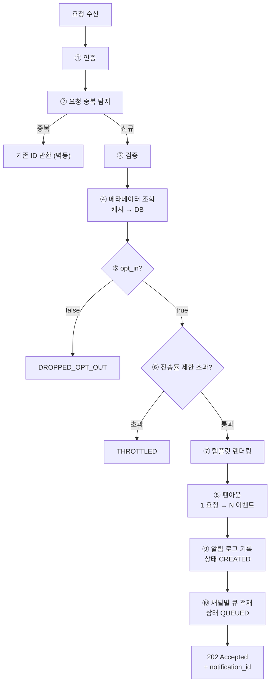
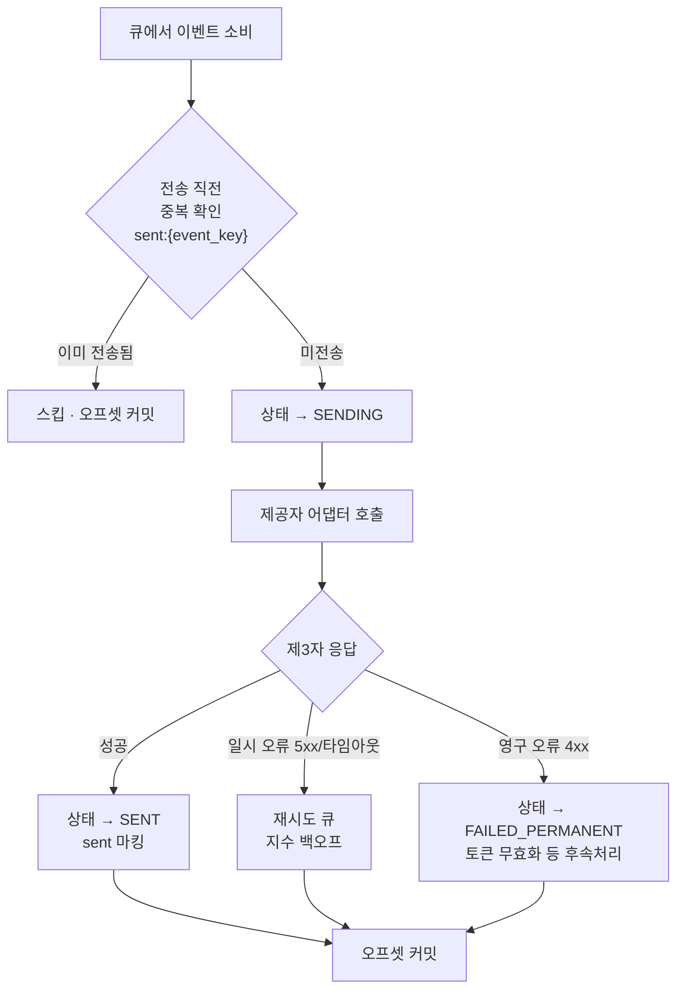
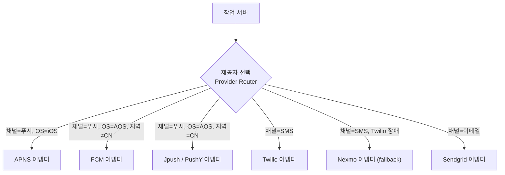
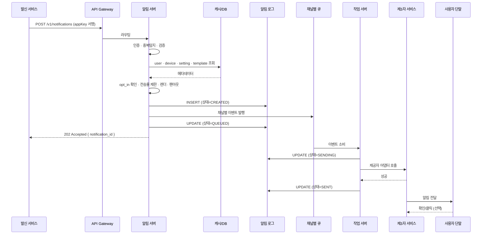

# 알림 시스템 (Notification System) 시스템 아키텍처 문서

> **문서 목적**: 요구사항 정의서를 기반으로 알림 시스템의 전체 구조, 각 컴포넌트의 역할과 상호작용, 기술 선택 근거를 정의한다.
> **참조 문서**: [`01-notification-requirements.md`](01-notification-requirements.md)
> **설계 원칙**: 접수와 전송의 분리 · 채널별 격리 · 무상태 수평 확장 · 제공자 추상화
> **참조 노트**: [정리노트 STEP 4](../정리노트/04_STEP4_개략설계_메시지큐_결합도제거.md)

---

## 1. 아키텍처 개요

### 1.1 설계 목표 요약

| 요구사항 | 아키텍처 결정 |
| --- | --- |
| 알림 무손실 (NFR-1) | 접수 즉시 **알림 로그 영속화** 후 202 반환, 이후 큐로 전달 |
| 연성 실시간 (NFR-3) | **접수(동기)와 전송(비동기)을 분리** — 제3자 응답을 API 경로에서 기다리지 않음 |
| 장애 격리 (NFR-5) | **채널별 메시지 큐 + 채널별 작업 서버 풀** |
| 수평 확장 (NFR-4) | 알림 서버·작업 서버 **무상태**, 상태는 전부 DB/캐시/큐에 |
| 제공자 확장성 (NFR-8) | **제공자 어댑터(Provider Adapter)** 계층 + 지역 기반 라우팅 |
| 다중 단말 (FR-2) | 알림 서버가 **팬아웃**해 단말 수만큼 이벤트 생성 |
| 중복 최소화 (NFR-2) | 알림 서버 진입 시 + 작업 서버 전송 직전 **2단 중복 탐지** |
| 관측성 (NFR-7) | 모든 상태 전이를 **이벤트로 발행** → 모니터링/분석 |

### 1.2 핵심 원칙 — "접수와 전송의 분리"

```text
[동기 구간]  호출 서비스 → 알림 서버 → (검증·설정확인·팬아웃·렌더·로그기록·큐적재) → 202 Accepted
                                                    ↕ 경계
[비동기 구간] 큐 → 작업 서버 → 제공자 어댑터 → 제3자 서비스 → 단말
```

| 구간 | 책임 | 실패 시 |
| --- | --- | --- |
| **동기 구간** | "이 알림을 책임지고 보내겠다"는 **접수 확약** | 4xx/5xx 반환. 호출자가 재시도 |
| **비동기 구간** | 실제 전달 시도 | **재시도 큐**로 회수. 호출자는 관여하지 않음 |

> ⚠️ 이 경계가 **연성 실시간 요구사항이 있어야만 성립**한다. 지연이 허용되지 않으면 큐를 둘 수 없다.

---

## 2. 전체 아키텍처 구성도

```text
┌──────────────────────────────────────────────────────────────────────┐
│                          발신 서비스 계층                              │
│   과금 서비스 · 쇼핑몰 · 마케팅 크론잡 · 보안 시스템 (Service 1~N)      │
└───────────────────────────────┬──────────────────────────────────────┘
                                │ POST /v1/notifications  (appKey/appSecret)
┌───────────────────────────────▼──────────────────────────────────────┐
│                        API Gateway / LB                              │
│              TLS 종료 · 라우팅 · 전역 처리율 제한                       │
└───────────────────────────────┬──────────────────────────────────────┘
                                │
┌───────────────────────────────▼──────────────────────────────────────┐
│                    알림 서버 (Notification Server) × N                 │
│                          [무상태 · 오토스케일]                          │
│  ① 인증        appKey/appSecret 검증                                   │
│  ② 요청 중복탐지 event_id 조회                                          │
│  ③ 검증        이메일/전화번호 형식, 페이로드 크기                       │
│  ④ 메타데이터 조회  user · device · notification_setting · template     │
│  ⑤ 설정 확인    opt_in == false → DROP                                 │
│  ⑥ 전송률 제한  사용자별 빈도 초과 → THROTTLED                          │
│  ⑦ 템플릿 렌더  [item_name] 치환 → 최종 본문                            │
│  ⑧ 팬아웃      1 요청 → 단말 수만큼 채널 이벤트 생성                     │
│  ⑨ 로그 기록    notification_log INSERT (상태=CREATED)                  │
│  ⑩ 큐 적재      채널별 토픽으로 발행 (상태=QUEUED)                       │
└────┬──────────────────┬──────────────────────────┬───────────────────┘
     │                  │                          │
┌────▼─────┐    ┌───────▼────────┐        ┌────────▼─────────────────────┐
│  캐시     │    │   메타데이터 DB  │        │       알림 로그 저장소         │
│ (Redis)  │    │   (MySQL)      │        │  (Cassandra / MySQL 샤딩)     │
│ user     │    │ user           │        │  notification_log             │
│ device   │    │ device         │        │  · 상태 전이 이력               │
│ setting  │    │ setting        │        │  · 재시도 횟수                  │
│ template │    │ template       │        │  · 30일 TTL → 아카이브          │
│ dedup    │    └────────────────┘        └───────────────────────────────┘
│ ratelimit│
└──────────┘
     │
┌────▼─────────────────────────────────────────────────────────────────┐
│                     메시지 큐 (Kafka) — 채널별 토픽                     │
│  notif.push.ios │ notif.push.android │ notif.sms │ notif.email        │
│  notif.retry.*  (지연 재시도)          │ notif.dlq.*  (최종 실패)       │
└────┬──────────────┬──────────────┬──────────────┬────────────────────┘
     │              │              │              │
┌────▼─────┐  ┌─────▼────┐  ┌──────▼───┐  ┌───────▼──┐
│작업 서버  │  │작업 서버  │  │작업 서버  │  │작업 서버  │
│ iOS 풀   │  │Android 풀│  │ SMS 풀   │  │Email 풀  │
└────┬─────┘  └─────┬────┘  └──────┬───┘  └───────┬──┘
     │              │              │              │
┌────▼──────────────▼──────────────▼──────────────▼────────────────────┐
│                     제공자 어댑터 (Provider Adapter)                    │
│      지역·비용·가용성 기반 제공자 선택 + 채널별 페이로드 변환             │
└────┬──────────────┬──────────────┬──────────────┬────────────────────┘
     │              │              │              │
 ┌───▼───┐    ┌─────▼────┐   ┌─────▼─────┐  ┌─────▼──────┐
 │ APNS  │    │FCM/Jpush │   │  Twilio   │  │  Sendgrid  │
 │       │    │  /PushY  │   │  /Nexmo   │  │ /Mailchimp │
 └───┬───┘    └─────┬────┘   └─────┬─────┘  └─────┬──────┘
     │              │              │              │
 ┌───▼───┐    ┌─────▼────┐   ┌─────▼─────┐  ┌─────▼──────┐
 │iOS단말 │    │AOS 단말   │   │ SMS 단말  │  │ 메일 수신함 │
 └───────┘    └──────────┘   └───────────┘  └────────────┘

        ┌──────────────────────────────────────────┐
        │  모니터링 · 이벤트 추적 (Prometheus/ELK/  │◄── 전 계층에서
        │  Analytics)  큐 적체 · 성공률 · 확인율     │    이벤트 발행
        └──────────────────────────────────────────┘
```

---

## 3. 계층별 컴포넌트 상세

### 3.1 발신 서비스 계층 (Service 1~N)

알림을 요청하는 주체다. **마이크로서비스**, **크론잡**, **분산 시스템 컴포넌트** 어느 형태든 가능하다.

**호출자가 알아야 하는 것**
- 발송 API 엔드포인트와 자신의 `appKey` / `appSecret`
- 대상 `user_id` (또는 `user_id` 배열)
- 사용할 템플릿 ID와 인자

**호출자가 알 필요 없는 것**
- 단말 토큰 · 전화번호 · 이메일 주소
- 어떤 제3자 서비스를 쓰는지
- 사용자가 몇 대의 단말을 갖고 있는지
- 재시도가 몇 번 일어났는지

> 핵심: 호출자는 **"누구에게, 무엇을"** 만 말한다. **"어디로, 어떻게"** 는 전적으로 알림 시스템의 책임이다.

---

### 3.2 API Gateway 계층

| 역할 | 설명 |
| --- | --- |
| TLS 종료 · 라우팅 | 표준 게이트웨이 기능 |
| **전역 처리율 제한** | 발신 서비스(appKey) 단위 호출량 제한 — 사용자별 제한과 구분됨 |
| 요청 크기 제한 | 대량 배치 요청의 상한 강제 |

> ⚠️ 여기서의 제한은 **"발신 서비스가 API를 얼마나 부르는가"**, [06 운영 설계](06-notification-operations.md)의 전송률 제한은 **"사용자가 알림을 얼마나 받는가"** 다. 두 개는 다른 축이다.

---

### 3.3 알림 서버 (Notification Server)

시스템의 **정책 집행 지점**이다. 무상태로 설계해 오토스케일한다.

#### 3.3.1 처리 파이프라인 10단계

| # | 단계 | 실패 시 처리 |
| :-: | --- | --- |
| ① | **인증** — appKey/appSecret(HMAC 서명) 검증 | `401 UNAUTHORIZED` |
| ② | **요청 중복 탐지** — `event_id` 기존 처리 여부 조회 | 기존 `notification_id`로 `200` 반환 (멱등) |
| ③ | **검증** — 이메일/전화번호 형식, 페이로드 크기, 템플릿 존재 | `400 INVALID_*` |
| ④ | **메타데이터 조회** — user · device · setting · template (캐시 우선) | 캐시 미스 시 DB, 사용자 없으면 `404` |
| ⑤ | **수신 설정 확인** — `opt_in == false`인 채널 제외 | 전 채널 제외 시 상태 `DROPPED_OPT_OUT`으로 기록 후 `202` |
| ⑥ | **전송률 제한** — 사용자별 빈도 초과 여부 | 상태 `THROTTLED`로 기록 후 `202` (또는 `429` 정책 선택) |
| ⑦ | **템플릿 렌더링** — 인자 치환, 채널별 표현 생성 | `400 TEMPLATE_RENDER_FAILED` |
| ⑧ | **팬아웃** — 사용자의 활성 단말 수만큼 채널 이벤트 생성 | 대상 0건이면 `DROPPED_NO_TARGET` |
| ⑨ | **로그 기록** — `notification_log` INSERT (상태 `CREATED`) | `500` — **큐 적재 전에 반드시 성공해야 함** |
| ⑩ | **큐 적재** — 채널별 토픽 발행, 상태 `QUEUED`로 갱신 | 실패 시 로그 상태 `CREATED` 유지 → **복구 배치가 재적재** |



> ⚠️ **⑨ → ⑩ 순서가 핵심이다.** 로그를 먼저 남기고 큐에 넣는다.
> 반대로 하면 큐 적재 성공 + 로그 실패 시 **추적 불가능한 알림**이 생긴다.
> ⑩이 실패하고 ⑨만 성공한 경우는 `CREATED` 상태로 남으므로 **복구 배치가 주워 담을 수 있다.** (자세한 내용은 [05 안정성 설계](05-notification-reliability.md))

#### 3.3.2 팬아웃 규칙

| 채널 | 대상 산출 | 이벤트 수 |
| --- | --- | ---: |
| 푸시 | `device` 테이블에서 해당 user의 **활성 단말** 전체 | N (평균 2) |
| SMS | `user.country_code` + `user.phone_number` | 1 |
| 이메일 | `user.email` | 1 |

> 팬아웃을 **알림 서버**에서 수행하는 이유: 작업 서버는 "이벤트 1건 = 전송 1회"라는 단순 계약만 갖게 되어, 재시도·중복 탐지·상태 추적 단위가 명확해진다.

---

### 3.4 캐시 계층 (Redis)

| 캐시 키 | 내용 | TTL | 목적 |
| --- | --- | --- | --- |
| `user:{user_id}` | email, phone, country_code | 1h | 매 건 DB 조회 회피 |
| `device:{user_id}` | 활성 단말 토큰 목록 | 1h | 팬아웃 대상 |
| `setting:{user_id}` | 채널별 `opt_in` | 10m | 발송 전 필수 확인 |
| `template:{template_id}:{version}` | 템플릿 본문·CTA | 24h | 렌더링 |
| `dedup:{event_id}` | 처리된 event_id → notification_id | 24h | 요청 중복 탐지 |
| `rate:{user_id}:{window}` | 사용자별 발송 카운터 | 윈도우 길이 | 전송률 제한 |

**무효화 전략**

| 이벤트 | 무효화 대상 |
| --- | --- |
| 사용자 프로필 변경 | `user:{user_id}` |
| 단말 등록/해제/로그아웃 | `device:{user_id}` |
| 수신 설정 변경 | `setting:{user_id}` (**TTL을 10분으로 짧게 둔 이유**) |
| 템플릿 수정 | 버전을 올려 새 키 사용 (기존 키는 자연 만료) |

> ⚠️ `setting` TTL이 가장 짧다. **사용자가 알림을 껐는데 캐시 때문에 계속 오는 것**은 신뢰를 직접 훼손하기 때문이다.
> 더 엄격히 가려면 설정 변경 시 **즉시 무효화(write-through)** 를 병행한다.

---

### 3.5 메타데이터 DB (MySQL)

| 테이블 | 성격 | 규모 |
| --- | --- | --- |
| `user` | 읽기 위주, 갱신 드묾 | 활성 1,000만 |
| `device` | 읽기 위주, 로그인 시 갱신 | 2,000만 |
| `notification_setting` | 읽기 위주 | 3,000만 (사용자 × 채널) |
| `notification_template` | 거의 읽기 전용 | 수천 |

- 읽기 부하는 **캐시 + 리드 레플리카**로 흡수한다.
- 상세 스키마는 [03 데이터 모델](03-notification-data-model.md) 참조.

---

### 3.6 알림 로그 저장소

| 항목 | 결정 |
| --- | --- |
| **성격** | **쓰기 집약** — 이벤트당 1 INSERT + 수 회 UPDATE, 일 2,600만 건 |
| **후보** | Cassandra(쓰기 최적화 LSM) vs MySQL 샤딩 |
| **선택** | **Cassandra** (또는 동급 와이드 컬럼 저장소) |
| **근거** | ① 쓰기 처리량 ② 시간 기반 TTL 내장 ③ 노드 추가로 선형 확장 ④ 로그는 조인이 필요 없음 |
| **대안 허용** | 초기 트래픽 구간(일 100만 건 이하)에서는 **MySQL 파티셔닝**으로 시작해도 무방 |

> 🏢 6장 키-값 저장소에서 다룬 **LSM 트리 / 안정 해시 / 정족수**가 그대로 적용되는 지점이다.

---

### 3.7 메시지 큐 계층

#### 3.7.1 기술 선택

| 후보 | 장점 | 단점 | 판단 |
| --- | --- | --- | --- |
| **Kafka** | 높은 처리량, **재생(replay)** 가능, 파티션 단위 순서 보장, 소비자 그룹으로 수평 확장 | 지연 메시지 네이티브 미지원 | ✅ **채택** |
| RabbitMQ | 유연한 라우팅, **지연 큐 플러그인** 내장 | 대용량 적체 시 성능 저하 | 재시도 지연 큐 용도로 병용 검토 |
| SQS | 운영 부담 최소 | 벤더 종속, 순서/재생 제약 | 클라우드 전제 시 대안 |

> **결정**: 주 파이프라인은 **Kafka**. 재시도의 **지연(delay)** 은 Kafka가 직접 지원하지 않으므로
> ① 지연 시간대별 토픽(`retry.5s` / `retry.1m` / `retry.10m`) 또는 ② 별도 스케줄러 테이블로 구현한다. ([05 안정성 설계](05-notification-reliability.md))

#### 3.7.2 토픽 구성

| 토픽 | 파티션 키 | 용도 |
| --- | --- | --- |
| `notif.push.ios` | `user_id` | iOS 푸시 이벤트 |
| `notif.push.android` | `user_id` | 안드로이드 푸시 이벤트 |
| `notif.sms` | `user_id` | SMS 이벤트 |
| `notif.email` | `user_id` | 이메일 이벤트 |
| `notif.retry.{5s,1m,10m,1h}` | `user_id` | 지연 재시도 |
| `notif.dlq.{channel}` | `user_id` | 최종 실패 (수동 개입 대상) |
| `notif.tracking` | `notification_id` | 상태 전이 이벤트 (모니터링·분석용) |

**파티션 키를 `user_id`로 두는 이유**
- 같은 사용자에게 가는 알림이 **같은 파티션 = 순서 보장**된다.
- 전송률 제한·중복 탐지가 사용자 단위이므로 **핫 사용자 처리가 한 컨슈머에 모인다**.
- ⚠️ 대량 발송 사용자가 있으면 **파티션 편중(hot partition)** 이 생길 수 있다 → 모니터링 대상.

#### 3.7.3 왜 채널별로 나누는가

| 구조 | SMS 제3자 장애 시 |
| --- | --- |
| 단일 큐 | ❌ SMS 메시지가 앞을 막아 **푸시·이메일까지 지연** (head-of-line blocking) |
| **채널별 큐** ✅ | ✅ SMS 토픽만 적체. **푸시·이메일 정상 발송** |

| 이득 | 설명 |
| --- | --- |
| **장애 격리** | 제3자 하나가 죽어도 나머지 채널은 산다 (NFR-5) |
| **독립 확장** | 푸시 2,000만 vs SMS 100만 → **작업 서버 수를 채널별로 다르게** |
| **병렬 처리** | 채널 간 완전 병렬 |
| **차등 정책** | 채널마다 재시도 횟수·타임아웃을 다르게 설정 |

---

### 3.8 작업 서버 (Worker)

채널별로 **독립된 소비자 그룹**을 구성한다.

| 항목 | 내용 |
| --- | --- |
| **책임** | 큐에서 이벤트 소비 → 전송 직전 중복 확인 → 제공자 어댑터 호출 → 결과에 따라 상태 갱신 |
| **상태** | 무상태. 오프셋은 Kafka가, 알림 상태는 로그 저장소가 보관 |
| **동시성** | 이벤트당 I/O 대기가 지배적 → **비동기 I/O 또는 큰 스레드 풀** |
| **커밋 정책** | **처리 완료 후 커밋**(at-least-once). 중간에 죽으면 재처리 → 중복 탐지가 흡수 |

#### 작업 서버 처리 흐름



#### 채널별 작업 서버 사이징 (가이드)

| 채널 | 일 이벤트 | 평균 QPS | 제3자 평균 지연 | 필요 동시성(≈) | 권장 인스턴스 |
| --- | ---: | ---: | ---: | ---: | ---: |
| iOS 푸시 | 10,000,000 | 116 | 50ms | 6 | 3 |
| AOS 푸시 | 10,000,000 | 116 | 50ms | 6 | 3 |
| SMS | 1,000,000 | 12 | 300ms | 4 | 2 |
| 이메일 | 5,000,000 | 58 | 500ms | 29 | 4 |

> 계산: `필요 동시성 = peak QPS × 평균 지연(초)`. 피크 계수 2와 여유율 2배를 더해 인스턴스 수를 잡는다.
> 실제 값은 제3자 SLA와 부하 테스트로 보정한다.

---

### 3.9 제공자 어댑터 (Provider Adapter)

**"채널"과 "제공자"를 분리**하는 계층이다. NFR-8(확장성)의 핵심.



#### 어댑터 공통 인터페이스

```text
interface ProviderAdapter {
    boolean supports(Channel channel, Region region)
    Payload  buildPayload(NotificationEvent event)   // 채널별 페이로드 변환
    SendResult send(Payload payload)                 // SENT / RETRIABLE / PERMANENT_FAIL
    int      maxRetries()
    Duration timeout()
}
```

#### 제공자 선택 규칙

| 조건 | 선택 |
| --- | --- |
| 채널=푸시, 단말 OS=iOS | **APNS** |
| 채널=푸시, OS=Android, 지역 ≠ CN | **FCM** |
| 채널=푸시, OS=Android, 지역 = CN | **Jpush / PushY** — ⚠️ **FCM은 중국에서 사용 불가** |
| 채널=SMS | **Twilio** (기본) → 장애 시 **Nexmo** 폴백 |
| 채널=이메일 | **Sendgrid** (기본) → 장애 시 **Mailchimp** 폴백 |

> 핵심: `if (channel == PUSH) callFCM()` 같은 **하드코딩 금지**.
> 제공자 추가는 **어댑터 클래스 하나 + 라우팅 규칙 한 줄**로 끝나야 한다.

#### 서킷 브레이커

| 상태 | 조건 | 동작 |
| --- | --- | --- |
| **Closed** | 정상 | 그대로 호출 |
| **Open** | 최근 1분 실패율 > 50% | 즉시 재시도 큐로 (제3자 호출 안 함), 폴백 제공자 시도 |
| **Half-Open** | Open 후 30초 경과 | 소수 요청만 통과시켜 회복 확인 |

> 제3자가 죽었을 때 **계속 때리는 것이 회복을 늦춘다**. 큐가 버퍼 역할을 하므로 잠시 멈춰도 알림은 소실되지 않는다.

---

### 3.10 모니터링 · 이벤트 추적 계층

모든 상태 전이는 `notif.tracking` 토픽으로 발행되어 두 곳으로 흘러간다.

| 소비자 | 용도 |
| --- | --- |
| **메트릭 수집기** (Prometheus 등) | 큐 적체, 채널별 성공률, 단계별 지연 → 경보 |
| **분석 서비스** (Analytics) | 확인율·클릭률·앱 사용 전환율 → 프로덕트 지표 |

상세는 [06 운영 설계](06-notification-operations.md) 참조.

---

## 4. 전체 요청 흐름 (End-to-End)



### 4.1 단계별 지연 예산 (P95 5초 목표 배분)

| 구간 | 예산 |
| --- | ---: |
| Gateway + 인증 | 10ms |
| 메타데이터 조회 (캐시 히트) | 5ms |
| 렌더 + 팬아웃 | 10ms |
| 알림 로그 INSERT | 20ms |
| 큐 발행 | 10ms |
| **→ API 응답까지 소계** | **≈ 55ms** (목표 P99 200ms 내) |
| 큐 대기 | 200ms |
| 작업 서버 처리 + 제3자 호출 | 500ms |
| **→ 전송 완료까지 총계** | **≈ 0.8초** (목표 P95 5초 내, 여유 충분) |

---

## 5. 주요 설계 결정과 근거

| # | 결정 | 대안 | 채택 근거 |
| :-: | --- | --- | --- |
| 1 | **접수와 전송 분리 (202 Accepted)** | 동기 전송 후 200 | 제3자 응답 대기가 API를 막지 않음. 연성 실시간 요구사항이 허용 |
| 2 | **알림 로그 기록 후 큐 적재** | 큐 적재 후 로그 | 큐만 성공하면 **추적 불가 알림**이 생김. 무손실(NFR-1) 우선 |
| 3 | **채널별 큐 분리** | 단일 큐 + 라우팅 키 | 장애 격리 · 독립 확장 · 차등 정책 (NFR-5) |
| 4 | **팬아웃을 알림 서버에서** | 작업 서버에서 | 작업 서버 계약을 "이벤트 1건 = 전송 1회"로 단순화 → 재시도·추적 단위 명확 |
| 5 | **템플릿 렌더링을 알림 서버에서** | 작업 서버에서 | 렌더 결과를 로그에 남겨 **"무엇이 발송됐는가"** 재현 가능 |
| 6 | **Kafka + `user_id` 파티션 키** | RabbitMQ / SQS | 처리량·재생·사용자 단위 순서 보장 |
| 7 | **제공자 어댑터 계층** | 채널별 직접 호출 | FCM 중국 미지원 등 **지역별 제공자 교체** 필요 (NFR-8) |
| 8 | **알림 로그를 Cassandra로** | MySQL 단일 | 일 2,600만 건 쓰기 + TTL + 선형 확장 |
| 9 | **2단 중복 탐지** | 단일 지점 | 진입 시 = 호출자 재시도 중복 / 전송 직전 = 작업 서버 재처리 중복 (원인이 다름) |
| 10 | **서킷 브레이커 + 폴백 제공자** | 무한 재시도 | 제3자 회복 지연 방지, 큐가 버퍼 역할을 하므로 안전 |

---

## 6. 확장 및 장애 시나리오

| 시나리오 | 시스템 동작 | 사용자 영향 |
| --- | --- | --- |
| **알림 서버 1대 다운** | LB가 제외, 오토스케일이 대체 인스턴스 기동 | 없음 |
| **전체 알림 서버 다운** | 발신 서비스가 5xx 수신 → 자체 재시도 | 알림 지연 |
| **Kafka 브로커 1대 다운** | 복제 파티션이 리더 승계 | 없음 |
| **작업 서버 처리 지연** | 큐 적체 증가 → **경보 발생 → 작업 서버 증설** | 알림 지연 |
| **Twilio 장애** | 서킷 오픈 → Nexmo 폴백, 실패분은 재시도 큐 | SMS만 지연, 푸시·이메일 정상 |
| **FCM 중국 접근 불가** | 제공자 라우터가 Jpush 선택 | 없음 |
| **Redis 캐시 다운** | DB 직접 조회로 폴백 (성능 저하 감수) | 지연 증가 |
| **알림 로그 저장소 다운** | ⚠️ **접수 거부(503)** — 무손실 보장 불가 상태이므로 받지 않는다 | 발송 중단 |
| **큐 적재만 실패 (로그는 성공)** | 상태 `CREATED` 잔류 → **복구 배치가 재적재** | 알림 지연 |

> ⚠️ 알림 로그 저장소 다운 시 **fail-close(접수 거부)** 를 택했다.
> "받아놓고 잃어버리는 것"보다 **"못 받겠다고 명확히 말하는 것"** 이 낫다는 판단이며, 이는 NFR-1의 직접적 귀결이다.

---

## 7. 컴포넌트 ↔ 요구사항 매핑

| 컴포넌트 | 충족하는 요구사항 |
| --- | --- |
| 알림 서버 파이프라인 ①~③ | NFR-6 보안, NFR-2 중복 최소화 |
| 알림 서버 파이프라인 ④~⑧ | FR-1 다채널, FR-2 팬아웃, FR-3 opt-out, FR-4 템플릿, FR-7 전송률 제한 |
| 알림 로그 저장소 | NFR-1 무손실, FR-5 상태 조회 |
| 채널별 메시지 큐 | NFR-3 연성 실시간, NFR-4 확장, NFR-5 격리 |
| 작업 서버 풀 | NFR-4 확장 |
| 제공자 어댑터 | NFR-8 확장성 |
| 재시도 큐 · DLQ | FR-6 재시도, NFR-1 무손실 |
| 모니터링 · 추적 | NFR-7 관측성, FR-8 이벤트 추적 |

---

➡️ 다음: [03 데이터 모델](03-notification-data-model.md)
