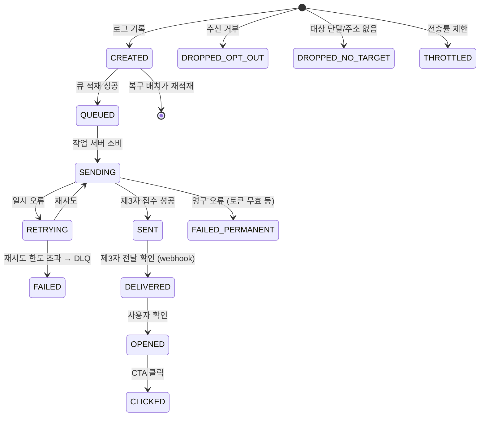

# 알림 시스템 (Notification System) 데이터 모델 문서

> **문서 목적**: 알림 시스템이 사용하는 모든 저장소의 스키마, 저장소 선택 근거, 접근 패턴, 수명주기 정책을 정의한다.
> **참조 문서**: [`01-notification-requirements.md`](01-notification-requirements.md), [`02-notification-architecture.md`](02-notification-architecture.md)
> **참조 노트**: [정리노트 STEP 3](../정리노트/03_STEP3_연락처정보수집_데이터모델.md)

---

## 1. 데이터 모델 개요

### 1.1 저장소 배치

알림 시스템의 데이터는 **성격이 완전히 다른 세 덩어리**로 나뉜다. 하나의 저장소에 몰아넣으면 안 된다.

| 덩어리 | 성격 | 저장소 | 근거 |
| --- | --- | --- | --- |
| **메타데이터** (user, device, setting, template) | 읽기 집약, 갱신 드묾, 관계형 | **MySQL** (+ 리드 레플리카) | 정합성 중요, 규모 작음, 조인 필요 |
| **알림 로그** (notification_log) | **쓰기 집약**, 일 2,600만 건, 조인 불필요 | **Cassandra** | LSM 기반 쓰기 최적화, TTL 내장, 선형 확장 |
| **휘발성 상태** (dedup, rate limit, cache) | 초고빈도 읽기·쓰기, 만료 필요 | **Redis** | 인메모리 속도 + TTL |

```text
┌──────────────────────┐   ┌──────────────────────┐   ┌──────────────────────┐
│      MySQL           │   │     Cassandra        │   │       Redis          │
│  (메타데이터)         │   │   (알림 로그)         │   │   (휘발성 상태)       │
├──────────────────────┤   ├──────────────────────┤   ├──────────────────────┤
│ user                 │   │ notification_log     │   │ user:{id}            │
│ device               │   │ notification_by_user │   │ device:{user_id}     │
│ notification_setting │   │ tracking_event       │   │ setting:{user_id}    │
│ notification_template│   │                      │   │ template:{id}:{ver}  │
│ provider_config      │   │                      │   │ dedup:{event_id}     │
│                      │   │                      │   │ sent:{event_key}     │
│                      │   │                      │   │ rate:{user}:{window} │
└──────────────────────┘   └──────────────────────┘   └──────────────────────┘
    수천만 행                  일 2,600만 건 · 30일 TTL       ~10GB · 전부 TTL
```

### 1.2 ER 개요

```mermaid
erDiagram
    user ||--o{ device : "1:N 보유"
    user ||--o{ notification_setting : "1:N 채널별"
    user ||--o{ notification_log : "1:N 수신 이력"
    notification_template ||--o{ notification_log : "렌더 원본"
    notification_log ||--o{ tracking_event : "1:N 상태 전이"

    user {
        bigint id PK
        varchar email
        int country_code
        varchar phone_number
    }
    device {
        bigint id PK
        bigint user_id FK
        varchar device_token
        varchar platform
    }
    notification_setting {
        bigint user_id PK_FK
        varchar channel PK
        boolean opt_in
    }
    notification_log {
        uuid notification_id PK
        bigint user_id
        varchar channel
        varchar status
    }
```

---

## 2. 메타데이터 스키마 (MySQL)

### 2.1 `user` — 사용자 연락처

```sql
CREATE TABLE user (
    id                BIGINT       NOT NULL AUTO_INCREMENT,
    email             VARCHAR(255) NULL,
    country_code      SMALLINT     NULL COMMENT '국가 번호 (예: 82)',
    phone_number      VARCHAR(20)  NULL COMMENT 'E.164 국번 제외 부분',
    locale            VARCHAR(10)  NOT NULL DEFAULT 'ko-KR',
    region            VARCHAR(4)   NOT NULL DEFAULT 'KR' COMMENT '제공자 라우팅용',
    timezone          VARCHAR(40)  NOT NULL DEFAULT 'Asia/Seoul',
    created_at        TIMESTAMP    NOT NULL DEFAULT CURRENT_TIMESTAMP,
    last_logged_in_at TIMESTAMP    NULL,
    PRIMARY KEY (id),
    UNIQUE KEY uk_email (email),
    KEY idx_phone (country_code, phone_number)
) ENGINE=InnoDB;
```

| 컬럼 | 용도 | 비고 |
| --- | --- | --- |
| `email` | **이메일 채널** 수신 주소 | NULL 허용 — 이메일 미등록 사용자 존재 가능 |
| `country_code` + `phone_number` | **SMS 채널** 수신 번호 | 원문은 `phone_number`를 integer로 두었으나 **선행 0 소실·자리수 초과** 문제로 `VARCHAR` 채택 |
| `locale` | 템플릿 다국어 선택 | 렌더링 시 사용 |
| `region` | **제공자 라우팅** (FCM vs Jpush) | ⚠️ 원문에 없는 추가 컬럼. NFR-8을 위해 필요 |
| `timezone` | 야간 발송 억제(quiet hours) | 운영 정책용 |

> ⚠️ **설계 판단**: 원문의 `phone_number integer`를 **`VARCHAR(20)`으로 변경**했다.
> 국제 전화번호는 선행 0이 유효하고 15자리까지 가능해 정수형으로는 손실이 발생한다.

### 2.2 `device` — 단말

```sql
CREATE TABLE device (
    id                BIGINT       NOT NULL AUTO_INCREMENT,
    user_id           BIGINT       NOT NULL,
    device_token      VARCHAR(512) NOT NULL COMMENT 'APNS/FCM 단말 토큰',
    platform          ENUM('IOS','ANDROID','WEB') NOT NULL,
    app_version       VARCHAR(20)  NULL,
    is_active         BOOLEAN      NOT NULL DEFAULT TRUE,
    created_at        TIMESTAMP    NOT NULL DEFAULT CURRENT_TIMESTAMP,
    last_logged_in_at TIMESTAMP    NULL,
    PRIMARY KEY (id),
    UNIQUE KEY uk_token (device_token),
    KEY idx_user_active (user_id, is_active)
) ENGINE=InnoDB;
```

#### 왜 `user`가 아닌 별도 테이블인가

> **한 사용자가 여러 단말을 가질 수 있고, 알림은 모든 단말에 전송되어야 한다.**

| `device_token`을 `user`에 넣으면 | 결과 |
| --- | --- |
| 사용자당 토큰 1개 | ❌ FR-2(다중 단말 팬아웃) 위반 |
| 새 단말 로그인 시 덮어쓰기 | ❌ 기존 단말은 알림을 못 받음 |

✅ 따라서 **`user : device = 1 : N`**.

#### 추가 컬럼의 이유

| 컬럼 | 왜 필요한가 |
| --- | --- |
| `platform` | 푸시 이벤트를 **iOS 토픽 / Android 토픽** 중 어디로 보낼지 결정 |
| `is_active` | 로그아웃·앱 삭제·**토큰 무효(410 Gone)** 시 비활성화. 물리 삭제 대신 소프트 삭제 |
| `uk_token` | 같은 토큰이 다른 사용자에게 재할당될 수 있음 → 유니크 제약으로 오배송 방지 |

> 🔁 **토큰 무효화 루프**: APNS/FCM이 `410 Gone`·`InvalidRegistration`을 반환하면
> 작업 서버가 해당 `device_token`의 `is_active`를 `FALSE`로 갱신한다. ([05 안정성 설계](05-notification-reliability.md))

### 2.3 `notification_setting` — 수신 설정

```sql
CREATE TABLE notification_setting (
    user_id    BIGINT NOT NULL,
    channel    ENUM('PUSH','SMS','EMAIL') NOT NULL,
    category   VARCHAR(40) NOT NULL DEFAULT 'ALL'
               COMMENT '알림 종류: MARKETING / TRANSACTIONAL / SECURITY / ALL',
    opt_in     BOOLEAN NOT NULL DEFAULT TRUE,
    updated_at TIMESTAMP NOT NULL DEFAULT CURRENT_TIMESTAMP ON UPDATE CURRENT_TIMESTAMP,
    PRIMARY KEY (user_id, channel, category)
) ENGINE=InnoDB;
```

| 원문 스키마 | 본 설계 | 변경 이유 |
| --- | --- | --- |
| `user_id`, `channel`, `opt_in` | + `category` | 채널 단위만으로는 **"결제 확인은 받고 마케팅은 끄겠다"** 를 표현할 수 없다 |

#### 설정 조회 규칙 (우선순위)

```text
1. (user_id, channel, category)  정확 일치 행이 있으면 그 값 사용
2. 없으면 (user_id, channel, 'ALL') 행 사용
3. 그것도 없으면 기본값 적용
```

| 카테고리 | 기본값 | 근거 |
| --- | :---: | --- |
| `SECURITY` | **강제 발송** (설정 무시) | 새 기기 로그인 등 안전 관련 통지는 거부 대상이 아님 |
| `TRANSACTIONAL` | `opt_in = true` | 결제·배송은 사용자가 기대하는 알림 |
| `MARKETING` | `opt_in = false` (**명시적 동의 필요**) | 규제 및 사용자 피로 |

> ⚠️ **발송 직전 반드시 이 테이블을 확인**해야 한다. 이것이 FR-3의 실행 지점이다.
> 캐시 TTL을 10분으로 짧게 둔 이유도 여기 있다 — **껐는데 계속 오는 것**이 가장 나쁜 실패다.

### 2.4 `notification_template` — 알림 템플릿

```sql
CREATE TABLE notification_template (
    id          VARCHAR(64)  NOT NULL COMMENT '예: ITEM_RESTOCK',
    version     INT          NOT NULL,
    channel     ENUM('PUSH','SMS','EMAIL') NOT NULL,
    locale      VARCHAR(10)  NOT NULL DEFAULT 'ko-KR',
    title       VARCHAR(200) NULL COMMENT 'CTA (Call to Action)',
    body        TEXT         NOT NULL,
    content_type ENUM('text/plain','text/html') NOT NULL DEFAULT 'text/plain',
    tracking_link_base VARCHAR(255) NULL,
    required_params JSON     NOT NULL COMMENT '["item_name","date"]',
    category    VARCHAR(40)  NOT NULL DEFAULT 'ALL',
    is_active   BOOLEAN      NOT NULL DEFAULT TRUE,
    created_at  TIMESTAMP    NOT NULL DEFAULT CURRENT_TIMESTAMP,
    PRIMARY KEY (id, version, channel, locale)
) ENGINE=InnoDB;
```

#### 템플릿 예시 (원문)

| 필드 | 값 |
| --- | --- |
| `id` | `ITEM_RESTOCK` |
| `body` | `여러분이 꿈꿔온 그 상품을 우리가 준비했습니다. [item_name]이 다시 입고되었습니다! [date]까지만 주문 가능합니다!` |
| `title` (CTA) | `지금 [item_name]을 주문 또는 예약하세요!` |
| `required_params` | `["item_name", "date"]` |

#### 버저닝을 두는 이유

| 문제 | 해결 |
| --- | --- |
| 템플릿을 수정하면 캐시된 구버전과 섞임 | `version`을 올려 **새 캐시 키** 사용 |
| "3개월 전 보낸 알림 내용이 뭐였나" | 로그에 `template_id + version` 저장 → **재현 가능** |
| 잘못된 템플릿 배포 | 이전 버전으로 즉시 롤백 |

#### 렌더링 계약

```text
render(template, params) →
    1. required_params 전부 존재하는지 검증 (누락 시 TEMPLATE_RENDER_FAILED)
    2. [key] 패턴을 params[key]로 치환
    3. 치환값은 채널별 이스케이프 (HTML 이메일은 HTML 이스케이프)
    4. tracking_link_base가 있으면 notification_id를 붙여 추적 링크 생성
```

> ⚠️ **치환값 이스케이프는 필수다.** 사용자 입력이 인자로 들어오면 HTML 이메일에서 인젝션이 된다.

### 2.5 `provider_config` — 제공자 라우팅 설정

```sql
CREATE TABLE provider_config (
    id          INT AUTO_INCREMENT,
    channel     ENUM('PUSH','SMS','EMAIL') NOT NULL,
    platform    ENUM('IOS','ANDROID','WEB','ANY') NOT NULL DEFAULT 'ANY',
    region      VARCHAR(4)  NOT NULL DEFAULT 'ANY' COMMENT 'KR / CN / US / ANY',
    provider    VARCHAR(40) NOT NULL COMMENT 'APNS / FCM / JPUSH / TWILIO / SENDGRID',
    priority    INT         NOT NULL DEFAULT 1 COMMENT '낮을수록 우선. 폴백 순서',
    is_enabled  BOOLEAN     NOT NULL DEFAULT TRUE,
    PRIMARY KEY (id),
    KEY idx_route (channel, platform, region, priority)
) ENGINE=InnoDB;
```

#### 기본 라우팅 데이터

| channel | platform | region | provider | priority |
| --- | --- | --- | --- | :---: |
| PUSH | IOS | ANY | APNS | 1 |
| PUSH | ANDROID | CN | **JPUSH** | 1 |
| PUSH | ANDROID | CN | PUSHY | 2 |
| PUSH | ANDROID | ANY | **FCM** | 1 |
| SMS | ANY | ANY | TWILIO | 1 |
| SMS | ANY | ANY | NEXMO | 2 |
| EMAIL | ANY | ANY | SENDGRID | 1 |
| EMAIL | ANY | ANY | MAILCHIMP | 2 |

> ⚠️ 이 테이블이 **NFR-8(확장성)의 실체**다. **FCM은 중국에서 사용할 수 없으므로**
> 제공자를 코드가 아니라 **데이터로** 관리해 무중단 교체가 가능하게 한다.

---

## 3. 알림 로그 스키마 (Cassandra)

### 3.1 `notification_log` — 알림 단건 (조회: notification_id)

```cql
CREATE TABLE notification_log (
    notification_id   uuid,
    event_id          text,        -- 호출자가 준 멱등 키
    user_id           bigint,
    channel           text,        -- PUSH / SMS / EMAIL
    platform          text,        -- IOS / ANDROID / WEB / null
    target            text,        -- device_token / phone / email (마스킹 저장)
    provider          text,        -- APNS / FCM / TWILIO ...
    template_id       text,
    template_version  int,
    rendered_title    text,
    rendered_body     text,
    status            text,        -- 상태 머신 참조
    retry_count       int,
    last_error_code   text,
    created_at        timestamp,
    updated_at        timestamp,
    PRIMARY KEY (notification_id)
) WITH default_time_to_live = 2592000;   -- 30일
```

### 3.2 `notification_by_user` — 사용자별 이력 (조회: user_id + 기간)

```cql
CREATE TABLE notification_by_user (
    user_id         bigint,
    bucket          text,        -- 'yyyy-MM' 파티션 분산용
    created_at      timestamp,
    notification_id uuid,
    channel         text,
    status          text,
    template_id     text,
    PRIMARY KEY ((user_id, bucket), created_at, notification_id)
) WITH CLUSTERING ORDER BY (created_at DESC)
  AND default_time_to_live = 2592000;
```

| 설계 요소 | 이유 |
| --- | --- |
| **파티션 키에 `bucket` 포함** | `user_id`만 쓰면 헤비 유저의 파티션이 무한 성장 → 월 단위로 분할 |
| **`created_at DESC` 클러스터링** | "최근 알림부터" 가 지배적 조회 패턴 |
| **비정규화 (같은 데이터 2벌)** | Cassandra는 조인이 없으므로 **조회 패턴마다 테이블을 만든다** |

### 3.3 `tracking_event` — 상태 전이 이력

```cql
CREATE TABLE tracking_event (
    notification_id uuid,
    occurred_at     timestamp,
    event_type      text,     -- CREATED/QUEUED/SENDING/SENT/DELIVERED/OPENED/CLICKED/FAILED
    detail          text,     -- 에러 코드, 제공자 응답 요약
    PRIMARY KEY (notification_id, occurred_at)
) WITH CLUSTERING ORDER BY (occurred_at ASC)
  AND default_time_to_live = 2592000;
```

### 3.4 알림 상태 머신



| 상태 | 의미 | 재시도 대상 |
| --- | --- | :---: |
| `CREATED` | 로그는 남았으나 큐 적재 미확인 | ✅ 복구 배치 |
| `QUEUED` | 큐 적재 완료 | — |
| `SENDING` | 작업 서버가 제3자 호출 중 | — |
| `SENT` | 제3자가 **접수**함 (전달 완료 아님) | — |
| `RETRYING` | 일시 오류로 재시도 대기 | ✅ |
| `DELIVERED` | 제3자가 **전달 확인** 회신 | — |
| `OPENED` / `CLICKED` | 사용자 상호작용 | — |
| `FAILED` | 재시도 한도 초과 → DLQ | ⚠️ 수동 |
| `FAILED_PERMANENT` | 토큰 무효 등 재시도 무의미 | ❌ |
| `DROPPED_OPT_OUT` | 수신 거부로 미발송 | ❌ |
| `DROPPED_NO_TARGET` | 발송 대상 없음 | ❌ |
| `THROTTLED` | 전송률 제한으로 미발송 | ❌ |

> ⚠️ **`SENT` ≠ `DELIVERED`.** `SENT`는 "제3자가 받아줬다", `DELIVERED`는 "단말에 도달했다"이다.
> 우리 통제 경계는 `SENT`까지이며, `DELIVERED` 이후는 제3자 webhook으로만 알 수 있다.

---

## 4. 휘발성 상태 (Redis)

| 키 패턴 | 자료형 | 값 | TTL | 용도 |
| --- | --- | --- | --- | --- |
| `user:{user_id}` | Hash | email, phone, region, locale | 1h | 메타데이터 캐시 |
| `device:{user_id}` | List/Set | 활성 device_token 목록 | 1h | 팬아웃 대상 |
| `setting:{user_id}` | Hash | `{channel}:{category}` → opt_in | **10m** | 수신 설정 |
| `template:{id}:{ver}:{ch}:{loc}` | String | 렌더 원본 | 24h | 템플릿 |
| `dedup:{event_id}` | String | notification_id | **24h** | **요청 중복 탐지** |
| `sent:{notification_id}` | String | `1` | **24h** | **전송 직전 중복 탐지** |
| `rate:{user_id}:{category}:{window}` | String(카운터) | 발송 횟수 | 윈도우 길이 | 전송률 제한 |

### 4.1 용량 산정

| 키 | 건수 | 건당 | 소계 |
| --- | ---: | ---: | ---: |
| `dedup` | 1,600만/일 | ~100B | **1.6 GB** |
| `sent` | 2,600만/일 | ~80B | **2.1 GB** |
| `user` + `device` + `setting` | 활성 1,000만 | ~300B | **3.0 GB** |
| `rate` | 활성 1,000만 | ~50B | **0.5 GB** |
| `template` | 수천 | ~2KB | 무시 가능 |
| **합계** | | | **≈ 7.2 GB** |

> Redis 단일 인스턴스(메모리 16GB)로 수용 가능하나, **가용성을 위해 클러스터 3노드**를 권장한다.
> ⚠️ Redis 유실 시 중복 탐지가 무력화되어 **중복 발송이 늘어날 뿐 소실은 없다** — 감내 가능한 실패다.

### 4.2 dedup과 sent를 나누는 이유

| 키 | 막는 중복 | 발생 원인 |
| --- | --- | --- |
| `dedup:{event_id}` | **호출자 재시도 중복** | 발신 서비스가 타임아웃 후 같은 요청 재전송 |
| `sent:{notification_id}` | **작업 서버 재처리 중복** | 전송 성공 후 오프셋 커밋 전 크래시 |

> 원인이 다르므로 **한 지점에서 둘 다 막을 수 없다.** 그래서 2단으로 배치한다.

---

## 5. 접근 패턴 정리

| # | 패턴 | 저장소 | 쿼리 | 빈도 |
| :-: | --- | --- | --- | --- |
| 1 | 사용자 연락처 조회 | Redis → MySQL | `SELECT * FROM user WHERE id = ?` | 185/s |
| 2 | 활성 단말 목록 조회 | Redis → MySQL | `SELECT device_token, platform FROM device WHERE user_id=? AND is_active=1` | 185/s |
| 3 | 수신 설정 조회 | Redis → MySQL | `SELECT channel, category, opt_in FROM notification_setting WHERE user_id=?` | 185/s |
| 4 | 템플릿 조회 | Redis → MySQL | PK 조회 | 185/s (히트율 ~100%) |
| 5 | 제공자 라우팅 조회 | 로컬 캐시 | 전량 메모리 적재, 1분 갱신 | 601/s |
| 6 | 알림 로그 기록 | Cassandra | `INSERT INTO notification_log` | **301/s** |
| 7 | 알림 상태 갱신 | Cassandra | `UPDATE ... WHERE notification_id=?` | **~900/s** (건당 3회) |
| 8 | 알림 단건 조회 | Cassandra | `SELECT ... WHERE notification_id=?` | 낮음 |
| 9 | 사용자 이력 조회 | Cassandra | `SELECT ... WHERE user_id=? AND bucket=?` | 낮음 |
| 10 | 중복 탐지 | Redis | `SET NX EX` | 486/s |
| 11 | 전송률 카운트 | Redis | `INCR` + `EXPIRE` | 185/s |
| 12 | 단말 토큰 무효화 | MySQL | `UPDATE device SET is_active=0 WHERE device_token=?` | 낮음 |

> ⚠️ **쓰기 부하의 대부분은 상태 갱신(#7)** 이다. 이것이 알림 로그를 RDB에 두지 않는 결정적 이유다.
> 알림 1건당 `CREATED → QUEUED → SENDING → SENT` 로 최소 3~4회 쓰기가 발생한다.

---

## 6. 데이터 수명주기

| 데이터 | 보관 | 이후 |
| --- | --- | --- |
| `user`, `device` | 영구 (계정 삭제 시 제거) | GDPR/개인정보 삭제 요청 대응 |
| `notification_setting` | 영구 | 사용자 의사 표시이므로 삭제하지 않음 |
| `notification_template` | 영구 (비활성화만) | 로그 재현을 위해 구버전 유지 |
| `notification_log` | **30일 TTL** | 이후 S3/객체 스토리지로 **아카이빙** (집계 지표만 장기 보관) |
| `tracking_event` | **30일 TTL** | 동일 |
| Redis 전량 | 키별 TTL | 자동 만료 |

### 6.1 개인정보 취급

| 항목 | 정책 |
| --- | --- |
| `target` (토큰/전화/이메일) | 로그에는 **마스킹 저장** (`010-****-1234`, `a***@example.com`) |
| `rendered_body` | 민감정보 포함 금지. 템플릿 등록 시 검수 |
| 계정 삭제 요청 | `user`·`device`·`setting` 즉시 삭제, 로그는 TTL 만료 대기 또는 즉시 파기 |
| 알림 페이로드 | **최소 정보만** — 상세는 앱에서 다시 조회하게 유도 (NFR-6) |

---

## 7. 원문 스키마 대비 변경 사항 요약

| 항목 | 원문 | 본 설계 | 이유 |
| --- | --- | --- | --- |
| `phone_number` | `integer` | `VARCHAR(20)` | 선행 0 소실·자리수 초과 방지 |
| `device` | id, user_id, device_token, last_logged_in_at | + `platform`, `is_active` | 채널 라우팅, 토큰 무효화 |
| `notification_setting` | user_id, channel, opt_in | + `category` | "결제는 받고 마케팅은 끔" 표현 |
| `user` | — | + `region`, `locale`, `timezone` | 제공자 라우팅, 다국어, 야간 억제 |
| 템플릿 | 개념만 언급 | **테이블 + 버저닝** | 로그 재현성·롤백 |
| 알림 로그 | "알림 로그 DB 유지" | **상태 머신 + 2테이블 + TTL** | 무손실·추적 구체화 |
| 제공자 | "FCM은 중국 불가" 서술 | **`provider_config` 테이블** | 코드가 아닌 데이터로 관리 |

---

➡️ 다음: [04 API 명세](04-notification-api-spec.md)
