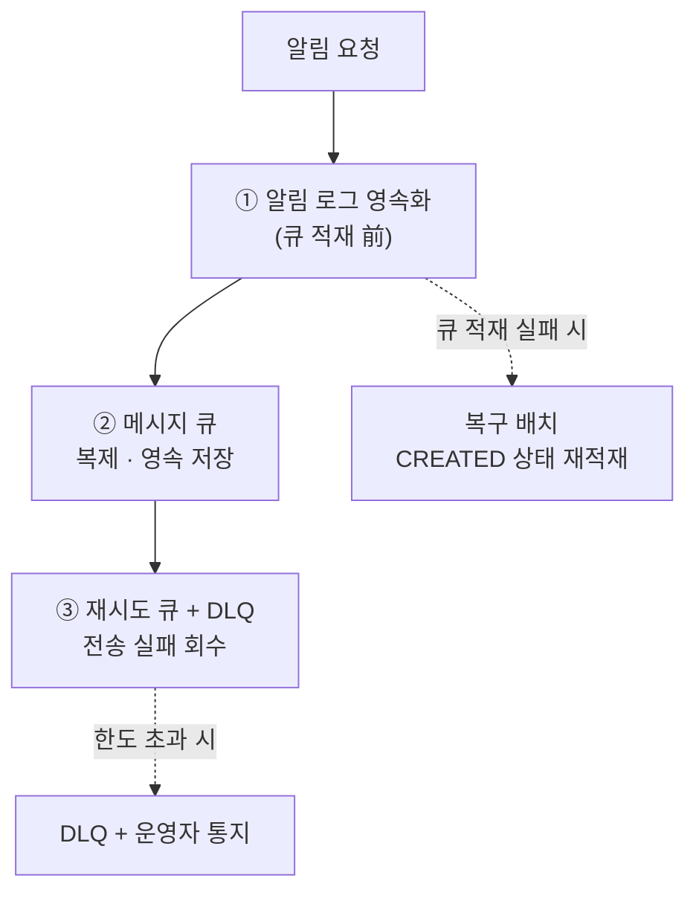
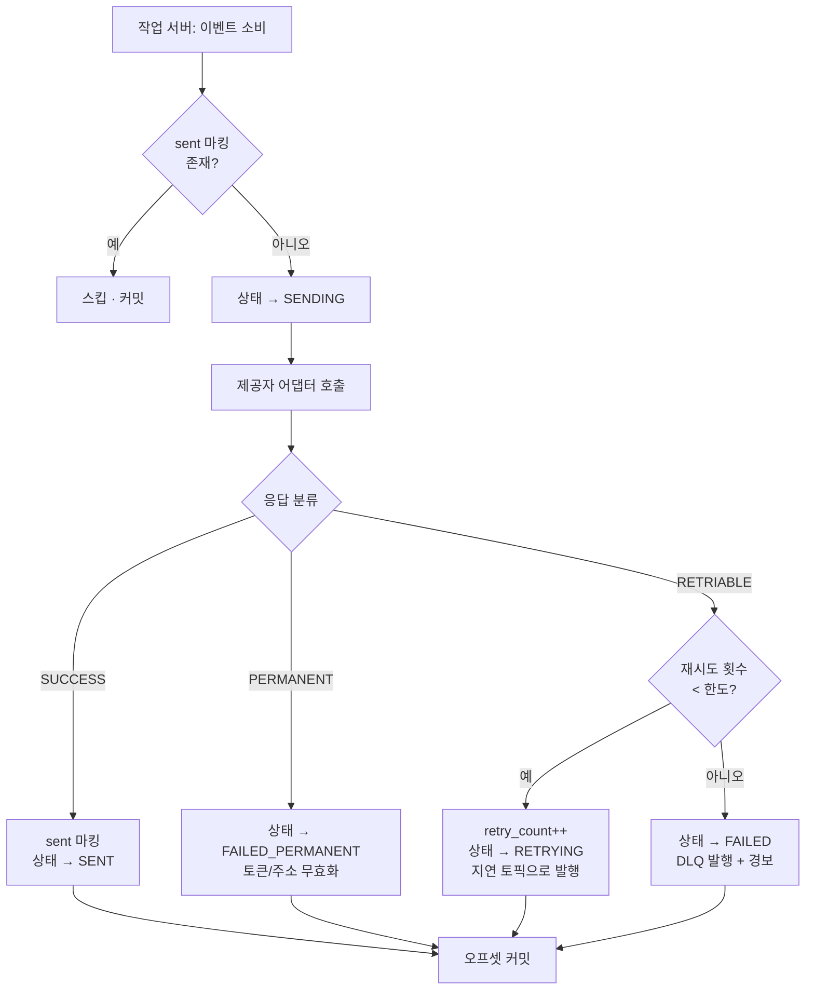

# 알림 시스템 (Notification System) 안정성 설계 문서

> **문서 목적**: "알림은 소실되어서는 안 된다"(NFR-1)는 최우선 요구사항을 어떤 메커니즘으로 보장하는지, 그 대가로 발생하는 중복을 어떻게 통제하는지 정의한다.
> **참조 문서**: [`02-notification-architecture.md`](02-notification-architecture.md), [`03-notification-data-model.md`](03-notification-data-model.md)
> **참조 노트**: [정리노트 STEP 5](../정리노트/05_STEP5_안정성_데이터손실_중복전송.md)

---

## 1. 안정성 목표

### 1.1 기준 한 줄

> **알림이 지연되거나 순서가 뒤바뀌어도 괜찮지만, 사라지면 안 된다.**

| 항목 | 허용 여부 | 근거 |
| --- | :---: | --- |
| 지연 | ✅ 허용 | 요구사항이 **연성 실시간** |
| 순서 뒤바뀜 | ✅ 허용 | 알림은 독립 이벤트 |
| **소실** | ❌ **불허** | NFR-1 최우선 |
| 중복 | ⚠️ 최소화 목표 | 완전 차단 **불가능** |

### 1.2 전달 보장 수준 결정

| 수준 | 의미 | 채택 여부 | 사유 |
| --- | --- | :---: | --- |
| at-most-once | 최대 1번. 소실 가능 | ❌ | NFR-1 위반 |
| **at-least-once** | 최소 1번. 중복 가능 | ✅ **채택** | 소실 금지를 만족하는 유일한 실용안 |
| exactly-once | 정확히 1번 | ❌ | 분산 환경에서 실질적으로 불가능 |

#### 왜 exactly-once가 불가능한가

```text
작업 서버:
    1. 제3자 API 호출 → 전송 성공
    2. "전송했음" 기록
```

**1과 2 사이에서 프로세스가 죽으면:**

| 이후 동작 | 결과 |
| --- | --- |
| 재시도한다 | ✅ 소실 없음 / ❌ **중복 발생** |
| 재시도하지 않는다 | ✅ 중복 없음 / ❌ **소실 발생** |

> "보냈다"는 **부수 효과(side effect)** 와 "보냈다고 기록했다"는 **상태 변경**을 **원자적으로 묶을 수 없다.**
> 제3자 시스템은 우리 트랜잭션에 참여하지 않기 때문이다.
> 🏢 참고: *You Cannot Have Exactly-Once Delivery* (bravenewgeek)

**→ 소실이 금지되었으므로 재시도한다. 즉 중복을 감수한다.**

#### 반문에 대한 답 3가지

| 반문 | 답 |
| --- | --- |
| "DB 트랜잭션으로 묶으면?" | ❌ **제3자가 트랜잭션에 참여하지 않는다.** 이미 나간 푸시는 롤백 불가 |
| "2단계 커밋(2PC)을 쓰면?" | ❌ Twilio·Sendgrid가 `prepare`/`commit`을 제공하지 않는다. 게다가 2PC는 **코디네이터 장애 시 blocking** |
| "Kafka가 exactly-once 지원하지 않나?" | ❌ Kafka EOS는 **읽기→처리→쓰기가 전부 Kafka 안**일 때만 성립. **외부 HTTP 부수 효과에는 적용 안 됨**<br/>⚠️ **exactly-once *processing* ≠ exactly-once *delivery***  |

#### 더 근본적인 이유 — 타임아웃은 정보가 없다

제3자 호출이 **타임아웃**됐을 때, 다음 둘을 **구분할 방법이 없다.**

| 실제로 일어난 일 | 우리가 본 것 | 필요한 행동 |
| --- | --- | --- |
| 요청이 아예 도달하지 않았다 | 타임아웃 | 재시도해야 함 |
| 요청은 도달해 **전송까지 됐는데 응답만 유실** | 타임아웃 | 재시도하면 안 됨 |

**두 장군 문제(Two Generals Problem)** — 신뢰할 수 없는 네트워크에서는 유한 번의 메시지 교환으로 양쪽이 합의할 수 없고, **마지막 메시지의 유실 가능성**이 항상 남는다.

> 📖 개념적 배경과 면접 대응은 **[정리노트 STEP 5 §3-2](../정리노트/05_STEP5_안정성_데이터손실_중복전송.md)** 에 상세히 정리되어 있다.

### 1.3 목표 지표 (SLO)

| 지표 | 목표 |
| --- | --- |
| 알림 유실률 | **0** (접수 후 최종 상태에 도달하지 못한 건 = 0) |
| 최종 전송 성공률 | ≥ 99.5% (제3자 영구 오류 제외) |
| 중복 전송률 | ≤ 0.01% |
| 접수 → 전송 완료 P95 | ≤ 5초 |
| 재시도 후 성공률 | ≥ 95% (1차 실패분 기준) |

---

## 2. 데이터 손실 방지

### 2.1 3중 방어선



| 방어선 | 무엇을 막나 |
| --- | --- |
| ① **알림 로그 선기록** | 큐 적재 실패 · 알림 서버 크래시 |
| ② **큐 복제·영속화** | 브로커 노드 장애 |
| ③ **재시도 큐 + DLQ** | 제3자 일시 장애 · 작업 서버 크래시 |

### 2.2 방어선 ① — 알림 로그 선기록

#### 순서가 핵심이다

```text
✅ 올바른 순서              ❌ 잘못된 순서
1. 알림 로그 INSERT         1. 큐 적재
   (상태 = CREATED)         2. 알림 로그 INSERT
2. 큐 적재
3. 상태 = QUEUED
```

| 시나리오 | 올바른 순서 | 잘못된 순서 |
| --- | --- | --- |
| 1단계 후 크래시 | `CREATED` 잔류 → **복구 배치가 재적재** ✅ | 큐에는 있고 로그에 없음 → **추적 불가 알림** ❌ |
| 2단계 후 크래시 | 큐에 있고 상태는 `CREATED` → 복구 배치가 중복 적재할 수 있으나 **중복 탐지가 흡수** ✅ | 로그만 있고 큐에 없음 → **영구 미발송** ❌ |

> **핵심: 로그를 먼저 남긴다.** 로그가 시스템의 **단일 진실 원천(source of truth)** 이고, 큐는 전달 수단일 뿐이다.

#### 로그 저장 실패 시 — fail-close

| 정책 | 동작 | 채택 |
| --- | --- | :---: |
| fail-open | 로그 없이 큐에 넣고 진행 | ❌ 무손실 보장이 깨짐 |
| **fail-close** | **`503 LOG_STORE_UNAVAILABLE` 반환, 접수 거부** | ✅ |

> "받아놓고 잃어버리는 것"보다 **"못 받겠다고 명확히 말하는 것"** 이 낫다.
> 발신 서비스는 5xx를 받고 자체 재시도하면 되고, 그때 `event_id` 멱등성이 안전망이 된다.

### 2.3 방어선 ② — 큐 설정

| 설정 | 값 | 이유 |
| --- | --- | --- |
| `replication.factor` | **3** | 브로커 1대 손실 감내 |
| `min.insync.replicas` | **2** | 리더 + 팔로워 1대 확인 후 ack |
| Producer `acks` | **all** | 복제 확인 전 성공 처리 금지 |
| Producer `enable.idempotence` | **true** | 프로듀서 재시도로 인한 큐 내 중복 억제 |
| `retention.ms` | **7일** | 컨슈머 장애 시 재생(replay) 여유 |
| Consumer `enable.auto.commit` | **false** | **처리 완료 후 수동 커밋** (at-least-once) |

> ⚠️ `acks=all` + `min.insync.replicas=2`가 없으면 브로커 장애 시 **조용히 메시지가 사라진다.**
> 이 조합이 큐 계층의 무손실 계약이다.

### 2.4 방어선 ③ — 복구 배치

`CREATED` 상태로 정체된 알림을 주워 담는다.

```text
매 1분 실행:
    SELECT * FROM notification_log
     WHERE status = 'CREATED'
       AND created_at < now() - 60s      -- 정상 처리 중인 건 제외
     LIMIT 10000

    각 건에 대해:
        큐에 재적재 → 상태 QUEUED로 갱신
```

| 항목 | 설정 |
| --- | --- |
| 실행 주기 | 1분 |
| 대상 조건 | `status = CREATED` AND `created_at`이 60초 이상 경과 |
| 배치 크기 | 10,000건 |
| 중복 위험 | 원래 큐에도 들어갔을 수 있음 → **`sent:{notification_id}` 중복 탐지가 흡수** |
| 경보 | 재적재 건수 > 100/분이면 **큐 적재 경로 이상** 경보 |

---

## 3. 재시도 설계

### 3.1 오류 분류

재시도 여부는 **제3자 응답을 어떻게 분류하느냐**로 갈린다. 이 분류가 틀리면 무의미한 재시도로 시스템을 갉아먹는다.

| 분류 | 조건 | 처리 |
| --- | --- | --- |
| **RETRIABLE** (일시) | HTTP 5xx, 429, 타임아웃, 커넥션 오류, 서킷 오픈 | ✅ 재시도 큐 |
| **PERMANENT** (영구) | 400 잘못된 페이로드, 401 인증 실패, **410 Gone(토큰 무효)**, 이메일 하드 바운스 | ❌ `FAILED_PERMANENT` + 후속 처리 |
| **SUCCESS** | 2xx | `SENT` |

#### 채널별 영구 오류와 후속 처리

| 채널 | 영구 오류 | 후속 처리 |
| --- | --- | --- |
| APNS | `410 Gone`, `BadDeviceToken` | ⚠️ `device.is_active = FALSE` |
| FCM | `NotRegistered`, `InvalidRegistration` | ⚠️ `device.is_active = FALSE` |
| SMS | 유효하지 않은 번호(`21211`) | ⚠️ 사용자에게 번호 재확인 요청 플래그 |
| 이메일 | 하드 바운스 (`550 user unknown`) | ⚠️ 이메일 무효 표시 + 발송 중단 |

> ⚠️ **영구 오류를 재시도하면 안 된다.** 무효 토큰에 5번 재시도하면 트래픽만 5배가 되고,
> 제3자로부터 **평판 하락(이메일)** 이나 **레이트 리밋(푸시)** 을 유발한다.

### 3.2 지수 백오프 정책

| 시도 | 대기 시간 | 누적 경과 | 사용 토픽 |
| :---: | ---: | ---: | --- |
| 1차 (최초) | — | 0s | `notif.{channel}` |
| 2차 | 5초 | 5s | `notif.retry.5s` |
| 3차 | 1분 | 65s | `notif.retry.1m` |
| 4차 | 10분 | 11m | `notif.retry.10m` |
| 5차 | 1시간 | 71m | `notif.retry.1h` |
| **한도 초과** | — | — | `notif.dlq.{channel}` |

- 각 대기 시간에 **지터(jitter) ±20%** 를 더해 재시도 폭주(thundering herd)를 방지한다.
- 채널별로 한도를 다르게 둔다.

| 채널 | 최대 재시도 | 이유 |
| --- | :---: | --- |
| 푸시 | 3회 | 시의성이 중요. 1시간 지난 푸시는 가치가 낮음 |
| SMS | 3회 | 건당 과금. 무한 재시도는 곧 비용 |
| 이메일 | 5회 | 시의성 요구가 낮고 지연 허용폭이 큼 |

#### Kafka에서 지연 재시도를 구현하는 법

Kafka는 **지연 메시지를 네이티브로 지원하지 않는다.** 두 가지 방식 중 하나를 쓴다.

| 방식 | 구현 | 장단점 |
| --- | --- | --- |
| ✅ **지연 토픽 분리** (채택) | `retry.5s` / `retry.1m` / `retry.10m` / `retry.1h` 토픽별 전용 컨슈머가 **메시지 타임스탬프 + 지연시간 < now** 일 때까지 대기 후 처리 | 구현 단순, 지연 단계가 이산적 |
| 스케줄러 테이블 | DB에 `next_retry_at` 저장, 스케줄러가 폴링해 재적재 | 임의 지연 가능, DB 부하 |

### 3.3 DLQ (Dead Letter Queue)

| 항목 | 정책 |
| --- | --- |
| 진입 조건 | 재시도 한도 초과 |
| 상태 | `FAILED` |
| 보관 | 7일 |
| 경보 | **DLQ 유입률 > 100건/분**이면 즉시 운영자 통지 |
| 처리 | 원인 분석 후 **수동 재처리 API**로 재투입 (`POST /v1/admin/notifications/{id}/replay`) |

> **같은 문제가 계속해서 발생하면 개발자에게 통지한다(alert).**
> DLQ는 "버리는 곳"이 아니라 **"사람이 봐야 하는 곳"** 이다. 유입 자체가 경보 신호다.

### 3.4 전체 재시도 흐름



---

## 4. 중복 전송 방지

### 4.1 중복이 발생하는 4가지 경로

| # | 경로 | 원인 | 방어 |
| :-: | --- | --- | --- |
| ① | **호출자 재시도** | 발신 서비스가 타임아웃 후 같은 요청 재전송 | `dedup:{event_id}` |
| ② | **복구 배치 재적재** | 큐에 이미 들어간 건을 배치가 다시 넣음 | `sent:{notification_id}` |
| ③ | **작업 서버 재처리** | 전송 성공 후 오프셋 커밋 전 크래시 | `sent:{notification_id}` |
| ④ | **재시도 오판** | 타임아웃이 났지만 제3자는 실제로 성공 | ⚠️ **방어 불가** — 제3자 멱등 키 사용 시 완화 |

> ④가 exactly-once가 불가능한 이유의 실체다. 완전 차단이 아니라 **빈도 축소**가 목표인 근거다.

### 4.2 방어선 1 — 요청 진입 시 (`event_id`)

```text
POST /v1/notifications 수신 시:

    result = REDIS.SET("dedup:" + event_id, PENDING, NX, EX=86400)

    if result == null:                     # 이미 존재
        existing = REDIS.GET("dedup:" + event_id)
        if existing == PENDING:
            return 409 CONFLICT            # 동시 처리 중
        return 200 OK {                    # 멱등 재생
            idempotent_replay: true,
            results: lookupByEventId(event_id)
        }

    # 신규 처리
    ... 파이프라인 실행 ...
    REDIS.SET("dedup:" + event_id, notification_ids, EX=86400)
```

| 요소 | 설정 | 이유 |
| --- | --- | --- |
| 원자성 | `SET NX` | 동시 요청 2건이 둘 다 통과하는 것을 막는다 |
| TTL | **24시간** | 발신 서비스의 재시도가 24시간을 넘는 경우는 없다고 가정 |
| 저장값 | 생성된 `notification_id` 목록 | 멱등 재생 시 **같은 응답**을 돌려주기 위해 |
| PENDING 상태 | 처리 중 표시 | 동시 중복 요청을 `409`로 분리 |

### 4.3 방어선 2 — 전송 직전 (`notification_id`)

```text
작업 서버가 이벤트를 소비했을 때:

    if REDIS.SET("sent:" + notification_id, 1, NX, EX=86400) == null:
        # 이미 전송됨
        commit_offset()
        return

    try:
        provider.send(payload)
        updateStatus(notification_id, SENT)
    catch RetriableError:
        REDIS.DEL("sent:" + notification_id)   # ⚠️ 마킹 해제 — 재시도 허용
        enqueueRetry(...)
```

> ⚠️ **재시도 가능 오류일 때 `sent` 마킹을 반드시 해제해야 한다.**
> 해제하지 않으면 재시도가 전부 "이미 전송됨"으로 스킵되어 **소실**이 발생한다.
> 이것이 중복 방지가 소실 방지를 망가뜨리는 대표적 실수다.

### 4.4 방어선 3 — 제3자 멱등 키 (가능한 경우)

일부 제3자 서비스는 요청 헤더로 멱등 키를 받는다.

| 제공자 | 지원 | 사용 |
| --- | :---: | --- |
| Twilio | ✅ | `Idempotency-Key: {notification_id}` |
| Sendgrid | 부분 | `custom_args`에 `notification_id` 삽입 |
| APNS | ✅ | `apns-collapse-id` (동일 ID는 최신 것만 표시) |
| FCM | 부분 | `collapse_key` |

> 🏢 **`apns-collapse-id` / `collapse_key`** 는 중복을 제거하지는 않지만,
> **단말에 여러 개가 쌓이지 않고 하나로 합쳐지게** 해준다. 사용자 체감상 중복이 사라진다.

### 4.5 중복 방지 3단 요약


### 4.6 방어선 4 — 중복을 "무해하게" 만들기

경로 ④는 막을 수 없으므로, **중복이 발생해도 사용자에게 해가 없도록** 설계한다.
이것은 우회책이 아니라 **명시적인 설계 요구사항**이다.

| 방법 | 적용 지점 | 예시 |
| --- | --- | --- |
| **알림 문구를 멱등하게** | 템플릿 등록 검수 | ❌ `잔액이 [amount]원 차감되었습니다` → 두 번 오면 2배로 오해<br/>✅ `결제가 완료되었습니다. 현재 잔액 [balance]원` → 두 번 와도 같은 사실 |
| **collapse 키** | 제공자 어댑터 | `apns-collapse-id` / FCM `collapse_key` = `notification_id`<br/>→ 단말 알림함에 쌓이지 않고 **하나로 병합** |
| **전송률 제한** | 알림 서버 | 중복이 폭주해도 사용자 도달량은 상한까지 ([06 운영 설계](06-notification-operations.md)) |
| **클라이언트 측 디둡** | 앱 SDK | 페이로드의 `notification_id`로 최근 수신 목록 대조 후 무시 |

#### 템플릿 등록 시 멱등성 검수 기준

| 금지 패턴 | 사유 | 대안 |
| --- | --- | --- |
| 상대적 변화량 (`차감되었습니다`, `추가되었습니다`) | 중복 시 누적으로 오해 | **절대 상태**로 표현 (`현재 잔액 …`) |
| 순번·카운터 (`3번째 알림입니다`) | 중복 시 순번 불일치 | 제거 |
| 액션 유도 중복 (`지금 눌러 쿠폰 받기`) | 중복 클릭 시 이중 발급 우려 | 쿠폰 발급 API 자체를 멱등하게 |

> ⚠️ **알림 내용의 멱등성은 백엔드가 아니라 문구 기획 단계에서 결정된다.**
> 그래서 템플릿 등록 검수 체크리스트에 포함한다 ([06 운영 설계](06-notification-operations.md)).

---

## 5. 장애 격리

### 5.1 서킷 브레이커

| 상태 | 전이 조건 | 동작 |
| --- | --- | --- |
| **Closed** | 기본 | 정상 호출 |
| **Open** | 최근 60초 실패율 > 50% (최소 20건 표본) | 제3자 호출 없이 **즉시 재시도 큐로**, 폴백 제공자 시도 |
| **Half-Open** | Open 후 30초 경과 | 10건만 통과시켜 회복 확인 → 성공 시 Closed |

> 큐가 버퍼 역할을 하므로 **잠시 멈춰도 알림은 소실되지 않는다.**
> 반대로 죽은 제3자를 계속 때리면 **회복이 늦어지고 우리 작업 서버도 스레드가 고갈**된다.

### 5.2 폴백 제공자

| 채널 | 1차 | 2차 (폴백) | 조건 |
| --- | --- | --- | --- |
| SMS | Twilio | Nexmo | Twilio 서킷 Open |
| 이메일 | Sendgrid | Mailchimp | Sendgrid 서킷 Open |
| 푸시(AOS, 중국) | Jpush | PushY | Jpush 서킷 Open |
| 푸시(iOS) | APNS | **없음** | ⚠️ 대체 불가 — 재시도만 |

> ⚠️ **APNS는 대체재가 없다.** iOS 푸시는 애플만 제공한다.
> 따라서 iOS 채널은 폴백 대신 **재시도 한도와 큐 보존 기간을 넉넉히** 잡는 것으로 대응한다.

### 5.3 격리 매트릭스

| 장애 지점 | 영향 범위 | 격리 수단 |
| --- | --- | --- |
| Twilio 다운 | SMS만 | 채널별 큐 + 서킷 + Nexmo 폴백 |
| APNS 다운 | iOS 푸시만 | 채널별 큐 + 재시도 |
| 작업 서버 iOS 풀 다운 | iOS 푸시 지연 | 큐가 버퍼, 재기동 후 소비 재개 |
| Cassandra 다운 | **전체 접수 중단** | ⚠️ fail-close (의도적) |
| Redis 다운 | 중복 탐지·캐시 무력화 | DB 폴백, **중복 증가하되 소실 없음** |
| Kafka 전체 다운 | 접수 중단 | `503 QUEUE_UNAVAILABLE` |

---

## 6. 정합성 검증 (Reconciliation)

무손실을 **주장**만 하지 않고 **측정**한다.

### 6.1 일일 정합성 배치

```text
매일 02:00 실행:

    A = 어제 접수된 알림 수        (notification_log INSERT 건수)
    B = 최종 상태 도달 건수
        (SENT + DELIVERED + FAILED + FAILED_PERMANENT
         + DROPPED_OPT_OUT + DROPPED_NO_TARGET + THROTTLED)

    미결 = A - B

    if 미결 > 0:
        미결 목록을 상태별로 분류해 리포트 + 경보
```

| 미결 상태 | 의미 | 조치 |
| --- | --- | --- |
| `CREATED` 잔류 | 큐 적재 실패 | 복구 배치 동작 확인 |
| `QUEUED` 잔류 | 작업 서버가 소비 못 함 | 컨슈머 랙 확인, 증설 |
| `SENDING` 잔류 | 작업 서버가 응답 대기 중 크래시 | 타임아웃 설정 확인, 재적재 |
| `RETRYING` 잔류 | 지연 토픽 컨슈머 정지 | 재시도 컨슈머 확인 |

> **미결 = 0이 무손실의 실측 증거다.** SLO 대시보드의 최상단 지표로 둔다.

### 6.2 상태별 상시 경보 임계치

| 지표 | 경고 | 심각 |
| --- | --- | --- |
| `CREATED` 5분 이상 잔류 건수 | > 100 | > 1,000 |
| `QUEUED` 10분 이상 잔류 건수 | > 1,000 | > 10,000 |
| `SENDING` 5분 이상 잔류 건수 | > 50 | > 500 |
| DLQ 유입률 | > 10/분 | > 100/분 |
| 중복 전송률 | > 0.01% | > 0.1% |
| 채널별 실패율 | > 5% | > 20% |

---

## 7. 안정성 메커니즘 ↔ 요구사항 매핑

| 메커니즘 | 충족 요구사항 | 대가 |
| --- | --- | --- |
| 알림 로그 선기록 | NFR-1 무손실 | API 지연 +20ms |
| fail-close (로그 실패 시 503) | NFR-1 무손실 | 가용성 일부 희생 |
| 큐 `acks=all` + RF3 | NFR-1 무손실 | 발행 지연 증가 |
| 수동 오프셋 커밋 | NFR-1 무손실 | **중복 재처리 발생** |
| 복구 배치 | NFR-1 무손실 | 중복 적재 가능성 |
| 지수 백오프 재시도 | FR-6, NFR-1 | 전달 지연 증가 |
| DLQ + 경보 | FR-6 | 운영 개입 필요 |
| `dedup:{event_id}` | NFR-2 중복 최소화 | Redis 메모리 1.6GB |
| `sent:{notification_id}` | NFR-2 중복 최소화 | Redis 메모리 2.1GB |
| 서킷 브레이커 + 폴백 | NFR-5 장애 격리 | 구현 복잡도 |
| 정합성 배치 | NFR-1 검증 | 배치 운영 비용 |

---

## 8. 설계 요약 — 한 문장

> **소실을 절대 금지했기 때문에 at-least-once를 택했고, at-least-once를 택했기 때문에 중복이 생기며,
> 그 중복을 `event_id`(진입) · `notification_id`(전송 직전) · 제3자 멱등 키(최종)의 3단으로 눌러
> 실용적으로 "잃지 않으면서 거의 중복도 없는" 상태를 만든다.**

---

➡️ 다음: [06 운영 설계](06-notification-operations.md)
