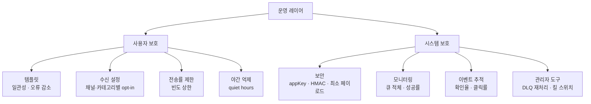
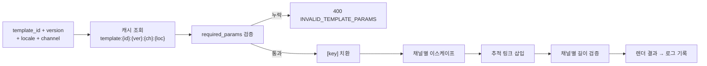
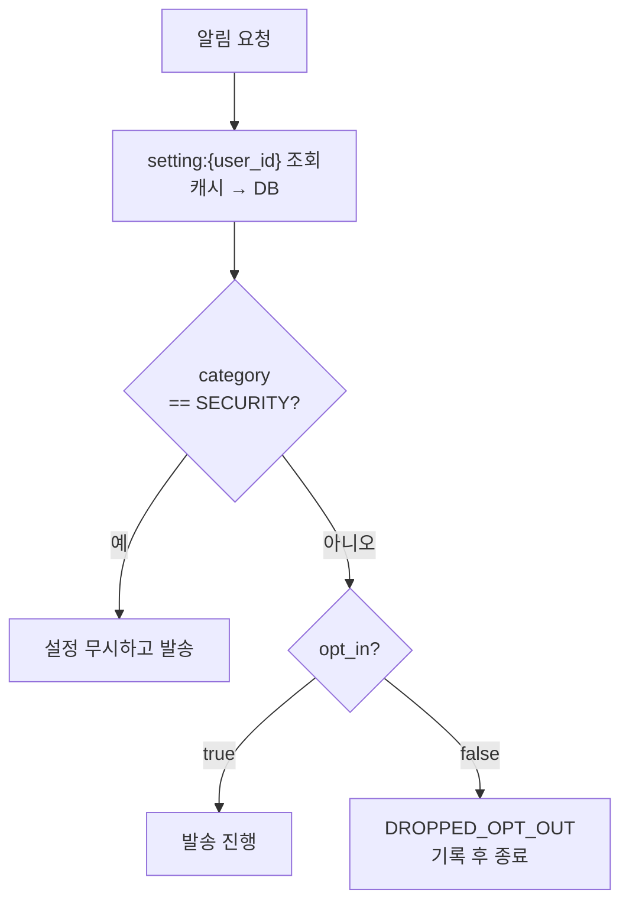
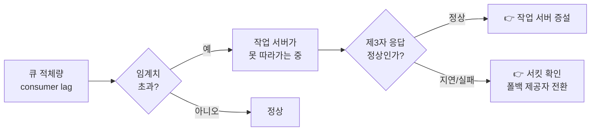
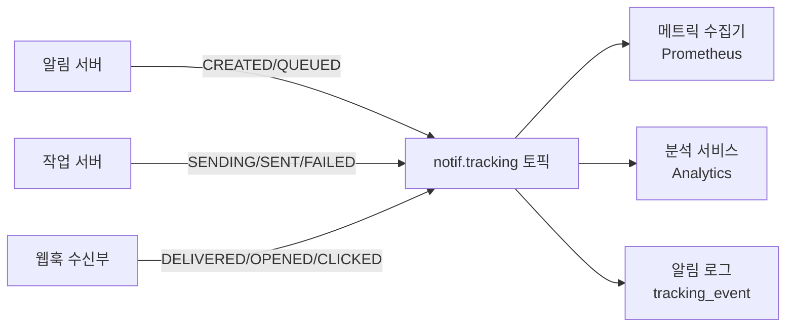

# 알림 시스템 (Notification System) 운영 설계 문서

> **문서 목적**: 알림을 "안정적으로 보내는 것"을 넘어 **"적절한 양을, 적절한 형식으로, 관측 가능하게"** 보내기 위한 운영 컴포넌트를 정의한다.
> **참조 문서**: [`02-notification-architecture.md`](02-notification-architecture.md), [`03-notification-data-model.md`](03-notification-data-model.md), [`05-notification-reliability.md`](05-notification-reliability.md)
> **참조 노트**: [정리노트 STEP 6](../정리노트/06_STEP6_추가컴포넌트_템플릿_설정_보안_모니터링.md)

---

## 1. 운영 컴포넌트 개요

| 축 | 목적 | 컴포넌트 |
| --- | --- | --- |
| **사용자를 지킨다** | 사용자가 알림 기능을 끄지 않게 | 알림 템플릿 · 수신 설정 · 전송률 제한 · 야간 억제 |
| **시스템을 지킨다** | 운영자가 상태를 알고 개입할 수 있게 | 보안 · 모니터링 · 이벤트 추적 · 관리자 도구 |



> **핵심: 여기까지가 "알림을 보낼 수 있다"와 "알림 서비스를 운영할 수 있다"의 차이다.**

---

## 2. 알림 템플릿

### 2.1 왜 필요한가

> 대형 알림 시스템은 하루 수백만 건 이상을 처리하는데, **알림 메시지 대부분은 형식이 비슷하다.**

| 이득 | 설명 |
| --- | --- |
| ✅ **일관성** | 전송될 알림들의 형식을 통일 |
| ✅ **오류 감소** | 매번 새로 작성하지 않으므로 실수 감소 |
| ✅ **시간 절약** | 알림 작성 시간 단축 |
| ✅ **재현성** | 버전을 로그에 남겨 "그때 뭘 보냈나"를 답할 수 있음 |
| ✅ **다국어** | `locale`별 템플릿으로 분기 없이 대응 |

### 2.2 렌더링 파이프라인



### 2.3 렌더링 규칙

| 단계 | 규칙 |
| --- | --- |
| **인자 검증** | `required_params` 전부 존재해야 함. 하나라도 없으면 발송하지 않고 `400` |
| **치환** | `[key]` → `params[key]` |
| **이스케이프** | ⚠️ `content_type = text/html`이면 **HTML 이스케이프 필수** (인젝션 방지) |
| **추적 링크** | `tracking_link_base` + `notification_id` → 클릭 추적 URL 생성 |
| **길이 검증** | 푸시 4KB / SMS 1,000자 / 이메일 256KB 초과 시 `400` |
| **결과 저장** | 렌더된 `title`·`body`를 알림 로그에 저장 → **재현 가능** |

### 2.4 템플릿 배포 안전장치

| 위험 | 대응 |
| --- | --- |
| 잘못된 템플릿을 대량 발송 | **버전 증가 방식** — 기존 버전은 그대로, 롤백은 버전 지정으로 즉시 |
| 인자 누락으로 `[item_name]`이 그대로 노출 | 등록 시 `required_params` 자동 추출 + 발송 시 검증 |
| 마케팅 문구에 민감정보 | 등록 시 검수 프로세스 + `category` 필수 지정 |
| 테스트 없이 배포 | **`POST /v1/templates/{id}/preview`** 로 렌더 결과 미리보기 (발송 없음) |
| **중복 수신 시 오해를 부르는 문구** | ⚠️ **멱등성 검수** — 상대적 변화량(`차감되었습니다`) 대신 절대 상태(`현재 잔액 …`)로 작성. 중복은 원리적으로 완전 차단이 불가능하므로([05 안정성 §4.6](05-notification-reliability.md)) **문구 단계에서 무해하게** 만든다 |

---

## 3. 수신 설정 (opt-in / opt-out)

### 3.1 집행 지점

> **특정 종류의 알림을 보내기 전에 반드시 해당 사용자가 해당 알림을 켜 두었는지 확인해야 한다.**



### 3.2 판정 우선순위

```text
1. (user_id, channel, category) 정확 일치
2. (user_id, channel, 'ALL')
3. 카테고리 기본값
```

| 카테고리 | 기본값 | 사용자 거부 가능 |
| --- | :---: | :---: |
| `SECURITY` | 강제 발송 | ❌ |
| `TRANSACTIONAL` | `true` | ✅ |
| `MARKETING` | `false` (명시적 동의 필요) | ✅ |

### 3.3 캐시 일관성

| 정책 | 값 | 이유 |
| --- | --- | --- |
| TTL | **10분** (가장 짧음) | 껐는데 계속 오는 것이 가장 나쁜 실패 |
| 변경 시 | **즉시 무효화** (write-through) | TTL을 기다리지 않음 |
| 무효화 실패 시 | 최대 10분 후 자연 반영 | TTL이 안전망 |

### 3.4 자동 opt-out 반영

| 경로 | 동작 |
| --- | --- |
| 이메일 수신거부 링크 클릭 | 제3자 웹훅 `unsubscribe` → **`opt_in = false` 자동 반영** |
| SMS `수신거부` 회신 | 제3자 웹훅 → 자동 반영 |
| 앱 내 알림 권한 해제 | 클라이언트가 단말 해제 API 호출 |
| 반복 하드 바운스 | 이메일 채널 자동 비활성화 |

> ⚠️ **법적 요구사항이기도 하다.** 수신거부 의사가 시스템에 반영되지 않으면 규제 위반이 된다.

---

## 4. 전송률 제한 (Rate Limiting)

### 4.1 왜 필요한가

> **알림을 너무 많이 보내기 시작하면 사용자가 알림 기능을 아예 꺼 버릴 수도 있다.**

| 목적 | 설명 |
| --- | --- |
| **사용자 이탈 방지** | 한 번 꺼지면 그 채널을 **영구히 잃는다** — 되돌리기 매우 어렵다 |
| **비용 통제** | SMS·이메일 제3자 서비스는 **건당 과금** |
| **중복의 최종 방어선** | [05 안정성](05-notification-reliability.md)에서 못 막은 중복이 폭주하는 것을 차단 |
| **버그 폭주 차단** | 발신 서비스의 루프 버그가 사용자에게 도달하기 전 차단 |

### 4.2 제한 축 — 두 개는 다른 것이다

| 축 | 대상 | 위치 | 목적 |
| --- | --- | --- | --- |
| **발신 서비스 제한** | `appKey` | API Gateway | 시스템 보호 (호출량) |
| **사용자 수신 제한** | `user_id` | 알림 서버 | **사용자 보호** (수신량) |

### 4.3 제한 규칙

| 축 | 카테고리 | 제한 |
| --- | --- | --- |
| 사용자별 | `MARKETING` | **일 3건**, 시간당 1건 |
| 사용자별 | `TRANSACTIONAL` | 시간당 20건 |
| 사용자별 | `SECURITY` | **제한 없음** |
| 사용자별 | 전체 합산 | 일 30건 |
| appKey별 | 전체 | 시간당 100만 호출 |

### 4.4 알고리즘 — 이동 윈도 카운터

🏢 4장 처리율 제한 장치와 **동일한 문제**이므로 그 결론을 재사용한다.

```text
key = "rate:" + user_id + ":" + category + ":" + hour_bucket

count = REDIS.INCR(key)
if count == 1:
    REDIS.EXPIRE(key, window_seconds)

if count > limit:
    상태 = THROTTLED, 발송하지 않음
```

| 선택 | 이유 |
| --- | --- |
| **이동 윈도 카운터** | 고정 윈도의 경계 폭주를 완화하면서 메모리가 작음 |
| Redis `INCR` + `EXPIRE` | 원자적 · 저지연 · TTL 자동 정리 |
| Lua 스크립트로 묶음 | `INCR`과 `EXPIRE` 사이 크래시 시 **TTL 없는 키 잔류** 방지 |

> ⚠️ **`INCR` 직후 크래시하면 TTL이 없는 키가 영구히 남아 그 사용자는 영원히 차단된다.**
> 반드시 Lua 스크립트로 원자화하거나 `SET key 1 EX n NX` + `INCR` 패턴을 쓴다.

### 4.5 제한 초과 시 동작

| 정책 | 동작 | 채택 |
| --- | --- | :---: |
| 드롭 | 상태 `THROTTLED`로 기록하고 버림 | ✅ 기본 |
| 지연 | 다음 윈도까지 미뤘다 발송 | ⚠️ `TRANSACTIONAL`만 선택적 |
| 병합 | 여러 알림을 하나로 요약해 발송 | 🟡 향후 과제 (다이제스트) |

> 발신 서비스에는 `202`와 함께 `"status": "THROTTLED"`를 반환한다.
> **에러가 아니므로 재시도를 유도해서는 안 된다.**

### 4.6 야간 억제 (Quiet Hours)

| 항목 | 정책 |
| --- | --- |
| 기준 시각 | `user.timezone` 기준 **22:00 ~ 08:00** |
| 대상 | `MARKETING` (푸시·SMS) |
| 제외 | `SECURITY`, `TRANSACTIONAL` |
| 동작 | `scheduled_at`을 다음 08:00으로 자동 조정 |

---

## 5. 보안

### 5.1 발송 API 인증

> **알림 전송 API는 appKey와 appSecret을 사용하여 보안을 유지한다.
> 인증된(authenticated) 혹은 승인된(verified) 클라이언트만 알림을 보낼 수 있다.**

| 계층 | 통제 |
| --- | --- |
| **인증** | `appKey` + HMAC-SHA256 서명 ([04 API 명세 §1.2](04-notification-api-spec.md)) |
| **재전송 방지** | `X-Timestamp` ±5분 윈도 |
| **인가** | appKey별 **허용 채널·템플릿·카테고리** 화이트리스트 |
| **네트워크** | 사내 서비스는 VPC 내부 통신, 외부는 TLS 1.2+ |
| **키 관리** | `appSecret`은 시크릿 매니저에 보관, **90일 주기 로테이션**, 이중 키 지원 |

#### appKey 권한 예시

| appKey | 허용 채널 | 허용 카테고리 | 허용 템플릿 |
| --- | --- | --- | --- |
| `svc-billing-prod` | PUSH, EMAIL, SMS | TRANSACTIONAL | `BILLING_*` |
| `svc-marketing-prod` | PUSH, EMAIL | MARKETING | `CAMPAIGN_*` |
| `svc-security-prod` | PUSH, SMS, EMAIL | SECURITY | `SECURITY_*` |

> ⚠️ **마케팅 키로 `SECURITY` 카테고리를 못 쓰게 막는 것**이 중요하다.
> 그렇지 않으면 전송률 제한과 수신 설정을 우회하는 통로가 된다.

### 5.2 페이로드 최소화

| 원칙 | 설명 |
| --- | --- |
| 민감정보 미포함 | 계좌번호·주민번호·인증코드 전문 등은 알림 본문에 넣지 않는다 |
| **딥링크 유도** | "결제가 완료되었습니다" + 앱 링크. 상세는 **앱에서 인증 후 조회** |
| 로그 마스킹 | `target`은 마스킹 저장 (`010-****-1234`) |
| 잠금화면 노출 고려 | 푸시는 **잠금화면에 그대로 보인다** — 제3자가 볼 수 있다고 가정 |

### 5.3 감사 로그

| 기록 대상 | 보관 |
| --- | --- |
| 발송 API 호출 (appKey, IP, 템플릿, 대상 수) | 1년 |
| 수신 설정 변경 이력 | 영구 |
| 템플릿 등록·수정 | 영구 |
| 관리자 도구 사용 (DLQ 재처리, 킬 스위치) | 영구 |

---

## 6. 모니터링

### 6.1 최우선 지표 — 큐 적체

> **알림 시스템을 모니터링할 때 중요한 메트릭 하나는 큐에 쌓인 알림의 개수이다.
> 이 수가 너무 크면 작업 서버들이 이벤트를 빠르게 처리하고 있지 못하다는 뜻이다.**



| 채널 | 경고 | 심각 |
| --- | ---: | ---: |
| `notif.push.ios` | > 5,000 | > 50,000 |
| `notif.push.android` | > 5,000 | > 50,000 |
| `notif.sms` | > 1,000 | > 10,000 |
| `notif.email` | > 3,000 | > 30,000 |
| `notif.dlq.*` | > 100 | > 1,000 |

> ⚠️ [02 아키텍처](02-notification-architecture.md)에서 "큐가 버퍼 역할을 한다"고 했다.
> **버퍼가 계속 차오르는 걸 아무도 모르면 그건 버퍼가 아니라 시한폭탄이다.** 이 지표가 필수인 이유다.
> 🏢 참고: *Key metrics for RabbitMQ monitoring* (Datadog)

### 6.2 전체 대시보드 지표

| 분류 | 지표 | 경고 임계치 |
| --- | --- | --- |
| **처리량** | 채널별 접수/초, 전송/초 | 평시 대비 ±50% |
| **적체** | 토픽별 consumer lag | §6.1 표 |
| **성공률** | 채널별 `SENT / 접수` | < 95% |
| **지연** | 접수 → SENT P50/P95/P99 | P95 > 5초 |
| **API** | 발송 API P99 응답시간 | > 200ms |
| **재시도** | 재시도율, 재시도 후 성공률 | 재시도율 > 10% |
| **DLQ** | 유입률 | > 10/분 |
| **제3자** | 제공자별 응답시간·에러율·서킷 상태 | 에러율 > 5% |
| **중복** | 중복 탐지 히트율 | 급증 시 조사 |
| **무손실** | **미결 건수** (정합성 배치) | **> 0** |
| **캐시** | 히트율 | < 90% |
| **정책** | `DROPPED_OPT_OUT` 비율, `THROTTLED` 비율 | 급증 시 조사 |

> **`미결 건수 > 0`이 가장 심각한 경보다.** NFR-1이 깨졌다는 직접 증거이기 때문이다.

### 6.3 경보 정책

| 심각도 | 조건 예시 | 통지 |
| --- | --- | --- |
| **P1** | 미결 건수 > 0 / 전 채널 성공률 < 50% / 로그 저장소 다운 | 즉시 온콜 호출 |
| **P2** | 큐 심각 임계치 / DLQ > 100/분 / 제공자 서킷 Open 5분 지속 | 담당 채널 알림 |
| **P3** | 큐 경고 임계치 / 캐시 히트율 저하 / 재시도율 증가 | 대시보드 표시 |

> 🔁 **알림 시스템의 경보를 알림 시스템으로 보내면 안 된다.** 순환 의존이 생긴다.
> 운영 경보는 **독립 채널**(PagerDuty 등)로 보낸다.

---

## 7. 이벤트 추적

### 7.1 추적 지표

> **알림 확인율, 클릭률, 실제 앱 사용으로 이어지는 비율 같은 메트릭은 사용자를 이해하는 데 중요하다.**

| 지표 | 계산 | 알려주는 것 |
| --- | --- | --- |
| **전달률** | `DELIVERED / SENT` | 제3자 전달 품질 |
| **확인율(open rate)** | `OPENED / DELIVERED` | 알림이 눈에 닿았나 |
| **클릭률(click rate)** | `CLICKED / OPENED` | CTA가 효과적인가 |
| **앱 사용 전환율** | 클릭 후 세션 발생 비율 | 실제 가치로 이어졌나 |
| **수신거부율** | 알림 후 opt-out 발생률 | ⚠️ **피로도 경고 신호** |

### 7.2 이벤트 파이프라인



> 🏢 **Sendgrid·Mailchimp가 analytics를 제공**하므로([02 아키텍처](02-notification-architecture.md)), 이메일 채널은
> 제3자 추적 데이터를 웹훅으로 받아 **우리 추적 체계에 통합**한다. 자체 구현보다 정확하다.

### 7.3 수신거부율 기반 자동 억제

| 조건 | 조치 |
| --- | --- |
| 특정 템플릿의 수신거부율 > 2% | ⚠️ 해당 템플릿 발송 **자동 일시 중지** + 담당자 통지 |
| 특정 appKey의 수신거부율 > 5% | 해당 키의 `MARKETING` 발송 제한 강화 |

> 이것이 전송률 제한과 함께 **사용자 이탈을 막는 두 번째 자동 방어선**이다.

---

## 8. 관리자 도구

| 도구 | 엔드포인트 | 용도 |
| --- | --- | --- |
| **DLQ 재처리** | `POST /v1/admin/notifications/{id}/replay` | 원인 해결 후 실패 알림 재투입 |
| **DLQ 일괄 재처리** | `POST /v1/admin/dlq/{channel}/replay` | 제3자 장애 복구 후 |
| **채널 킬 스위치** | `PUT /v1/admin/channels/{channel}/enabled` | 사고 시 특정 채널 즉시 중단 |
| **템플릿 킬 스위치** | `PUT /v1/admin/templates/{id}/active` | 잘못된 캠페인 즉시 중단 |
| **appKey 차단** | `PUT /v1/admin/apps/{key}/enabled` | 폭주하는 발신 서비스 차단 |
| **제공자 강제 전환** | `PUT /v1/admin/providers/{name}/enabled` | 수동 폴백 |
| **템플릿 미리보기** | `POST /v1/templates/{id}/preview` | 발송 없이 렌더 결과 확인 |

> ⚠️ **킬 스위치는 사고 대응의 생명줄이다.** "잘못된 마케팅 알림 100만 건이 나가는 중"일 때
> 배포 없이 **1분 안에 멈출 수 있어야** 한다. 모든 관리자 도구 사용은 **감사 로그에 영구 기록**한다.

---

## 9. 운영 컴포넌트 ↔ 요구사항 매핑

| 컴포넌트 | 충족 요구사항 |
| --- | --- |
| 알림 템플릿 | FR-4 |
| 수신 설정 집행 | FR-3 |
| 전송률 제한 | FR-7 |
| 야간 억제 | FR-7 (확장) |
| appKey/appSecret + 권한 | NFR-6 |
| 페이로드 최소화 | NFR-6 |
| 큐 적체 모니터링 | NFR-7, NFR-4 |
| 정합성 미결 지표 | NFR-1 |
| 이벤트 추적 | FR-8 |
| DLQ 재처리 | FR-6, NFR-1 |
| 킬 스위치 | NFR-5 |

---

## 10. 운영 체크리스트 (출시 전)

- [ ] 모든 템플릿의 `required_params`가 등록되어 있고 미리보기로 검증되었다
- [ ] 모든 템플릿 문구가 **멱등성 검수**를 통과했다 (중복 수신해도 오해를 부르지 않는가)
- [ ] 카테고리별 기본 opt-in 정책이 법무 검토를 통과했다
- [ ] `SECURITY` 카테고리가 전송률 제한·수신 설정을 우회하도록 설정되었다
- [ ] appKey별 채널·템플릿 화이트리스트가 설정되었다
- [ ] `appSecret` 로테이션 절차가 문서화되었다
- [ ] 큐 적체 경보가 채널별 임계치로 설정되었다
- [ ] **정합성 배치가 매일 돌고, 미결 건수가 P1 경보에 연결되었다**
- [ ] 운영 경보가 **알림 시스템이 아닌 독립 채널**로 나간다
- [ ] DLQ 재처리·킬 스위치가 스테이징에서 실제로 동작 확인되었다
- [ ] 제공자별 폴백이 서킷 오픈 상황에서 테스트되었다
- [ ] 부하 테스트로 peak 602 이벤트/초를 견디는 것이 확인되었다

---

## 11. 향후 과제

| 과제 | 내용 |
| --- | --- |
| **다이제스트(묶음) 알림** | 여러 알림을 하나로 병합해 피로도 감소 |
| **발송 시각 최적화** | 사용자별 과거 확인 패턴으로 최적 시각 학습 |
| **채널 폴백** | 푸시 미확인 시 이메일로 승격 |
| **A/B 테스트** | 템플릿 버전별 클릭률 비교 |
| **인앱 알림함** | 아웃바운드와 별개로 앱 내 이력 제공 |
| **우선순위 큐** | `HIGH` 알림이 대량 캠페인에 밀리지 않도록 분리 |

---

## 12. 설계 요약 — 한 문장

> 알림 시스템은 **인증과 전송률 제한을 갖춘 알림 서버**가 템플릿·설정·연락처를 조회해
> **채널별 메시지 큐**에 이벤트를 넣고, **작업 서버**가 제공자 어댑터를 통해 제3자로 전달하며,
> **실패는 재시도 큐로 회수**하고, 전 과정을 **알림 로그·모니터링·이벤트 추적**으로 관측하는 시스템이다.

---

➡️ 돌아가기: [00 통합 설계서](00-알림시스템-통합설계서-origin.md) · [정리노트 인덱스](../정리노트/00_인덱스.md)
