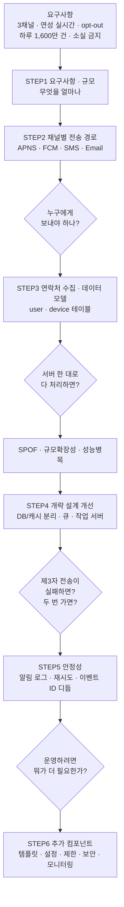

# 알림 시스템 — 왜 / 무엇을 / 그래서 어떻게

> STEP에 들어가기 전에 잡고 갈 큰 그림.
> "알림 = 그냥 메시지 보내는 기능" 에서 **"하루 1,600만 건을 잃어버리지 않고 보내는 분산 시스템"** 으로 넘어가는 지점을 본다.

---

## 한 장 요약

| 질문 | 답 | 더 보기 |
| --- | --- | --- |
| **왜?** | 중요한 정보를 **비동기적으로** 사용자에게 밀어 넣기 위해. 없으면 사용자가 직접 확인하러 와야 한다 | [1장](#1-왜--알림-시스템이-왜-필요한가) |
| **무엇을?** | 3개 채널 · 연성 실시간 · opt-out · 하루 1,600만 건 · **알림 소실 금지** | [2장](#2-무엇을--무엇을-만족해야-하는가) |
| **어떻게?** | 채널 이해(STEP2) → 연락처 확보(STEP3) → 큐로 분리(STEP4) → 안정성(STEP5) → 운영 컴포넌트(STEP6) | [3장](#3-그래서-어떻게--결정의-연쇄) |

> **한 문장:** 알림 시스템 설계의 본체는 "어떻게 보내나"가 아니라 **"내 손을 떠난 알림을 어떻게 책임지나"** 다.

---

## 1. 왜 — 알림 시스템이 왜 필요한가

알림 시스템(notification system)은 최신 뉴스·제품 업데이트·이벤트·선물처럼 **고객에게 중요할 만한 정보를 비동기적으로 제공**하는 기능이다.
넷플릭스 신작 출시, 할인 쿠폰 이메일, 온라인 쇼핑 결제 확정 메시지가 전부 이 기능을 통해 전달된다.

알림은 **모바일 푸시 알림에 한정되지 않는다.** 크게 세 가지로 분류된다.

| 유형 | 예시 |
| --- | --- |
| **모바일 푸시 알림**(mobile push notification) | "Hi Alex, your Amazon package was delivered." |
| **SMS 메시지** | "AT&T phone outage in San Mateo County" |
| **이메일** | GoDaddy 마케팅 메일 |

> 핵심: 알림 시스템은 **채널 3개를 하나의 API 뒤에 통합**하는 문제다. 채널마다 전송 경로·제약·실패 방식이 다르다.

### 왜 "그냥 API 하나"로 끝나지 않는가

가장 단순한 구현은 **서버 한 대**가 요청을 받아 제3자 서비스로 그대로 넘기는 것이다.
원문도 정확히 이 초안부터 시작해서, **세 가지 문제**로 무너뜨린다.

| 부딪히는 벽 | 무엇이 막히나 | 어디서 푸나 |
| --- | --- | --- |
| **SPOF** (Single-Point-Of-Failure) | 알림 서버가 한 대뿐 → 그 서버가 죽으면 **전체 알림 장애** | [STEP 4](04_STEP4_개략설계_메시지큐_결합도제거.md) |
| **규모 확장성** | 한 대가 모든 걸 처리 → DB·캐시 같은 컴포넌트를 **개별적으로 늘릴 방법이 없음** | [STEP 4](04_STEP4_개략설계_메시지큐_결합도제거.md) |
| **성능 병목** | HTML 생성, 제3자 응답 대기 = **오래 걸리는 작업** → 트래픽 몰리면 과부하 | [STEP 4](04_STEP4_개략설계_메시지큐_결합도제거.md) |
| **알림 소실** | 제3자 전송이 실패하면 그 알림은 **그냥 사라짐** | [STEP 5](05_STEP5_안정성_데이터손실_중복전송.md) |
| **알림 중복** | 분산 환경에서 같은 알림이 두 번 나감 | [STEP 5](05_STEP5_안정성_데이터손실_중복전송.md) |
| **사용자 피로** | 알림이 너무 많으면 사용자가 **기능을 아예 꺼 버림** | [STEP 6](06_STEP6_추가컴포넌트_템플릿_설정_보안_모니터링.md) |

---

## 2. 무엇을 — 무엇을 만족해야 하는가

### 2-1. 기능 요구사항 (면접 문답으로 확정한 것)

| 질문 | 답 | 설계에 미치는 영향 |
| --- | --- | --- |
| 어떤 종류의 알림? | **푸시 알림 · SMS · 이메일** | 채널별 전송 경로 3종 통합 ([STEP 2](02_STEP2_알림채널별_전송경로.md)) |
| 실시간이어야 하나? | **연성 실시간**(soft real-time) — 부하 시 약간의 지연 무방 | **메시지 큐로 비동기화 가능** ([STEP 4](04_STEP4_개략설계_메시지큐_결합도제거.md)) |
| 어떤 단말? | **iOS · 안드로이드 · 랩톱/데스크톱** | 단말 토큰을 **여러 개** 저장해야 함 ([STEP 3](03_STEP3_연락처정보수집_데이터모델.md)) |
| 누가 알림을 만드나? | **클라이언트 앱** 또는 **서버 측 스케줄링(크론잡)** | 스팸 방지를 위한 **인증** 필요 ([STEP 6](06_STEP6_추가컴포넌트_템플릿_설정_보안_모니터링.md)) |
| opt-out 가능해야 하나? | **그렇다** — 설정한 사용자는 더 이상 받지 않음 | 발송 전 **알림 설정 확인** 단계 필수 ([STEP 6](06_STEP6_추가컴포넌트_템플릿_설정_보안_모니터링.md)) |
| 하루 몇 건? | 푸시 **1,000만** · SMS **100만** · 이메일 **500만** | 규모 추정의 출발점 ([STEP 1](01_STEP1_요구사항_규모추정.md)) |

### 2-2. 비기능 요구사항 — 이 장의 판단 기준 4개

원문 4단계 마무리에서 스스로 정리한 집중 주제가 그대로 비기능 요구사항이다.

| 속성 | 무엇을 요구하나 | 어긋나면 생기는 일 | 어디서 다루나 |
| --- | --- | --- | --- |
| **안정성**(reliability) | 어떤 상황에서도 **알림이 소실되면 안 된다** | 결제 확정·장애 공지가 그냥 사라짐 | STEP 5 |
| **보안**(security) | **인증된 클라이언트만** 알림 발송 가능 | 스팸·사칭 알림 발송 | STEP 6 |
| **이벤트 추적 · 모니터링** | 생성부터 전송까지 각 단계를 추적 | 왜 안 갔는지 아무도 모름 | STEP 6 |
| **사용자 설정 · 전송률 제한** | 수신 설정 확인 + 빈도 제한 | 사용자가 알림을 **영구히 꺼 버림** | STEP 6 |

> ⚠️ **"지연·순서 뒤바뀜은 괜찮지만 소실은 안 된다"** — 이 한 줄이 이 장의 안정성 기준이다.
> 연성 실시간이라는 요구사항과 정확히 맞물린다. **지연을 허용했기 때문에 큐와 재시도를 쓸 수 있다.**

---

## 3. 그래서 어떻게 — 결정의 연쇄

### 3-1. "그냥 보내면 되지" 가 무너지는 지점

```text
1. 서비스가 "이 사용자에게 알림 보내줘" 라고 호출한다
2. 알림 서버가 제3자 서비스(APNS/FCM/Twilio/Sendgrid)로 넘긴다
3. 제3자 서비스가 단말로 전달한다
```

세 줄에 규모와 분산을 대입하면 각 줄이 전부 깨진다.

| 단순 흐름의 줄 | 규모·분산을 대입하면 | 필요한 결정 |
| --- | --- | --- |
| "이 사용자에게" | 단말 토큰·전화번호·이메일을 **어디서 아나**? 한 사람이 단말 여러 개면? | 연락처 수집 + 데이터 모델 (STEP 3) |
| "알림 서버가" | 한 대면 **SPOF·병목**. 채널마다 응답 시간이 다름 | 큐로 분리 + 작업 서버 (STEP 4) |
| "제3자로 넘긴다" | 제3자가 **실패하면?** 중국에서 FCM이 **안 되면?** | 재시도 큐, 채널별 큐 분리, 확장성 (STEP 4·5) |
| "단말로 전달" | 두 번 갔으면? 사용자가 **끄고 싶다면?** | 중복 방지, 알림 설정, 전송률 제한 (STEP 5·6) |

### 3-2. 결정의 연쇄



### 3-3. 왜 이 순서인가

| 순서 | 결정 | 직전 단계가 남긴 질문 | 핵심 키워드 |
| :---: | --- | --- | --- |
| **STEP 1** | 무엇을 얼마나 만들까 | (출발점) 범위와 규모는? | 3채널, 연성 실시간, 1,600만 건/일 |
| **STEP 2** | 채널마다 어떻게 나가나 | 알림을 실제로 **보내는 주체**는 누구인가 | APNS, FCM, Twilio, Sendgrid, 단말 토큰 |
| **STEP 3** | 누구에게 보낼지 어떻게 아나 | 제공자가 필요로 하는 **식별자**를 어디서 얻나 | 연락처 수집, user·device 1:N |
| **STEP 4** | 시스템을 어떻게 쪼갤까 | 한 대 서버가 만든 3가지 문제를 어떻게 | SPOF, 메시지 큐, 작업 서버, 6단계 흐름 |
| **STEP 5** | 실패·중복을 어떻게 다룰까 | 큐와 제3자를 거치는 사이 알림이 사라지면 | 알림 로그 DB, 재시도, 이벤트 ID, exactly-once 불가 |
| **STEP 6** | 실제로 운영하려면 | 안정적으로 보내는 건 됐는데, **적절히** 보내려면 | 템플릿, 알림 설정, 전송률 제한, appKey, 큐 모니터링 |

> 각 화살표는 "**앞 결정이 새 문제를 만들고, 다음 STEP이 그걸 받는다**" 는 뜻이다.
> 채널을 알면(STEP2) → "식별자는 어디서(STEP3)" 가 생기고 → "한 대로 다 하면 터진다(STEP4)" 가 생기고 →
> "큐를 넣었더니 소실·중복(STEP5)" 이 생기고 → "그래서 운영 컴포넌트(STEP6)" 로 이어진다.

---

## 4. 요구사항 → STEP 빠른 매핑

| 요구사항 | 1차 방어 STEP | 보조 STEP |
| --- | --- | --- |
| 3개 채널 지원 | STEP 2 (전송 경로) | STEP 4 (채널별 큐) |
| 연성 실시간 | STEP 4 (큐로 비동기화) | STEP 5 (재시도 허용) |
| 다중 단말 | STEP 3 (device 테이블 1:N) | — |
| opt-out | STEP 6 (알림 설정) | STEP 3 (설정 저장) |
| 하루 1,600만 건 | STEP 4 (수평 확장·작업 서버) | STEP 1 (규모 추정) |
| 알림 소실 금지 | STEP 5 (알림 로그 + 재시도) | STEP 4 (큐 = 버퍼) |
| 중복 최소화 | STEP 5 (이벤트 ID 디둡) | — |
| 스팸 방지 | STEP 6 (appKey/appSecret) | STEP 4 (알림 전송 API) |

---

## 5. 이 장을 한 문장으로

> 알림 시스템 설계는 **"3개 채널로 나가는 하루 1,600만 건의 알림을, 메시지 큐로 결합도를 끊어 비동기 처리하면서
> 알림 로그·재시도·중복 탐지로 '소실 금지'를 지키는 작업"** 이며,
> 그 위에 템플릿·설정·전송률 제한·보안·모니터링이라는 **운영 레이어**를 얹으면 완성된다.

➡️ 시작: [STEP 1 — 요구사항과 규모 추정](01_STEP1_요구사항_규모추정.md)
