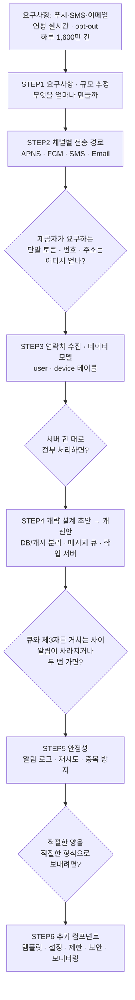

# 알림 시스템 설계 — STEP별 정리 노트

> 『가상 면접 사례로 배우는 대규모 시스템 설계 기초』 10장(165~181p) 학습 노트
> 설계를 시작하기 전에 알아야 할 개념을 STEP 순서대로 정리한다.

---

## 이 노트의 목적

알림 시스템의 기본 동작은 **세 줄**이면 끝난다.

```text
1. 서비스가 "이 사용자에게 알림 보내줘" 라고 알림 서버 API를 호출한다.
2. 알림 서버가 제3자 서비스(APNS / FCM / SMS / 이메일)로 알림을 넘긴다.
3. 제3자 서비스가 사용자 단말에 알림을 전달한다.
```

문제는 이 세 줄을 **하루 1,600만 건 규모**로, **한 건도 잃어버리지 않으면서** 돌리는 순간
세 줄이 하나도 그대로 성립하지 않는다는 것이다.

각 STEP은 *기능 추가*가 아니라 **"앞 단계가 만든 문제를 푸는 다음 결정"** 이다.

> 📌 STEP으로 들어가기 전에 **"왜 / 무엇을 / 그래서 어떻게"** 큰 그림이 필요하면
> 먼저 **[00_왜_무엇_어떻게](00_왜_무엇_어떻게.md)** 를 읽고 오자.

---

## 왜 "세 줄"로 끝나지 않는가

| 벽 | 무엇이 막히나 | 10장 요구사항과 충돌 |
| --- | --- | --- |
| **SPOF** | 알림 서버가 한 대면 그 서버 장애 = **전체 알림 장애** | 하루 1,600만 건 처리 ❌ |
| **규모 확장성** | 한 대가 모든 걸 처리 → DB·캐시를 **개별적으로 증설 불가** | 확장성 ❌ |
| **성능 병목** | HTML 생성 · 제3자 응답 대기 = **오래 걸리는 작업** → 피크 시 과부하 | 연성 실시간 ❌ |
| **알림 소실** | 제3자 전송 실패 시 알림이 **그냥 사라짐** | "어떤 상황에서도 소실 금지" ❌ |
| **알림 중복** | 분산 시스템 특성상 같은 알림이 **두 번 이상** 발송 | 사용자 경험 ❌ |
| **사용자 피로** | 너무 많이 보내면 사용자가 알림 기능을 **아예 꺼 버림** | opt-out 요구사항 ❌ |
| **채널 가용성** | FCM은 **중국에서 사용 불가** | 확장성(extensibility) ❌ |

> 그래서 **범위·규모를 확정하고(STEP1) → 채널별 전송 경로를 이해하고(STEP2) → 누구에게 보낼지 확보하고(STEP3) →
> 큐로 결합도를 끊고(STEP4) → 소실·중복을 막고(STEP5) → 운영 컴포넌트를 얹는다(STEP6)** 는 6개의 결정이 이어진다.

---

## 설계 로드맵



---

## STEP 목록

| STEP | 주제 | 핵심 키워드 | 푸는 문제 |
|:---:|------|-----------|----------|
| [STEP 1](01_STEP1_요구사항_규모추정.md) | 요구사항 · 규모 추정 | 3채널, 연성 실시간, opt-out, 1,000만/100만/500만 | 무엇을 얼마나 만들 것인가 |
| [STEP 2](02_STEP2_알림채널별_전송경로.md) | 채널별 전송 경로 | 알림 제공자, APNS, FCM, 단말 토큰, 페이로드, Twilio, Sendgrid | 채널마다 알림이 어떻게 나가나 |
| [STEP 3](03_STEP3_연락처정보수집_데이터모델.md) | 연락처 수집 · 데이터 모델 | user · device 테이블, 1:N, device_token | 누구에게 보낼지 어떻게 아나 |
| [STEP 4](04_STEP4_개략설계_메시지큐_결합도제거.md) | 개략 설계 초안 → 개선안 | SPOF, 메시지 큐, 작업 서버, 6단계 흐름, 알림 전송 API | 한 대 서버의 세 가지 문제를 어떻게 |
| [STEP 5](05_STEP5_안정성_데이터손실_중복전송.md) | 안정성 | 알림 로그 DB, 재시도, 이벤트 ID 디둡, exactly-once 불가 | 소실·중복을 어떻게 막나 |
| [STEP 6](06_STEP6_추가컴포넌트_템플릿_설정_보안_모니터링.md) | 추가 컴포넌트 · 수정 설계안 | 템플릿, 알림 설정, 전송률 제한, appKey/appSecret, 큐 모니터링, 이벤트 추적 | 실제로 운영하려면 뭐가 더 필요한가 |

### 각 STEP에서 깊게 다루는 것

| STEP | 세부 내용 |
| --- | --- |
| STEP 1 | 면접관에게 던질 질문 6가지, **연성 실시간의 의미와 설계적 함의**, 하루 1,600만 건 → QPS 환산, opt-out이 만들어내는 필수 조회 단계 |
| STEP 2 | **알림 제공자(provider) 개념**, iOS 3-컴포넌트 구조(제공자·APNS·단말), 단말 토큰과 페이로드 JSON, 안드로이드 FCM, SMS 제3자(Twilio·Nexmo), 이메일 제3자(Sendgrid·Mailchimp), **왜 자체 구축 대신 상용 서비스인가**, FCM의 중국 미지원과 Jpush/PushY |
| STEP 3 | 연락처 수집 시점(앱 설치·계정 등록), user 테이블 vs device 테이블 분리 이유, **한 사용자 : 여러 단말(1:N)** 과 "모든 단말에 전송" 요구사항의 연결, 각 컬럼이 어떤 채널에 쓰이는지 |
| STEP 4 | 초안의 3대 문제(SPOF·규모확장성·성능병목), 개선 3원칙(DB/캐시 분리·수평 확장·큐로 결합도 제거), 알림 서버의 4가지 기능, **알림 전송 API 예제**, **채널별 큐를 나누는 이유**, 작업 서버, 6단계 작업 흐름 |
| STEP 5 | "지연·순서는 OK, 소실은 NO" 기준, **알림 로그 DB**, 재시도 메커니즘, 중복 전송이 왜 100% 막을 수 없는지, 이벤트 ID 기반 중복 탐지 로직, at-least-once vs exactly-once |
| STEP 6 | 알림 템플릿(본문·CTA·인자), 알림 설정 테이블(user_id·channel·opt_in), 전송률 제한의 진짜 이유, 재시도 전용 큐와 개발자 통지, appKey/appSecret, **큐 길이 = 작업 서버 증설 신호**, 이벤트 추적, 수정된 설계안 5가지 변화, 4단계 마무리 |

---

## 학습 우선순위

1. **먼저 잡을 것**: STEP 1의 **"연성 실시간 + 소실 금지"** 조합. 이 두 단어가 이 장의 모든 설계 결정을 정당화한다.
   지연을 허용했기 때문에 **큐·재시도**를 쓸 수 있고, 소실을 금지했기 때문에 **알림 로그**가 필요해진다.
2. **가장 많이 투자**: **STEP 4(개략 설계 개선안)**. 이 장의 본체이자 면접의 핵심이다.
   "초안의 3가지 문제 → 개선 3원칙 → 6단계 흐름"을 **그림 없이** 말로 설명할 수 있어야 한다.
3. **그다음**: **STEP 5(안정성)**. "exactly-once는 불가능하고 at-least-once + 중복 탐지로 간다"는 답변은
   분산 시스템 이해도를 보여주는 지점이라 후속 질문이 붙기 쉽다.
4. STEP 2·3은 **말로 흐름을 설명**할 수 있으면 충분. 단, **단말 토큰**과 **1:N 단말 구조**는 놓치지 말 것.
5. STEP 6은 **체크리스트처럼 나열**할 수 있으면 된다. 면접에서 "더 고려할 게 있나?" 질문의 답 창고다.
6. 레퍼런스:
   - **Twilio SMS** / **Nexmo SMS** — SMS 제3자 서비스
   - **Sendgrid** / **Mailchimp** — 이메일 제3자 서비스
   - **You Cannot Have Exactly-Once Delivery** (bravenewgeek) — 중복 전송을 100% 막을 수 없는 이유
   - **Security in Push Notifications** (IBM Cloud Docs) — appKey/appSecret 기반 인증
   - **Key metrics for RabbitMQ monitoring** (Datadog) — 큐 모니터링 메트릭
   - 4장 **처리율 제한 장치** — 전송률 제한 구현은 그대로 4장 내용

---

## 빠른 복습 — 5문장 요약

> 알림 시스템은 **푸시·SMS·이메일** 세 채널을 하나의 API 뒤로 통합하는 시스템이고, 실제 전달은 **제3자 서비스**가 한다(STEP2).
> 보내려면 **단말 토큰·전화번호·이메일 주소**가 필요하므로 앱 설치 시점에 수집해 user·device 테이블에 저장한다(STEP3).
> 서버 한 대 초안은 **SPOF·규모확장성·성능병목**으로 무너지므로, DB/캐시를 분리하고 알림 서버를 수평 확장하고 **채널별 메시지 큐 + 작업 서버**로 결합도를 끊는다(STEP4).
> 큐를 거치면서 생기는 **소실·중복**은 알림 로그 DB + 재시도 + 이벤트 ID 중복 탐지로 막는다 — 단 **exactly-once는 불가능**하다(STEP5).
> 마지막으로 **템플릿·알림 설정·전송률 제한·appKey 인증·큐 모니터링·이벤트 추적**을 얹으면 운영 가능한 시스템이 완성된다(STEP6).
