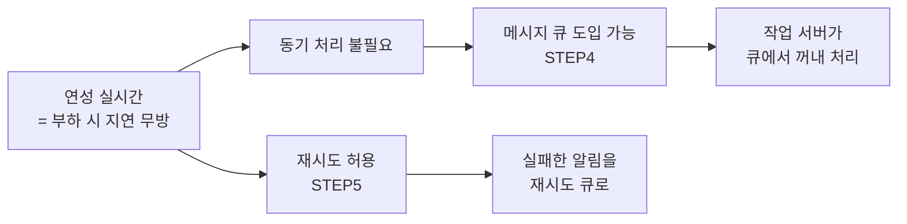
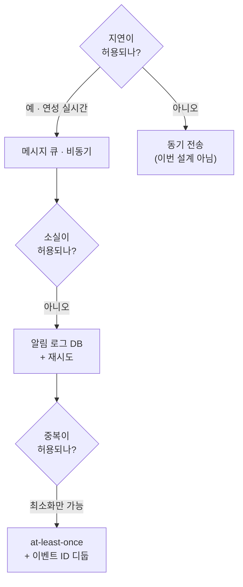

# STEP 1. 요구사항과 규모 추정 — 무엇을 얼마나 만들 것인가

> 설계의 출발점. 알림 시스템 문제는 **정해진 정답이 없고 문제 자체가 모호하게 주어지는 것이 일반적**이라,
> 적절한 질문으로 요구사항을 스스로 알아내는 것이 1단계의 전부다.
> 이 STEP은 **던져야 할 질문 6가지 → 확정된 요구사항 → 규모 환산**을 정리한다.

---

## 0. 먼저: 왜 이 장은 "질문"이 유독 중요한가

알림 시스템은 **누구나 써 본 기능**이다. 그래서 오히려 위험하다.

| 함정 | 왜 생기나 |
| --- | --- |
| "알림 = 푸시 알림" 이라고 좁게 가정 | 실제로는 **푸시 · SMS · 이메일** 세 가지다 |
| "실시간이어야지" 라고 넘겨짚음 | **연성 실시간**이면 큐를 쓸 수 있고, 강한 실시간이면 못 쓴다 — 설계가 통째로 달라진다 |
| "그냥 보내면 되지" | opt-out 요구사항 하나로 **발송 전 조회 단계**가 필수가 된다 |

> **핵심:** 하루 백만 건 이상을 처리하는 확장성 높은 시스템을 만드는 건 쉬운 과제가 아니다.
> **질문으로 범위를 좁히지 않으면 설계 자체가 잡히지 않는다.**

---

## 1. 면접에서 던질 질문과 확정된 요구사항

| # | 질문 | 답변 | 이 답이 결정하는 것 |
| :-: | --- | --- | --- |
| 1 | 어떤 종류의 알림을 지원해야 하나? | **푸시 알림, SMS 메시지, 이메일** | 채널 3종 → 전송 경로 3개 통합 ([STEP 2](02_STEP2_알림채널별_전송경로.md)) |
| 2 | 실시간(real-time) 시스템이어야 하나? | **연성 실시간**(soft real-time). 가능한 한 빨리 전달하되 **높은 부하 시 약간의 지연은 무방** | **메시지 큐로 비동기화 가능** ([STEP 4](04_STEP4_개략설계_메시지큐_결합도제거.md)) |
| 3 | 어떤 종류의 단말을 지원하나? | **iOS 단말, 안드로이드 단말, 랩톱/데스크톱** | 사용자당 단말 여러 개 → **device 테이블 분리** ([STEP 3](03_STEP3_연락처정보수집_데이터모델.md)) |
| 4 | 사용자에게 보낼 알림은 누가 만드나? | **클라이언트 앱**이 만들 수도, **서버 측에서 스케줄링(크론잡)** 할 수도 있음 | 스팸 방지 → **인증된 클라이언트만** API 사용 ([STEP 6](06_STEP6_추가컴포넌트_템플릿_설정_보안_모니터링.md)) |
| 5 | 알림을 받지 않도록(opt-out) 설정 가능해야 하나? | **네.** 설정한 사용자는 더 이상 받지 않음 | 발송 전 **알림 설정 조회** 단계가 필수 ([STEP 6](06_STEP6_추가컴포넌트_템플릿_설정_보안_모니터링.md)) |
| 6 | 하루에 몇 건을 보낼 수 있어야 하나? | 푸시 **1,000만** · SMS **100만** · 이메일 **500만** | 규모 추정의 출발점 (아래 3장) |

> 이 질문들은 사례일 뿐이다. 중요한 것은 **질문을 통해 모호한 부분을 제거**하는 행위 자체다.

---

## 2. 요구사항 해독 — 각 답변이 왜 중요한가

### 2-1. "연성 실시간" 이 이 장에서 가장 중요한 단어인 이유



| 만약 요구사항이 이랬다면 | 설계는 이렇게 달라진다 |
| --- | --- |
| **경성(hard) 실시간** — 지연 절대 불가 | 큐를 못 쓰거나 매우 짧은 지연 큐만 가능, 동기 전송 + 엄격한 SLA, 재시도 여지 축소 |
| **연성 실시간** (이번 요구사항) | ✅ 메시지 큐로 비동기화 · ✅ 버퍼링 · ✅ 재시도 · ✅ 작업 서버 수평 확장 |

> 핵심: **"지연은 허용, 소실은 불가"** — 이 조합이 4·5 STEP의 모든 설계 결정을 정당화한다.
> 지연을 허용받았기 때문에 **큐와 재시도**를 쓸 수 있고, 소실이 금지되었기 때문에 **알림 로그 DB**가 필요해진다.

### 2-2. 나머지 답변이 만들어내는 설계 항목

| 답변 | 만들어지는 설계 항목 | 담당 STEP |
| --- | --- | --- |
| 푸시 · SMS · 이메일 | 채널별 제3자 서비스 연동 + **채널별 메시지 큐** | STEP 2·4 |
| iOS · 안드로이드 · 랩톱/데스크톱 | **한 사용자 : 여러 단말(1:N)** → 모든 단말에 전송 | STEP 3 |
| 클라이언트/서버 양쪽에서 알림 생성 | **알림 전송 API** + appKey/appSecret 인증 | STEP 4·6 |
| opt-out 지원 | **알림 설정 테이블**(user_id, channel, opt_in) + 발송 전 확인 | STEP 6 |
| 하루 1,600만 건 | 수평 확장 가능한 알림 서버 + 작업 서버 풀 | STEP 4 |

---

## 3. 규모 추정

### 3-1. 원문이 준 숫자

| 채널 | 하루 발송량 | 비중 |
| --- | ---: | ---: |
| 모바일 푸시 알림 | **10,000,000** | 62.5% |
| SMS 메시지 | **1,000,000** | 6.25% |
| 이메일 | **5,000,000** | 31.25% |
| **합계** | **16,000,000 / 일** | 100% |

### 3-2. QPS로 환산해 보면 (원문에 명시된 계산은 아니지만 직접 해 볼 것)

```text
전체 QPS = 16,000,000 / (24 × 3,600)
         = 16,000,000 / 86,400
         ≈ 185 건/초
Peak     = 185 × 2 ≈ 370 건/초
```

| 채널 | 계산 | 평균 QPS |
| --- | --- | ---: |
| 푸시 | 10,000,000 ÷ 86,400 | ≈ **116** |
| SMS | 1,000,000 ÷ 86,400 | ≈ **12** |
| 이메일 | 5,000,000 ÷ 86,400 | ≈ **58** |
| 합계 | 16,000,000 ÷ 86,400 | ≈ **185** (peak ≈ 370) |

> ⚠️ QPS 자체는 크지 않다. **이 장의 난이도는 처리량이 아니라 "안정성 · 채널 이질성 · 제3자 의존"** 에 있다.
> 4장(처리율 제한)이나 9장(웹 크롤러)처럼 숫자가 설계를 지배하는 장이 아니라는 점을 알아두자.

### 3-3. 이 숫자가 설계로 이어지는 경로

| 추정치 | 그래서 어떤 설계가 필요한가 |
| --- | --- |
| **하루 1,600만 건** | 서버 한 대로는 SPOF·병목 → **알림 서버 수평 확장 + 작업 서버 풀** ([STEP 4](04_STEP4_개략설계_메시지큐_결합도제거.md)) |
| **채널별 발송량이 16배 차이** | 채널마다 필요한 처리량이 다름 → **채널별 큐 분리 + 채널별 작업 서버 증설** ([STEP 4](04_STEP4_개략설계_메시지큐_결합도제거.md)) |
| **알림 1건당 DB/캐시 조회 발생** | 사용자 정보·단말 토큰·설정을 매번 조회 → **캐시 필수** ([STEP 4](04_STEP4_개략설계_메시지큐_결합도제거.md)) |
| **피크 트래픽 존재** | 큐가 **버퍼** 역할을 해야 함 → 다량 알림 시 완충 ([STEP 4](04_STEP4_개략설계_메시지큐_결합도제거.md)) |
| **소실 금지** | 전 건을 **알림 로그 DB**에 보관 + 재시도 ([STEP 5](05_STEP5_안정성_데이터손실_중복전송.md)) |
| **사용자 피로** | 하루 1,600만 건이면 개인별로도 많음 → **전송률 제한** ([STEP 6](06_STEP6_추가컴포넌트_템플릿_설정_보안_모니터링.md)) |

---

## 4. 요구사항 ↔ 설계 결정 매핑 (미리 보기)

| 요구사항 | 유리한 선택 | 이유 |
| --- | --- | --- |
| 3개 채널 지원 | 채널별 제3자 서비스 + 채널별 큐 | 한 채널 장애가 다른 채널로 번지지 않음 |
| 연성 실시간 | 메시지 큐 + 작업 서버 비동기 처리 | 지연 허용 → 결합도 제거·버퍼링 가능 |
| 다중 단말 | user ↔ device 1:N 테이블 | 모든 단말에 전송해야 함 |
| opt-out | 알림 설정 테이블 + 발송 전 확인 | 설정을 안 보면 요구사항 위반 |
| 확장성 높은 처리 | 무상태 알림 서버 + 오토스케일 | 수평 확장 |
| 알림 소실 금지 | 알림 로그 DB + 재시도 큐 | 실패해도 복구 가능 |
| 스팸 방지 | appKey/appSecret 인증 | 인증된 클라이언트만 발송 |



---

## ✅ STEP 1 체크리스트

- [ ] 알림의 3가지 유형(푸시·SMS·이메일)을 말할 수 있다
- [ ] 면접에서 먼저 던져야 할 질문 6가지를 기억한다
- [ ] **연성 실시간(soft real-time)** 의 정의와, 그것이 왜 메시지 큐 도입의 근거가 되는지 설명할 수 있다
- [ ] "지연·순서는 괜찮지만 소실은 안 된다"는 기준을 한 줄로 말할 수 있다
- [ ] 하루 1,000만/100만/500만 → 합계 1,600만 건, 약 185 QPS를 직접 계산할 수 있다
- [ ] 이 장의 난이도가 **처리량이 아니라 안정성·제3자 의존**에 있다는 것을 설명할 수 있다
- [ ] opt-out 요구사항 하나가 왜 발송 경로에 조회 단계를 추가시키는지 말할 수 있다
- [ ] 각 요구사항이 어떤 설계 결정으로 이어지는지 연결해 말할 수 있다

---

## 💬 예상 면접 질문

**Q1. 알림 시스템 설계를 시작할 때 가장 먼저 무엇을 하겠나?**
> **지원 채널·실시간성·단말 종류·생성 주체·opt-out 여부·일일 발송량**을 질문으로 확정한다. 이 문제는 정답이 없고 모호하게 주어지므로, 질문으로 범위를 좁히는 것이 1단계의 전부다.

**Q2. 연성 실시간(soft real-time)이란 무엇이고 왜 중요한가?**
> 알림은 **가능한 한 빨리** 전달하되 **시스템 부하가 높을 때는 약간의 지연이 허용**된다는 뜻이다. 이 허용 덕분에 **메시지 큐로 비동기 처리**하고 **실패 시 재시도**할 수 있다 — 설계 전체의 전제 조건이다.

**Q3. 하루 1,600만 건이면 QPS는 얼마인가? 이게 어려운 수치인가?**
> 16,000,000 ÷ 86,400 ≈ **185 QPS**, 피크는 2배로 잡아 **370 QPS** 정도다. 처리량 자체는 부담스러운 수준이 아니며, 이 장의 진짜 난이도는 **알림 소실 금지, 채널별 이질성, 제3자 서비스 의존**에 있다.

**Q4. 실시간성이 아니라 '경성 실시간'이 요구사항이었다면 설계가 어떻게 달라지나?**
> 큐를 통한 버퍼링과 재시도 여지가 크게 줄어든다. 동기 전송 경로와 엄격한 지연 SLA가 필요해지고, 대신 **소실 위험과 피크 부하 취약성**이 커진다. 즉 큐 기반 아키텍처의 전제가 무너진다.

**Q5. opt-out 요구사항이 설계에 미치는 영향은?**
> **알림 설정 테이블**(user_id, channel, opt_in)이 필요해지고, 발송 전에 **반드시 해당 사용자가 그 채널을 켜 두었는지 확인**하는 단계가 경로에 추가된다. 이 조회가 매 건마다 발생하므로 **캐시** 대상이 된다.

➡️ 다음: [STEP 2 — 채널별 전송 경로](02_STEP2_알림채널별_전송경로.md)
