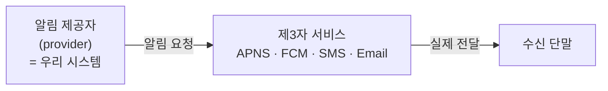
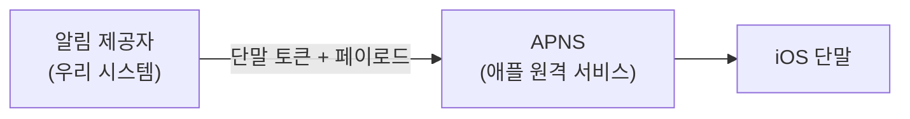
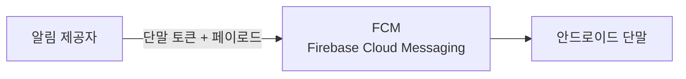
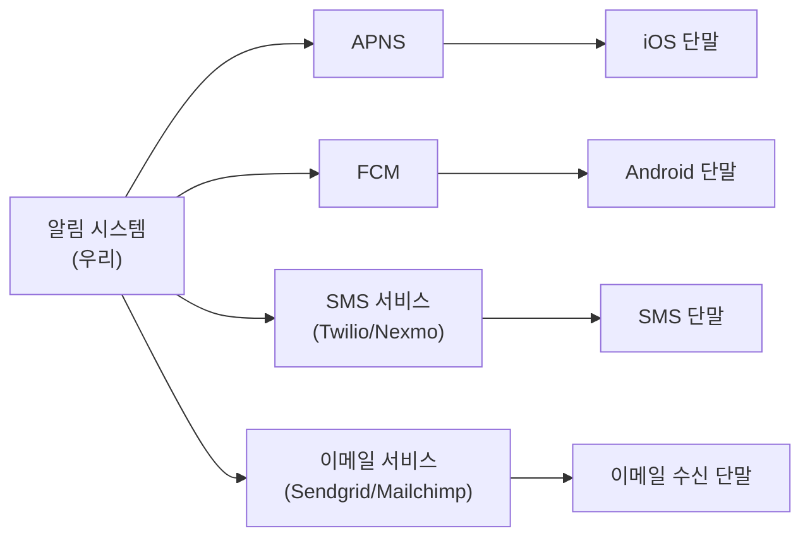
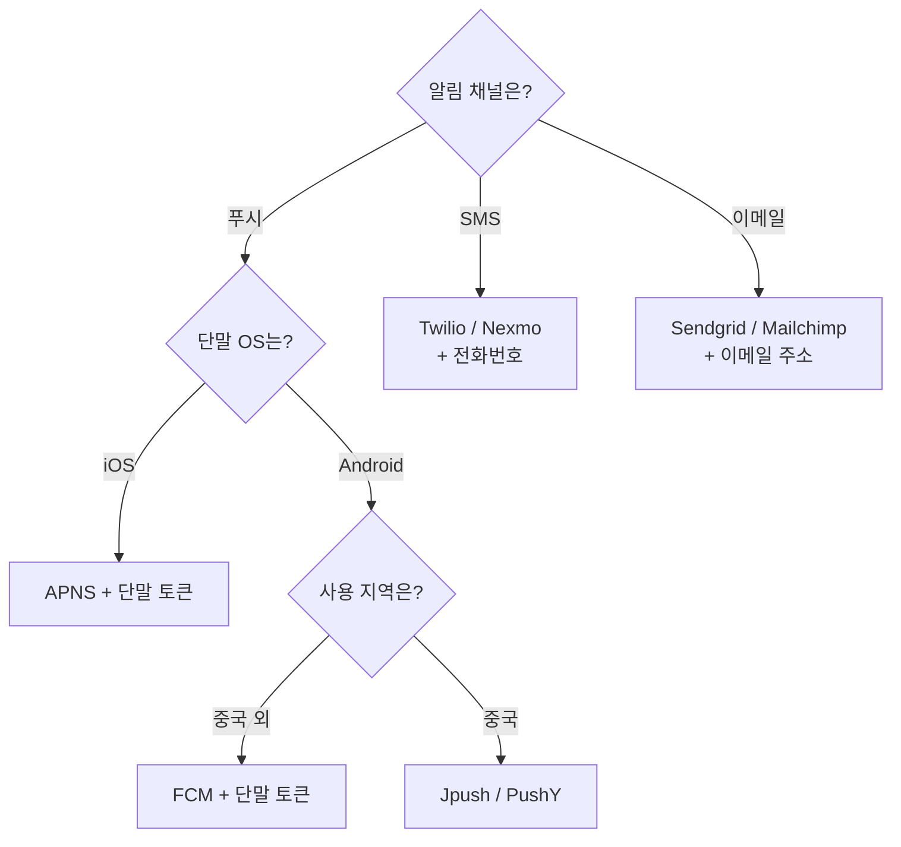

# STEP 2. 채널별 전송 경로 — 알림은 실제로 누가 어떻게 전달하나

> STEP 1이 "푸시·SMS·이메일 세 채널을 지원한다"고 확정했다.
> 그렇다면 **각 채널에서 알림이 실제로 어떤 경로로 단말에 도착하는가**를 먼저 알아야 한다.
> 이 STEP의 결론은 하나다 — **우리는 알림을 직접 전달하지 않는다. 제3자 서비스에 넘길 뿐이다.**

---

## 0. 먼저: 모든 채널이 공유하는 3-컴포넌트 구조

채널이 4개(iOS·안드로이드·SMS·이메일)지만 구조는 전부 동일하다.



| 역할 | 무엇을 하나 | 누가 소유하나 |
| --- | --- | --- |
| **알림 제공자**(provider) | 알림 요청(notification request)을 만들어 제3자 서비스로 보냄 | **우리** (설계 대상) |
| **제3자 서비스** | 알림을 실제로 단말까지 전달 | 애플·구글·트윌리오·센드그리드 등 |
| **수신 단말** | 알림을 표시 | 사용자 |

> 핵심: **설계의 경계는 "제3자 서비스에 넘기는 순간"** 까지다.
> 그 다음은 우리 통제 밖이므로, **넘기기 전까지의 안정성**([STEP 5](05_STEP5_안정성_데이터손실_중복전송.md))이 설계의 초점이 된다.

---

## 1. 핵심 개념 한눈에

| 채널 | 제3자 서비스 | 필요한 식별자 | 비고 |
| --- | --- | --- | --- |
| **iOS 푸시** | **APNS** (Apple Push Notification Service) | **단말 토큰**(device token) | 애플이 제공하는 원격 서비스 |
| **안드로이드 푸시** | **FCM** (Firebase Cloud Messaging) | 단말 토큰 | 절차는 iOS와 동일, APNS 자리에 FCM만 들어감 |
| **SMS** | **트윌리오(Twilio)**, **넥스모(Nexmo)** 등 | 전화번호 | 대부분 **상용 서비스 — 이용요금 발생** |
| **이메일** | **센드그리드(Sendgrid)**, **메일침프(Mailchimp)** 등 | 이메일 주소 | 전송 성공률 높고 **데이터 분석 서비스** 제공 |

> 필요한 식별자가 채널마다 다르다 → 이것이 다음 STEP(**연락처 정보 수집**)을 부른다.

---

## 2. iOS 푸시 알림 — 세 가지 컴포넌트

iOS에서 푸시 알림을 보내려면 세 가지가 필요하다.



### 2-1. 알림 요청에 필요한 데이터 2가지

| 데이터 | 정의 | 어디서 오나 |
| --- | --- | --- |
| **단말 토큰**(device token) | 알림 요청을 보내는 데 필요한 **고유 식별자** | 앱 설치·계정 등록 시 수집 → device 테이블 ([STEP 3](03_STEP3_연락처정보수집_데이터모델.md)) |
| **페이로드**(payload) | 알림 **내용을 담은 JSON 딕셔너리** | 알림 서버가 템플릿·데이터로 생성 ([STEP 6](06_STEP6_추가컴포넌트_템플릿_설정_보안_모니터링.md)) |

### 2-2. 페이로드 예시 (원문)

```json
{
  "aps": {
    "alert": {
      "title": "Game Request",
      "body": "Bob wants to play chess",
      "action-loc-key": "PLAY"
    },
    "badge": 5
  }
}
```

| 필드 | 의미 |
| --- | --- |
| `title` | 알림 제목 |
| `body` | 알림 본문 |
| `action-loc-key` | 사용자가 취할 행동(액션 버튼) 키 |
| `badge` | 앱 아이콘에 표시할 뱃지 숫자 |

> 핵심: 알림 서버가 만들어야 하는 것은 **"제3자 서비스에 전달할 알림 페이로드"** 다.
> 채널마다 페이로드 형식이 다르므로, 이 변환 자체가 알림 서버의 주요 책임 중 하나다.

---

## 3. 안드로이드 푸시 알림



> 안드로이드 푸시 알림도 **비슷한 절차**로 전송된다. **APNS 대신 FCM을 사용한다는 점만 다르다.**

✅ 구조가 같다는 것이 중요하다 → 알림 서버는 **"채널 종류 + 식별자 + 페이로드"** 라는 하나의 추상으로 4채널을 다룰 수 있다.

---

## 4. SMS 메시지

SMS는 보통 **제3자 사업자의 서비스**를 이용한다.

| 서비스 | 특징 |
| --- | --- |
| **트윌리오(Twilio)** | 대표적인 SMS API 서비스 |
| **넥스모(Nexmo)** | 동일 |

- ❌ 이런 서비스는 대부분 **상용 서비스라서 이용요금을 내야 한다.**
- ➡️ 그래서 **전송률 제한**(rate limiting)이 비용 관점에서도 의미를 갖는다 ([STEP 6](06_STEP6_추가컴포넌트_템플릿_설정_보안_모니터링.md)).

---

## 5. 이메일

> **대부분의 회사는 고유 이메일 서버를 구축할 역량은 갖추고 있다. 그럼에도 많은 회사가 상용 이메일 서비스를 이용한다.**

| 서비스 | 왜 쓰나 |
| --- | --- |
| **센드그리드(Sendgrid)** | ✅ 전송 성공률이 높다 · ✅ **데이터 분석 서비스(analytics)** 제공 |
| **메일침프(Mailchimp)** | 동일 |

> ⚠️ 이 대목은 면접에서 좋은 소재다. **"할 수 있는데 왜 안 하는가"** 의 전형적 사례다.
> 이메일 전송은 **스팸 필터 회피·전송 성공률(deliverability)·IP 평판 관리**가 본질인데,
> 이건 서버를 세운다고 해결되는 문제가 아니다. 그래서 **성공률과 분석**을 사서 쓴다.
> 🏢 센드그리드·메일침프가 제공하는 **analytics**는 [STEP 6의 이벤트 추적](06_STEP6_추가컴포넌트_템플릿_설정_보안_모니터링.md)과 그대로 연결된다.

---

## 6. 네 채널을 하나의 시스템으로 묶으면



| 관찰 | 설계적 함의 |
| --- | --- |
| 제3자 서비스가 **4개**로 분리되어 있다 | 하나가 죽어도 나머지는 살아야 한다 → **채널별 큐 분리** ([STEP 4](04_STEP4_개략설계_메시지큐_결합도제거.md)) |
| 채널마다 **응답 속도·실패율이 다르다** | 채널별로 작업 서버를 **독립 증설** 가능해야 함 |
| 채널마다 **페이로드 형식이 다르다** | 알림 서버가 **채널별 페이로드 생성** 책임을 짐 |

---

## 7. 제3자 서비스 통합 시 유의할 두 가지 (원문 강조)

| 유의점 | 내용 | 대응 |
| --- | --- | --- |
| **확장성**(extensibility) | 쉽게 **새로운 서비스를 통합**하거나 **기존 서비스를 제거**할 수 있어야 한다 | 제3자 어댑터를 **교체 가능한 모듈**로 설계 |
| **시장별 가용성** | 어떤 서비스는 특정 시장에서 사용할 수 없다 — 🏢 **FCM은 중국에서 사용 불가** | 중국 시장에서는 **제이푸시(Jpush), 푸시와이(PushY)** 사용 |

> 핵심: "푸시 = FCM" 이라는 **1:1 하드코딩은 금물**이다.
> **채널(푸시) ↔ 제공자(FCM/Jpush/PushY)** 를 분리하고, **사용자의 지역에 따라 제공자를 고르는** 구조여야 한다.

---

## 8. 채널 ↔ 설계 결정 매핑

| 채널 특성 | 유리한 선택 | 이유 |
| --- | --- | --- |
| 채널마다 다른 식별자 | user·device 테이블에 **전부 저장** | 발송 시점에 조회해야 함 ([STEP 3](03_STEP3_연락처정보수집_데이터모델.md)) |
| 채널마다 다른 페이로드 | 알림 서버가 **채널별 이벤트 생성** | 작업 서버는 전달만 담당 |
| 한 채널 장애의 격리 | **채널별 메시지 큐** | 다른 종류 알림은 정상 동작 ([STEP 4](04_STEP4_개략설계_메시지큐_결합도제거.md)) |
| SMS 유료 | **전송률 제한** | 비용 통제 ([STEP 6](06_STEP6_추가컴포넌트_템플릿_설정_보안_모니터링.md)) |
| 시장별 제공자 차이 | 제공자 **플러그인/어댑터화** | FCM 불가 지역 대응 |



---

## ✅ STEP 2 체크리스트

- [ ] **알림 제공자(provider)** 가 무엇이고 우리 시스템이 그 역할이라는 걸 설명할 수 있다
- [ ] iOS 푸시의 3-컴포넌트(제공자 · APNS · iOS 단말)를 말할 수 있다
- [ ] **단말 토큰**과 **페이로드**가 각각 무엇인지 한 줄로 설명할 수 있다
- [ ] APNS 페이로드 JSON의 대략적 구조(`aps` / `alert` / `title` / `body` / `badge`)를 안다
- [ ] 안드로이드 푸시가 iOS와 **어디만 다른지**(APNS→FCM) 말할 수 있다
- [ ] SMS·이메일에서 **자체 구축 대신 제3자 상용 서비스를 쓰는 이유**를 설명할 수 있다
- [ ] 제3자 서비스 통합 시 **확장성**과 **시장별 가용성(FCM 중국 불가)** 을 언급할 수 있다
- [ ] 채널별 제3자 분리가 왜 **채널별 큐 분리**로 이어지는지 연결해 말할 수 있다

---

## 💬 예상 면접 질문

**Q1. iOS 푸시 알림은 어떤 경로로 전달되나?**
> **알림 제공자 → APNS → iOS 단말** 3단계다. 제공자(우리 시스템)가 **단말 토큰**과 **페이로드 JSON**으로 알림 요청을 만들어 APNS에 보내면, APNS가 실제로 단말에 전달한다.

**Q2. 안드로이드는 뭐가 다른가?**
> 절차는 동일하고 **APNS 자리에 FCM(Firebase Cloud Messaging)** 이 들어갈 뿐이다. 그래서 알림 서버는 "채널 + 식별자 + 페이로드"라는 **하나의 추상**으로 두 푸시 채널을 다룰 수 있다.

**Q3. 이메일 서버를 직접 구축할 역량이 있어도 왜 Sendgrid 같은 상용 서비스를 쓰나?**
> **전송 성공률**과 **데이터 분석(analytics)** 때문이다. 이메일은 스팸 필터·IP 평판 관리가 본질이라 서버를 세운다고 해결되지 않는다. 분석 기능은 [STEP 6의 이벤트 추적](06_STEP6_추가컴포넌트_템플릿_설정_보안_모니터링.md)과도 그대로 이어진다.

**Q4. 제3자 서비스를 통합할 때 무엇을 유의하나?**
> **확장성** — 새 서비스를 쉽게 추가하고 기존 서비스를 제거할 수 있어야 한다. 그리고 **시장별 가용성** — 예를 들어 **FCM은 중국에서 쓸 수 없으므로** 그 시장에서는 Jpush·PushY 같은 대체 서비스를 써야 한다. 따라서 채널과 제공자를 하드코딩으로 묶으면 안 된다.

**Q5. 제3자 서비스가 장애를 일으키면 전체 알림이 멈추나?**
> 그렇게 되면 안 된다. 그래서 **알림 종류별로 별도 메시지 큐**를 두어, 제3자 서비스 하나에 장애가 나도 **다른 종류의 알림은 정상 동작**하도록 격리한다 ([STEP 4](04_STEP4_개략설계_메시지큐_결합도제거.md)).

➡️ 다음: [STEP 3 — 연락처 정보 수집과 데이터 모델](03_STEP3_연락처정보수집_데이터모델.md)
