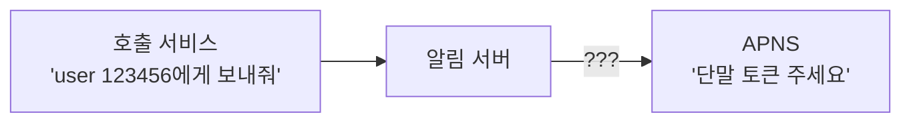
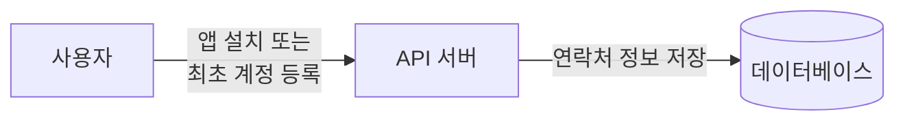
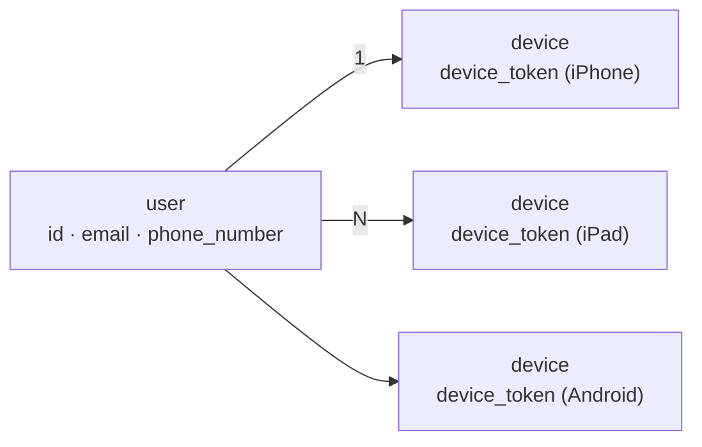
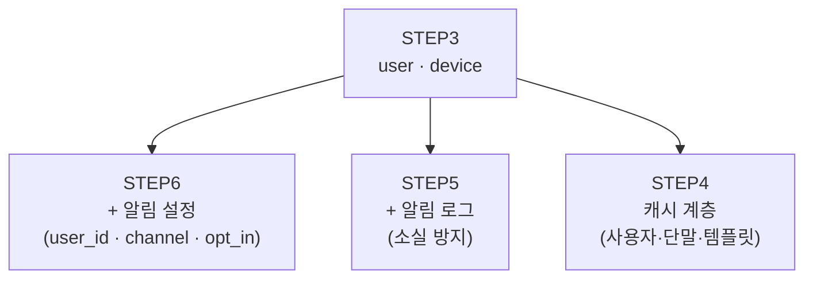

# STEP 3. 연락처 정보 수집과 데이터 모델 — 누구에게 보낼지 어떻게 아나

> [STEP 2](02_STEP2_알림채널별_전송경로.md)에서 채널마다 필요한 식별자가 다르다는 걸 확인했다 — **단말 토큰 · 전화번호 · 이메일 주소**.
> 그렇다면 이 값들을 **언제 수집해서 어떻게 저장할 것인가**. 이것이 이번 STEP의 결정이다.

---

## 0. 먼저: 이 STEP이 짧지만 중요한 이유

알림 시스템의 API는 보통 **`user_id`만 받는다** (원문 API 예제도 `"to": [{"user_id": 123456}]` 형태다).
그런데 제3자 서비스는 `user_id`를 모른다. **단말 토큰·전화번호·이메일 주소**를 요구한다.

> 핵심: **`user_id` → 채널별 식별자** 변환이 반드시 어딘가에 있어야 한다.
> 그 변환 테이블이 바로 이 STEP의 데이터 모델이고, 이 조회가 매 건마다 일어나므로 **캐시 대상**이 된다.

---

## 1. 연락처 정보 수집 절차

알림을 보내려면 **모바일 단말 토큰, 전화번호, 이메일 주소** 등의 정보가 필요하다.

| 시점 | 무엇이 일어나나 |
| --- | --- |
| 사용자가 **앱을 설치**하거나 | API 서버가 해당 사용자의 정보를 수집 |
| **처음으로 계정을 등록**하면 | 수집한 정보를 데이터베이스에 저장 |

> ⚠️ 수집 시점이 **"설치·등록 시"** 라는 게 포인트다. 알림을 보낼 때 수집하는 게 아니라,
> **미리 확보해 둔 것을 발송 시점에 조회**하는 구조다.

---

## 2. 테이블 구조 — 왜 둘로 나누는가

필수 정보만 담은 개략적 설계안이다.

### 2-1. `user` 테이블

| 컬럼 | 타입 | 쓰임 |
| --- | --- | --- |
| `id` | bigint | 사용자 식별자 (PK) |
| `email` | varchar | **이메일 채널**의 수신 주소 |
| `country_code` | integer | 국가 번호 |
| `phone_number` | integer | **SMS 채널**의 수신 번호 |
| `created_at` | timestamp | 생성 시각 |
| `last_logged_in_at` | timestamp | 최근 로그인 시각 |

### 2-2. `device` 테이블

| 컬럼 | 타입 | 쓰임 |
| --- | --- | --- |
| `id` | bigint | 단말 식별자 (PK) |
| `user_id` | bigint | 소유 사용자 (FK → `user.id`) |
| `device_token` | varchar | **푸시 채널**(APNS/FCM)의 수신 식별자 |
| `last_logged_in_at` | timestamp | 최근 로그인 시각 |

### 2-3. 분리 이유 — 1:N

> **한 사용자가 여러 단말을 가질 수 있고, 알림은 모든 단말에 전송되어야 한다는 점을 고려**했다.

| 만약 device_token을 user 테이블에 넣었다면 | 무엇이 깨지나 |
| --- | --- |
| 한 사용자당 토큰 1개만 저장 가능 | ❌ STEP 1 요구사항 "iOS · 안드로이드 · 랩톱/데스크톱 지원" 위반 |
| 새 단말 로그인 시 기존 토큰 덮어쓰기 | ❌ **"알림은 모든 단말에 전송"** 위반 |

✅ 그래서 **user : device = 1 : N** 으로 분리한다.

---

## 3. 채널 ↔ 컬럼 매핑

발송 시점에 어떤 값을 꺼내야 하는지.

| 채널 | 필요한 값 | 어느 테이블 | 조회 결과 개수 |
| --- | --- | --- | --- |
| iOS 푸시 | `device_token` | `device` | **N개** (해당 사용자의 모든 iOS 단말) |
| 안드로이드 푸시 | `device_token` | `device` | **N개** |
| SMS | `country_code` + `phone_number` | `user` | 1개 |
| 이메일 | `email` | `user` | 1개 |

> 핵심: **푸시만 1:N으로 팬아웃(fan-out)** 된다.
> 알림 1건 요청이 실제로는 **여러 건의 푸시 이벤트**가 될 수 있다는 뜻이고,
> 이것이 [STEP 4](04_STEP4_개략설계_메시지큐_결합도제거.md)에서 알림 서버가 큐에 **이벤트**를 만들어 넣는 이유다.

---

## 4. 이 데이터 모델이 만들어내는 후속 결정

| 관찰 | 후속 결정 | 어디서 |
| --- | --- | --- |
| 발송 1건마다 사용자·단말 정보 조회 발생 | **캐시**에 사용자 정보·단말 정보 보관 | [STEP 4](04_STEP4_개략설계_메시지큐_결합도제거.md) |
| 조회 대상이 DB에 몰림 | DB·캐시를 **알림 서버에서 분리**해 독립 확장 | [STEP 4](04_STEP4_개략설계_메시지큐_결합도제거.md) |
| 이메일·전화번호는 **검증**이 필요 | 알림 서버가 **알림 검증(validation)** 수행 | [STEP 4](04_STEP4_개략설계_메시지큐_결합도제거.md) |
| 채널별 수신 여부를 켜고 끌 수 있어야 함 | **알림 설정 테이블**(user_id · channel · opt_in) 추가 | [STEP 6](06_STEP6_추가컴포넌트_템플릿_설정_보안_모니터링.md) |
| 보낸 알림을 잃어버리면 안 됨 | **알림 로그** 테이블 추가 | [STEP 5](05_STEP5_안정성_데이터손실_중복전송.md) |

> 즉 이 장의 데이터 모델은 최종적으로 **`user` · `device` · `알림 설정` · `알림 로그`** 네 덩어리로 확장된다.

---

## 5. 요구사항 ↔ 설계 결정 매핑

| 요구사항 | 유리한 선택 | 이유 |
| --- | --- | --- |
| iOS · 안드로이드 · 랩톱/데스크톱 지원 | `device` 테이블 분리 (1:N) | 사용자당 단말 여러 개 |
| 알림은 모든 단말에 전송 | `user_id`로 device 전체 조회 후 팬아웃 | 요구사항 직접 대응 |
| SMS 지원 | `user`에 `country_code` + `phone_number` | 국제 번호 대응 |
| 이메일 지원 | `user.email` | — |
| 발송 지연 최소화 | 조회 결과를 **캐시** | 매 건 DB 조회 회피 |
| opt-out | 별도 알림 설정 테이블 | 채널 단위 on/off |

---

## ✅ STEP 3 체크리스트

- [ ] 연락처 정보를 **언제** 수집하는지(앱 설치·최초 계정 등록 시) 말할 수 있다
- [ ] `user` 테이블과 `device` 테이블의 컬럼을 각각 말할 수 있다
- [ ] **왜 device를 별도 테이블로 분리**하는지 요구사항과 연결해 설명할 수 있다
- [ ] 채널별로 어느 컬럼이 쓰이는지(토큰/전화번호/이메일) 매핑할 수 있다
- [ ] 푸시만 1:N 팬아웃이 일어난다는 점을 설명할 수 있다
- [ ] 이 조회가 왜 **캐시 대상**이 되는지 말할 수 있다
- [ ] 최종 데이터 모델이 user · device · 알림 설정 · 알림 로그로 확장된다는 걸 안다

---

## 💬 예상 면접 질문

**Q1. 알림을 보내려면 어떤 정보가 필요하고, 언제 수집하나?**
> **단말 토큰 · 전화번호 · 이메일 주소**가 필요하다. 사용자가 **앱을 설치하거나 처음 계정을 등록할 때** API 서버가 수집해 DB에 저장해 두고, 발송 시점에는 조회만 한다.

**Q2. 왜 단말 토큰을 user 테이블이 아니라 device 테이블에 두나?**
> **한 사용자가 여러 단말을 가질 수 있고, 알림은 모든 단말에 전송되어야 하기** 때문이다. user 테이블에 넣으면 사용자당 토큰이 1개로 제한되어 요구사항을 만족할 수 없다. 그래서 **user : device = 1 : N** 구조로 간다.

**Q3. API는 `user_id`만 받는데 제3자 서비스는 단말 토큰을 요구한다. 이 간극은 누가 메우나?**
> **알림 서버**가 메운다. 알림 서버는 캐시나 DB에서 **사용자 정보·단말 토큰·알림 설정 같은 메타데이터를 조회**한 뒤, 채널에 맞는 이벤트를 만들어 큐에 넣는다.

**Q4. 이 조회가 성능 문제를 만들지 않나?**
> 알림 1건마다 조회가 발생하므로 그대로 두면 DB에 부하가 몰린다. 그래서 **사용자 정보·단말 정보·알림 템플릿을 캐시**하고, DB·캐시를 알림 서버에서 **분리해 독립적으로 확장**할 수 있게 만든다 ([STEP 4](04_STEP4_개략설계_메시지큐_결합도제거.md)).

**Q5. 이 데이터 모델은 최종적으로 어떻게 확장되나?**
> `user`·`device`에 더해 **알림 설정 테이블**(user_id, channel, opt_in — [STEP 6](06_STEP6_추가컴포넌트_템플릿_설정_보안_모니터링.md))과 **알림 로그 테이블**(소실 방지 — [STEP 5](05_STEP5_안정성_데이터손실_중복전송.md))이 추가된다.

➡️ 다음: [STEP 4 — 개략 설계 초안에서 개선안으로](04_STEP4_개략설계_메시지큐_결합도제거.md)
