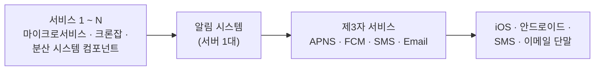
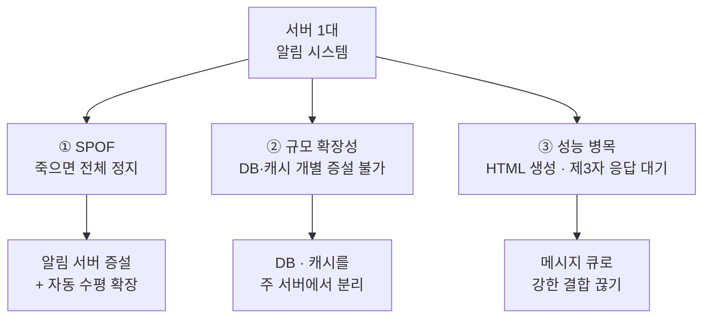
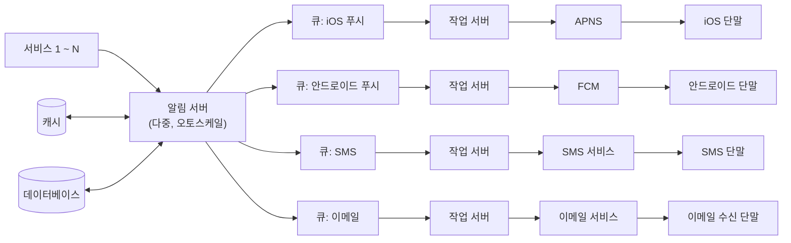
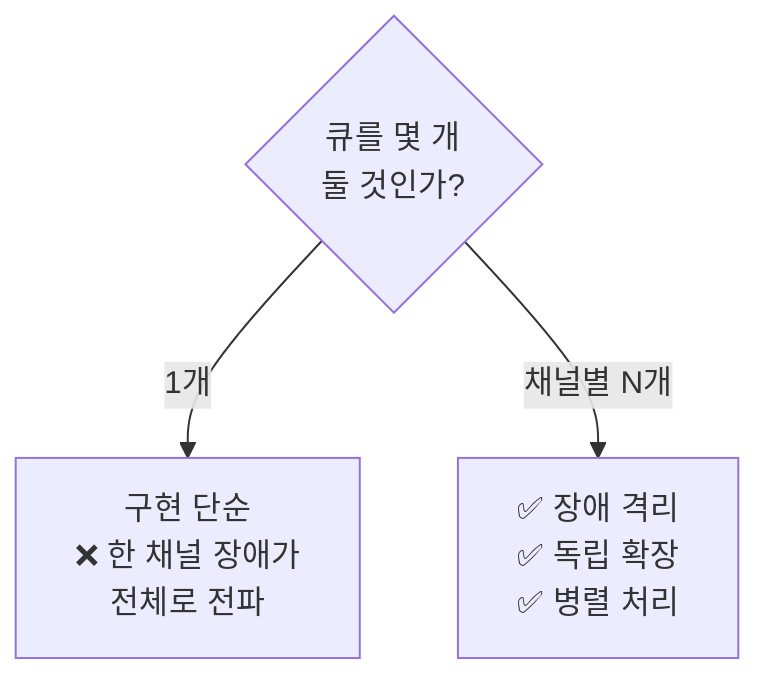
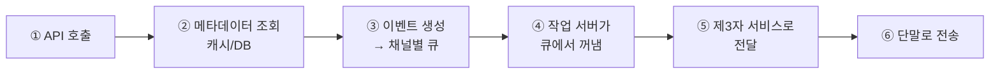

# STEP 4. 개략 설계 초안 → 개선안 — 서버 한 대의 세 가지 문제를 어떻게 푸나

> 채널도 알았고([STEP 2](02_STEP2_알림채널별_전송경로.md)) 연락처도 확보했다([STEP 3](03_STEP3_연락처정보수집_데이터모델.md)).
> 이제 **시스템을 어떻게 쪼갤 것인가**. 이 STEP이 이 장의 **본체**이자 면접의 핵심이다.
> 흐름은 하나다 — **초안을 세우고 → 세 가지 문제를 찾고 → 세 가지 원칙으로 고친다.**

---

## 0. 먼저: 이 STEP을 관통하는 한 줄

> **"모든 걸 한 서버에서 동기적으로 처리하지 않는다."**
>
> 알림 처리는 **자원을 많이 쓰는 작업**(HTML 생성, 제3자 응답 대기)이고,
> 요구사항은 **연성 실시간**(지연 허용)이다. 이 둘이 만나면 답은 **메시지 큐**다.

---

## 1. 개략적 설계안 (초안)



| 컴포넌트 | 역할 |
| --- | --- |
| **서비스 1~N** | 알림을 요청하는 주체. **마이크로서비스**일 수도, **크론잡**일 수도, **분산 시스템 컴포넌트**일 수도 있다.<br/>🏢 예: 납기일을 알리는 **과금 서비스**, 배송 알림을 보내는 **쇼핑몰 웹사이트** |
| **알림 시스템** | 알림 전송/수신 처리의 핵심. **우선은 1개 서버만 사용한다고 가정.**<br/>① 서비스 1~N에 **알림 전송 API** 제공 ② 제3자에 전달할 **알림 페이로드 생성** |
| **제3자 서비스** | 사용자에게 알림을 **실제로 전달**. 통합 시 **확장성**과 **시장별 가용성**(FCM 중국 불가) 유의 |
| **단말** | 사용자가 알림을 수신 |

---

## 2. 초안의 세 가지 문제

> ⚠️ 면접에서 **이 세 가지를 스스로 짚어내는 것**이 핵심이다. 초안을 그린 뒤 반드시 본인이 무너뜨려야 한다.

| # | 문제 | 무슨 일이 벌어지나 |
| :-: | --- | --- |
| ① | **SPOF**<br/>(Single-Point-Of-Failure) | 알림 서비스에 **서버가 하나밖에 없다** → 그 서버 장애 = **전체 서비스 장애** |
| ② | **규모 확장성** | 한 대가 푸시 알림 관련 **모든 것**을 처리 → **데이터베이스·캐시 등 중요 컴포넌트를 개별적으로 늘릴 방법이 없다** |
| ③ | **성능 병목** | 알림 처리·전송은 **자원을 많이 쓰는 작업**. **HTML 페이지 생성**, **제3자 서비스 응답 대기**는 시간이 오래 걸린다 → 트래픽이 몰리는 시간에 **과부하** |



---

## 3. 개선 3원칙

원문이 제시하는 개선 방향은 정확히 세 줄이다.

| # | 원칙 | 어떤 문제를 푸나 |
| :-: | --- | --- |
| 1 | **데이터베이스와 캐시를 알림 시스템의 주 서버에서 분리한다** | ② 규모 확장성 |
| 2 | **알림 서버를 증설하고 자동으로 수평적 규모 확장이 이루어지도록 한다** | ① SPOF · ② 규모 확장성 |
| 3 | **메시지 큐를 이용해 시스템 컴포넌트 사이의 강한 결합을 끊는다** | ③ 성능 병목 |

> ⚠️ 3번이 가능한 이유는 **STEP 1의 "연성 실시간"** 요구사항 덕분이다.
> 지연을 허용받지 못했다면 큐로 비동기화할 수 없다. **요구사항 → 아키텍처**의 연결을 반드시 말하자.

---

## 4. 개선된 설계안



### 4-1. 알림 서버(notification server)의 4가지 기능

| 기능 | 내용 | 왜 필요한가 |
| --- | --- | --- |
| **알림 전송 API** | 스팸 방지를 위해 보통 **사내 서비스 또는 인증된 클라이언트만** 이용 가능 | 아무나 알림을 못 보내게 ([STEP 6 보안](06_STEP6_추가컴포넌트_템플릿_설정_보안_모니터링.md)) |
| **알림 검증**(validation) | 이메일 주소·전화번호 등에 대한 **기본적 검증** | 잘못된 값이 제3자까지 흘러가면 낭비·실패 |
| **데이터베이스 또는 캐시 질의** | 알림에 포함시킬 **데이터를 가져옴** | `user_id` → 단말 토큰·주소·설정 ([STEP 3](03_STEP3_연락처정보수집_데이터모델.md)) |
| **알림 전송** | 알림 데이터를 **메시지 큐에 넣는다**. **하나 이상의 큐**를 사용하므로 **병렬 처리** 가능 | 결합도 제거 + 병렬성 |

> 핵심: 알림 서버는 **직접 보내지 않는다.** **검증하고 · 조회하고 · 큐에 넣는다.**
> 실제 전송은 작업 서버의 몫이다.

### 4-2. 알림 전송 API 예제 (원문)

```http
POST https://api.example.com/v/sms/send
```

```json
{
  "to": [
    { "user_id": 123456 }
  ],
  "from": {
    "email": "from_address@example.com"
  },
  "subject": "Hello, World!",
  "content": [
    {
      "type": "text/plain",
      "value": "Hello, World!"
    }
  ]
}
```

| 관찰 | 의미 |
| --- | --- |
| `to`가 **`user_id`** 다 | 호출자는 단말 토큰·주소를 모른다 → **알림 서버가 조회해서 변환**([STEP 3](03_STEP3_연락처정보수집_데이터모델.md)) |
| `to`가 **배열** | 한 번의 호출로 **여러 사용자**에게 발송 가능 |
| `content`가 **배열 + type** | `text/plain`, `text/html` 등 **다중 표현** 지원 |

### 4-3. 나머지 컴포넌트

| 컴포넌트 | 역할 |
| --- | --- |
| **캐시(cache)** | **사용자 정보 · 단말 정보 · 알림 템플릿**을 캐시 |
| **데이터베이스(DB)** | **사용자 · 알림 · 설정** 등 다양한 정보 저장 |
| **메시지 큐(message queue)** | ① 컴포넌트 간 **의존성 제거** ② 다량 알림 대비 **버퍼** ③ **알림 종류별 별도 큐** |
| **작업 서버(workers)** | 메시지 큐에서 알림을 **꺼내서 제3자 서비스로 전달** |

---

## 5. 왜 큐를 채널별로 나누는가 — 이 장의 핵심 아이디어

> **본 설계안에서는 알림의 종류별로 별도 메시지 큐를 사용하였다.
> 따라서 제3자 서비스 가운데 하나에 장애가 발생해도 다른 종류의 알림은 정상 동작하게 된다.**

| 구조 | SMS 서비스에 장애가 나면 |
| --- | --- |
| **단일 큐** | ❌ SMS 알림이 큐 앞을 막아 **푸시·이메일까지 지연·정지** (head-of-line blocking) |
| **채널별 큐** ✅ | ✅ SMS 큐만 적체. **푸시·이메일은 정상 발송** |

| 채널별 큐의 3가지 이득 | 설명 |
| --- | --- |
| **장애 격리** | 제3자 하나가 죽어도 나머지 채널은 산다 |
| **독립 확장** | 채널별 발송량이 다르다(푸시 1,000만 vs SMS 100만) → **채널별로 작업 서버 수를 다르게** |
| **병렬 처리** | 하나 이상의 큐를 쓰므로 알림을 **병렬적으로 처리** 가능 |



---

## 6. 작업 흐름 6단계 (외울 것)

| # | 단계 |
| :-: | --- |
| 1 | **API를 호출**하여 알림 서버로 알림을 보낸다 |
| 2 | 알림 서버는 **사용자 정보·단말 토큰·알림 설정 같은 메타데이터**를 캐시나 DB에서 가져온다 |
| 3 | 알림 서버는 전송할 알림에 맞는 **이벤트를 만들어 해당 큐에 넣는다** (iOS 푸시 이벤트 → iOS 푸시 큐) |
| 4 | **작업 서버**가 메시지 큐에서 알림 이벤트를 꺼낸다 |
| 5 | 작업 서버가 알림을 **제3자 서비스로 보낸다** |
| 6 | 제3자 서비스가 **사용자 단말로 알림을 전송**한다 |



> ⚠️ **② 단계에서 알림 설정(opt_in)도 함께 조회**해야 한다는 점을 잊지 말자.
> STEP 1의 opt-out 요구사항이 여기서 실행된다 ([STEP 6](06_STEP6_추가컴포넌트_템플릿_설정_보안_모니터링.md)).

---

## 7. 이 설계가 남긴 새 문제 → STEP 5로

| 큐를 넣어서 얻은 것 | 큐를 넣어서 생긴 문제 |
| --- | --- |
| ✅ 결합도 제거, 버퍼링, 병렬 처리, 장애 격리 | ❌ 큐를 거치는 사이 **알림이 사라질 수 있다** |
| ✅ 수평 확장 | ❌ 재시도하면 **같은 알림이 두 번 갈 수 있다** |
| ✅ 작업 서버가 제3자 응답을 기다려도 API는 안 막힘 | ❌ 제3자 전송이 **실패하면 그 알림은?** |
| ✅ 큐가 버퍼 역할 | ❌ 큐가 계속 쌓이면 **아무도 모른다** → 모니터링 필요 ([STEP 6](06_STEP6_추가컴포넌트_템플릿_설정_보안_모니터링.md)) |

> ➡️ 그래서 다음 STEP은 **안정성 — 데이터 손실 방지와 중복 전송 방지**다.

---

## 8. 요구사항 ↔ 설계 결정 매핑

| 요구사항 | 유리한 선택 | 이유 |
| --- | --- | --- |
| 연성 실시간 | 메시지 큐 + 작업 서버 | 지연 허용 → 비동기화 가능 |
| 하루 1,600만 건 | 알림 서버 오토스케일 + 작업 서버 풀 | 수평 확장 |
| 채널별 발송량 편차(16배) | **채널별 큐 + 채널별 작업 서버** | 독립 증설 |
| 제3자 장애 격리 | **채널별 큐** | 다른 채널은 정상 동작 |
| SPOF 제거 | 알림 서버 다중화 + DB/캐시 분리 | 단일 장애점 제거 |
| 조회 지연 최소화 | 캐시(사용자·단말·템플릿) | 매 건 DB 조회 회피 |
| 스팸 방지 | 인증된 클라이언트만 API 사용 | 알림 전송 API 정책 |

---

## ✅ STEP 4 체크리스트

- [ ] 초안의 컴포넌트 4개(서비스 1~N · 알림 시스템 · 제3자 · 단말)를 말할 수 있다
- [ ] **초안의 세 가지 문제(SPOF · 규모 확장성 · 성능 병목)** 를 스스로 짚어낼 수 있다
- [ ] 성능 병목의 구체적 사례 2가지(**HTML 생성 · 제3자 응답 대기**)를 말할 수 있다
- [ ] **개선 3원칙**(DB/캐시 분리 · 수평 확장 · 메시지 큐로 결합 제거)을 외운다
- [ ] 메시지 큐 도입의 근거가 **연성 실시간 요구사항**이라는 걸 연결해 말할 수 있다
- [ ] 알림 서버의 **4가지 기능**(전송 API · 검증 · DB/캐시 질의 · 큐 전송)을 말할 수 있다
- [ ] 알림 전송 API가 왜 `user_id`만 받는지, 그 변환을 누가 하는지 설명할 수 있다
- [ ] **채널별로 큐를 나누는 이유 3가지**(장애 격리 · 독립 확장 · 병렬 처리)를 설명할 수 있다
- [ ] **작업 흐름 6단계**를 그림 없이 순서대로 말할 수 있다
- [ ] 큐 도입이 만들어낸 새 문제(소실 · 중복)가 STEP 5로 이어지는 걸 안다

---

## 💬 예상 면접 질문

**Q1. 알림 시스템 초안(서버 1대)의 문제는 무엇인가?**
> 세 가지다. **SPOF** — 서버 하나가 죽으면 전체 장애. **규모 확장성** — 한 대가 다 처리해서 DB·캐시를 개별 증설할 수 없음. **성능 병목** — HTML 생성과 제3자 응답 대기는 오래 걸리는 작업이라 트래픽이 몰리면 과부하에 빠짐.

**Q2. 그 문제를 어떻게 개선하나?**
> **① DB와 캐시를 주 서버에서 분리**하고, **② 알림 서버를 증설해 자동 수평 확장**하고, **③ 메시지 큐로 컴포넌트 간 강한 결합을 끊는다.** ③이 가능한 건 요구사항이 **연성 실시간**이라 지연이 허용되기 때문이다.

**Q3. 왜 메시지 큐를 알림 종류별로 나누나?**
> **장애 격리** 때문이다. 큐가 하나면 SMS 제3자 장애가 큐 앞을 막아 푸시·이메일까지 지연된다. 채널별로 나누면 **한 제3자 서비스에 장애가 나도 다른 종류의 알림은 정상 동작**한다. 덤으로 채널별 **독립 확장**과 **병렬 처리**도 얻는다.

**Q4. 알림 서버는 무슨 일을 하나?**
> 네 가지다. **알림 전송 API 제공**(인증된 클라이언트만), **알림 검증**(이메일·전화번호), **DB/캐시 질의**(알림에 넣을 데이터·단말 토큰·설정), **큐에 알림 전송**. 실제 제3자 전송은 **작업 서버**가 한다.

**Q5. 알림 하나가 전송되는 전체 흐름을 설명해 보라.**
> ① 서비스가 API 호출 → ② 알림 서버가 캐시/DB에서 사용자 정보·단말 토큰·알림 설정 조회 → ③ 채널에 맞는 이벤트를 만들어 **해당 채널 큐**에 넣음 → ④ 작업 서버가 큐에서 꺼냄 → ⑤ 제3자 서비스로 전달 → ⑥ 제3자가 단말로 전송.

**Q6. 큐를 도입하면 새로 생기는 문제는 없나?**
> 있다. 큐와 제3자를 거치는 사이 **알림이 소실**될 수 있고, 재시도하면 **중복 발송**될 수 있다. 또 작업 서버가 느리면 **큐가 계속 쌓이는데 아무도 모른다**. 그래서 알림 로그·재시도([STEP 5](05_STEP5_안정성_데이터손실_중복전송.md))와 큐 모니터링([STEP 6](06_STEP6_추가컴포넌트_템플릿_설정_보안_모니터링.md))이 필요하다.

➡️ 다음: [STEP 5 — 안정성: 데이터 손실과 중복 전송](05_STEP5_안정성_데이터손실_중복전송.md)
