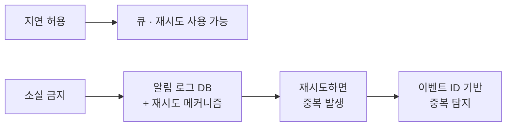
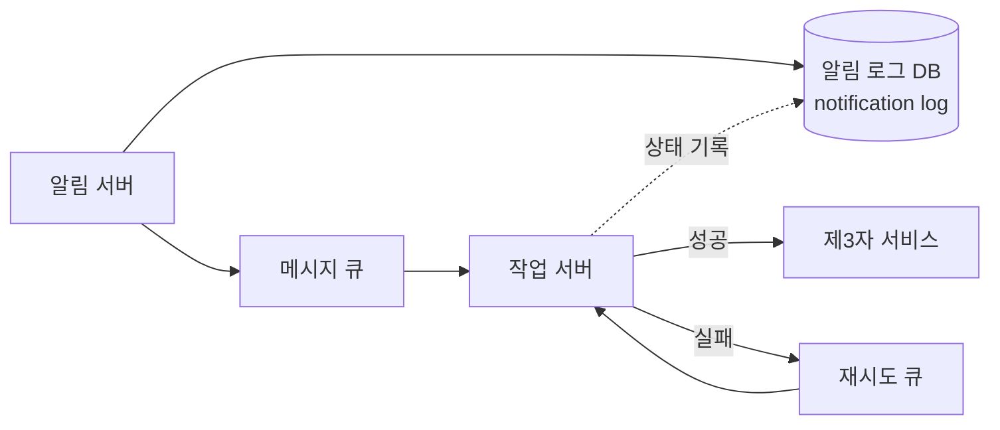
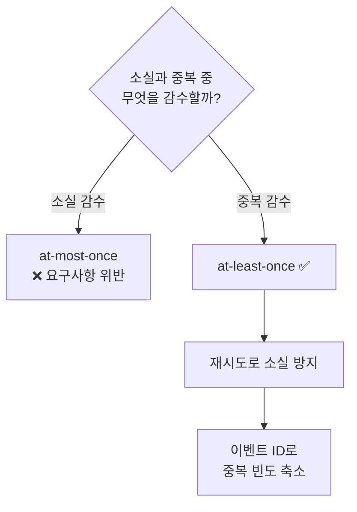
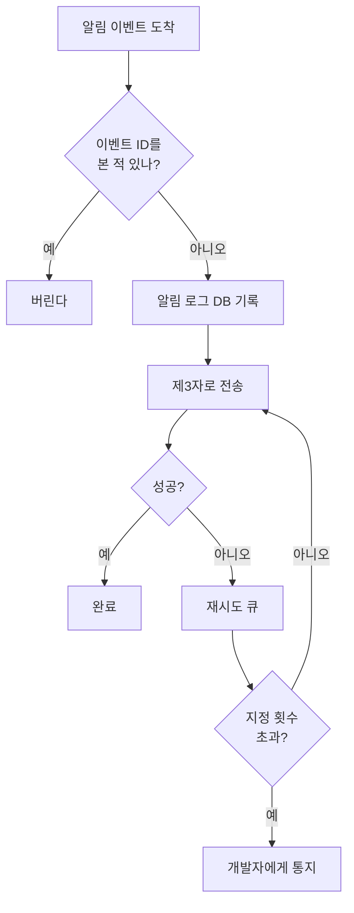

# STEP 5. 안정성 — 소실은 막고, 중복은 줄인다

> [STEP 4](04_STEP4_개략설계_메시지큐_결합도제거.md)에서 메시지 큐로 결합도를 끊었다.
> 그 대가로 알림은 **알림 서버 → 큐 → 작업 서버 → 제3자** 라는 긴 여정을 거치게 됐고,
> 그 사이 **사라지거나 두 번 갈 수 있다**. 이 STEP은 그 두 가지를 다룬다.

---

## 0. 먼저: 이 장의 안정성 기준 한 줄

> **알림이 지연되거나 순서가 틀려도 괜찮지만, 사라지면 곤란하다.**

| 허용되는 것 | 허용되지 않는 것 |
| --- | --- |
| ✅ **지연**(연성 실시간) | ❌ **소실**(loss) |
| ✅ **순서 뒤바뀜** | — |
| ⚠️ **중복** — 완전 차단은 불가, **빈도를 줄이는 것**이 목표 | — |



> 핵심: **소실을 막으려고 재시도를 넣으면 중복이 생긴다.** 이 둘은 한 세트로 이해해야 한다.

---

## 1. 핵심 개념 한눈에

| 문제 | 원인 | 해결 | 완전 해결 가능? |
| --- | --- | --- | :---: |
| **데이터 손실** | 제3자 전송 실패, 컴포넌트 장애 | **알림 로그 DB에 보관** + **재시도 메커니즘** | ✅ 가능 |
| **중복 전송** | 분산 시스템 특성, 재시도 | **이벤트 ID 기반 중복 탐지** + 신중한 오류 처리 | ❌ **불가능**, 빈도만 줄임 |

---

## 2. 데이터 손실 방지

> **알림 전송 시스템의 가장 중요한 요구사항 가운데 하나는 어떤 상황에서도 알림이 소실되면 안 된다는 것이다.**

### 2-1. 해법 두 가지

| 해법 | 내용 |
| --- | --- |
| **알림 데이터를 데이터베이스에 보관** | **알림 로그(notification log)** 데이터베이스를 유지한다 |
| **재시도 메커니즘 구현** | 전송 실패 시 다시 시도 |



### 2-2. 알림 로그 DB가 있으면 무엇이 가능해지나

| 능력 | 설명 |
| --- | --- |
| **복구** | 전송 실패한 알림을 나중에 다시 꺼내 보낼 수 있다 |
| **감사(audit)** | "이 알림이 보내졌나?" 를 답할 수 있다 |
| **중복 탐지의 근거** | 이미 처리한 이벤트인지 대조할 대상이 생긴다 |
| **이벤트 추적의 시작점** | 생성 → 큐 → 전송 → 도착 단계를 추적 ([STEP 6](06_STEP6_추가컴포넌트_템플릿_설정_보안_모니터링.md)) |

> ⚠️ 메시지 큐도 나름 내구성을 갖지만, **큐만으로는 부족하다**.
> 큐는 "처리되면 사라지는" 구조라 **처리 이후의 실패**와 **사후 조회**를 감당하지 못한다.
> 그래서 **별도의 알림 로그 DB**를 둔다.

### 2-3. 재시도 메커니즘 (STEP 6과 연결)

| 단계 | 동작 |
| --- | --- |
| 1 | 제3자 서비스가 알림 전송에 **실패** |
| 2 | 해당 알림을 **재시도 전용 큐**에 넣는다 |
| 3 | 지정된 횟수만큼 재시도 |
| 4 | 같은 문제가 **계속해서 발생**하면 **개발자에게 통지(alert)** |

> 🏢 실무에서는 여기에 **지수 백오프(exponential backoff)** 와 **데드 레터 큐(DLQ)** 개념이 붙는다.
> 원문은 "지정된 횟수만큼 재시도 → 계속 실패하면 알림" 까지만 명시한다.

---

**토픽의 우선순위 지정 알아보기**

### 3. 중복 전송 방지

### 3-1. 왜 100% 막을 수 없는가

> **같은 알림이 여러 번 반복되는 것을 완전히 막는 것은 가능하지 않다.
> 대부분의 경우 알림은 딱 한 번만 전송되겠지만, 분산 시스템의 특성상 가끔은 같은 알림이 중복되어 전송되기도 할 것이다.**

| 전달 보장 | 의미 | 이 설계의 선택 |
| --- | --- | --- |
| **at-most-once** | 최대 1번. **소실 가능** | ❌ "소실 금지" 요구사항 위반 |
| **at-least-once** | 최소 1번. **중복 가능** | ✅ **채택** — 재시도로 소실을 막고, 중복은 탐지로 줄인다 |
| **exactly-once** | 정확히 1번 | ❌ 분산 환경에서 **실질적으로 불가능** (참고문헌 [5]) |



> ⚠️ 왜 불가능한가를 한 줄로: **"보냈다"는 사실과 "보냈다고 기록했다"는 사실을 원자적으로 묶을 수 없기 때문**이다.

---

### 3-2. 왜 exactly-once가 불가능한가 — 세 겹의 이유

> 면접에서 가장 깊게 파고드는 지점이다. **한 줄 답 → 실패 창 → 타임아웃의 모호성** 순서로 설명할 수 있어야 한다.

#### 이유 ① 어떤 순서로 짜도 실패 창(window)이 남는다

작업 서버가 하는 일은 결국 **두 개의 연산**이다.

```text
send()   — 제3자(APNS / Twilio)에게 전송   ← 부수 효과(side effect)
mark()   — "전송함"을 우리 저장소에 기록     ← 상태 변경
```

이 사이 어디서든 프로세스가 죽을 수 있고, 순서는 두 가지밖에 없다.

| 순서 | 중간에 죽으면 | 재처리 시 | 결과 |
| --- | --- | --- | :---: |
| **A. send → mark** | 전송은 됐는데 기록이 없음 | mark가 없으니 **다시 보냄** | ❌ **중복** |
| **B. mark → send** | 기록은 됐는데 전송이 안 됨 | mark가 있으니 **건너뜀** | ❌ **소실** |

```text
A:  send() ──✅ 전송됨──┐
                        💥 crash
                        └── mark() 미실행  →  재시도 → 중복

B:  mark() ──✅ 기록됨──┐
                        💥 crash
                        └── send() 미실행  →  스킵 → 소실
```

> **중복과 소실 중 하나는 반드시 골라야 한다.**
> 이 설계는 **소실을 절대 금지**했으므로 A(= at-least-once)를 택했고, 그래서 중복이 남는다.

#### 이유 ② 트랜잭션으로 묶을 수 없다 — 제3자가 참여하지 않으므로

| 시도 | 왜 안 되나 |
| --- | --- |
| DB 트랜잭션에 `send()` 포함 | ❌ APNS 호출은 **롤백이 안 된다**. 이미 나간 푸시는 되돌릴 수 없다 |
| **2단계 커밋(2PC)** | ❌ Twilio·Sendgrid가 `prepare`/`commit` 프로토콜을 제공하지 않는다. 게다가 2PC도 **코디네이터 장애 시 참여자가 blocking** 된다 |
| **Kafka exactly-once semantics** | ❌ Kafka **내부**(읽기→처리→쓰기가 전부 Kafka 안)에서만 성립. **외부 HTTP 호출이라는 부수 효과에는 적용되지 않는다** |

> ⚠️ **자주 헷갈리는 구분**
> **exactly-once *processing*은 가능하다** — 닫힌 시스템 안에서라면.
> **exactly-once *delivery*는 불가능하다** — 외부 부수 효과가 끼는 순간.
> "Kafka가 exactly-once 지원하잖아요?" 라는 반문에는 이 구분으로 답한다.

#### 이유 ③ 타임아웃은 아무 정보도 주지 않는다 (가장 근본적)

작업 서버가 제3자를 호출하고 **타임아웃**을 받았을 때, 다음 두 상황을 **구분할 방법이 없다.**

| 실제로 일어난 일 | 우리가 본 것 | 취해야 할 행동 |
| --- | --- | --- |
| 요청이 아예 도달하지 않았다 | **타임아웃** | 재시도해야 함 |
| 요청은 도달해 **전송까지 됐는데 응답만 유실**됐다 | **타임아웃** | 재시도하면 안 됨 |

둘이 똑같이 생겼는데 행동은 정반대다. 이것이 **두 장군 문제(Two Generals Problem)** 의 실체다.

> 신뢰할 수 없는 네트워크 위에서는 **유한 번의 메시지 교환으로 양쪽이 "상대도 알고 있다"에 합의할 수 없다.**
> 확인 메시지를 아무리 더 주고받아도 **마지막 메시지의 유실 가능성**이 항상 남는다.

#### 정리 — 막을 수 있는 중복과 없는 중복

우리 **시스템 경계 안**의 중복은 거의 다 막을 수 있다. Redis `SET NX`처럼 **한 시스템 안에서는 검사와 기록을 원자적으로** 할 수 있기 때문이다. 못 막는 것은 오직 경계 밖 하나다.

| # | 중복 경로 | 원인 | 막을 수 있나 |
| :-: | --- | --- | :---: |
| ① | 호출자 재시도 | 발신 서비스가 타임아웃 후 재전송 | ✅ `dedup:{event_id}` |
| ② | 복구 배치 재적재 | 큐에 이미 있는 건을 또 넣음 | ✅ `sent:{notification_id}` |
| ③ | 작업 서버 재처리 | 커밋 전 크래시 | ✅ `sent:{notification_id}` |
| ④ | **응답 유실 후 재시도** | **제3자가 실제로 성공했는지 알 수 없음** | ❌ **원리적으로 불가** |


> ④를 **없앨** 수는 없고 **책임을 옮길** 수는 있다.
> 제3자가 멱등 키를 지원하면(`Idempotency-Key: {notification_id}`) 중복 판정이 **제3자 내부의 원자적 연산**이 되어 그쪽 경계 안에서 해결된다.
> 다만 모든 제공자가 지원하지 않고, `apns-collapse-id` 같은 것은 **중복 제거가 아니라 단말에서의 표시 병합**일 뿐이다.

#### 그래서 목표가 달라진다

"중복 0"은 달성 불가능한 목표라서, 목표 자체를 바꾼다.

| 잘못된 목표 | 실제 목표 |
| --- | --- |
| 중복을 **0으로 만든다** | **중복률을 0.01% 이하로 누른다** |
| — | **중복이 나도 사용자에게 무해하게 만든다** |

무해하게 만드는 방법이 알림 시스템에서는 오히려 더 중요하다.

| 방법 | 예시 |
| --- | --- |
| **알림 내용을 멱등하게** | ❌ "잔액이 1,000원 차감되었습니다" (두 번 오면 2,000원으로 오해)<br/>✅ "결제가 완료되었습니다. 현재 잔액 9,000원" (두 번 와도 같은 사실) |
| **collapse-id로 표시 병합** | 단말 알림함에 쌓이지 않고 하나로 합쳐짐 |
| **전송률 제한** | 중복이 폭주해도 사용자에게 도달하는 건 상한선까지 ([STEP 6](06_STEP6_추가컴포넌트_템플릿_설정_보안_모니터링.md)) |

> **한 문장 정리:** 소실을 금지했기 때문에 재시도하고, 재시도하기 때문에 중복이 생기며,
> 그 중복 중 **우리 경계 안의 것(①②③)은 원자적 연산으로 막고, 경계 밖의 것(④)은 막는 대신 무해하게 만든다.**

### 3-3. 중복 방지 로직 (원문)

> **보내야 할 알림이 도착하면 그 이벤트 ID를 검사하여 이전에 본 적이 있는 이벤트인지 살핀다.
> 중복된 이벤트라면 버리고, 그렇지 않으면 알림을 발송한다.**

```text
onNotificationEvent(event):
    if seen(event.id):          # 이전에 본 적 있는 이벤트인가?
        discard(event)          # 버린다
        return
    markSeen(event.id)
    send(event)                 # 발송
```

| 요소 | 설계 시 고려할 것 |
| --- | --- |
| **이벤트 ID** | 알림 생성 시점에 **고유하게 부여**되어야 한다 (7장 유일 ID 생성기와 연결) |
| **`seen()` 저장소** | 조회가 매우 빈번 → **캐시/키-값 저장소**가 자연스럽다 |
| **보관 기간** | 무한 보관 불가 → **TTL**로 일정 기간만 |
| **판정 시점** | 알림 서버 진입 시 / 작업 서버 전송 직전 — 어디에 두느냐로 커버 범위가 달라진다 |

> **오류를 신중하게 처리해야 한다** 는 원문 표현도 중요하다.
> "실패했다고 판단했는데 실은 성공한 경우" 가 중복의 대표적 원인이다.

---

## 4. 손실 ↔ 중복 트레이드오프 정리

| 축 | 강하게 막으면 | 대가 |
| --- | --- | --- |
| **소실 방지** ↑ | 재시도 횟수 ↑, 로그 보관 ↑ | 중복 발생 확률 ↑, 저장 비용 ↑ |
| **중복 방지** ↑ | 이벤트 ID 보관 기간 ↑, 판정 지점 앞당김 | 저장·조회 비용 ↑, 판정 오류 시 **정상 알림도 버림** ⚠️ |

> 핵심: 알림 시스템은 **"보내지지 않는 것보다 두 번 보내지는 게 낫다"** 는 쪽으로 기운 시스템이다.
> 다만 그 중복이 사용자 피로로 이어지므로, **전송률 제한**([STEP 6](06_STEP6_추가컴포넌트_템플릿_설정_보안_모니터링.md))이 마지막 방어선이 된다.

---

## 5. 요구사항 ↔ 설계 결정 매핑

| 요구사항 | 유리한 선택 | 이유 |
| --- | --- | --- |
| 어떤 상황에서도 소실 금지 | **알림 로그 DB** + **재시도 메커니즘** | 실패해도 복구 가능 |
| 지연·순서는 허용 | 재시도 큐 · 비동기 처리 | 즉시성보다 도달을 우선 |
| 중복 최소화 | **이벤트 ID 기반 중복 탐지** | 완전 차단은 불가, 빈도 축소 |
| 계속 실패하는 알림 | **개발자에게 통지(alert)** | 무한 재시도 방지, 운영 개입 |
| 사용자 피로 방지 | 전송률 제한 | 중복·과다 발송의 마지막 방어선 |



---

## ✅ STEP 5 체크리스트

- [ ] 이 장의 안정성 기준 **"지연·순서는 괜찮지만 소실은 안 된다"** 를 한 줄로 말할 수 있다
- [ ] 데이터 손실 방지의 두 축(**알림 로그 DB** + **재시도**)을 말할 수 있다
- [ ] 큐가 있는데도 왜 **별도 알림 로그 DB**가 필요한지 설명할 수 있다
- [ ] **중복 전송을 100% 막을 수 없는 이유**를 한 줄로 설명할 수 있다
- [ ] `send()` / `mark()` **순서를 어떻게 바꿔도 중복 아니면 소실이 남는다**는 것을 그림으로 설명할 수 있다
- [ ] 왜 **DB 트랜잭션·2PC로 묶을 수 없는지** 설명할 수 있다 (제3자가 참여하지 않음)
- [ ] **exactly-once *processing*** 과 **exactly-once *delivery*** 를 구분할 수 있다 (Kafka EOS 반문 대응)
- [ ] **타임아웃의 모호성**(도달 안 함 vs 응답만 유실)과 **두 장군 문제**를 연결해 말할 수 있다
- [ ] 중복 발생 4경로 중 **①②③은 막히고 ④만 못 막힌다**는 것을 설명할 수 있다
- [ ] "중복 0" 대신 **"중복을 무해하게"** 가 실제 목표가 되는 이유와 그 방법 3가지를 말할 수 있다
- [ ] at-most-once / at-least-once / exactly-once 를 구분하고, 이 설계가 **at-least-once** 를 택한 근거를 말할 수 있다
- [ ] 이벤트 ID 기반 중복 탐지 로직을 의사코드 수준으로 쓸 수 있다
- [ ] 중복 탐지 저장소가 **캐시 + TTL** 로 가는 이유를 설명할 수 있다
- [ ] 재시도 흐름(실패 → 재시도 큐 → 지정 횟수 → 개발자 통지)을 말할 수 있다
- [ ] 소실 방지와 중복 방지가 **서로 밀어내는 트레이드오프**라는 걸 설명할 수 있다

---

## 💬 예상 면접 질문

**Q1. 알림 시스템의 안정성 요구사항은 무엇인가?**
> **알림이 어떤 상황에서도 소실되면 안 된다**는 것이다. 지연되거나 순서가 뒤바뀌는 건 괜찮다. 이를 위해 알림 데이터를 **알림 로그 DB**에 보관하고 **재시도 메커니즘**을 구현한다.

**Q2. 메시지 큐가 있는데 왜 별도 알림 로그 DB가 필요한가?**
> 큐는 **처리되면 사라지는** 구조라, 큐에서 꺼낸 뒤 제3자 전송이 실패한 경우나 사후 조회·감사에 대응할 수 없다. 알림 로그 DB가 있어야 **복구·감사·중복 탐지·이벤트 추적**의 근거가 생긴다.

**Q3. 같은 알림이 두 번 가는 걸 완전히 막을 수 있나?**
> **불가능하다.** 분산 시스템에서 exactly-once 전달은 실질적으로 성립하지 않는다. "보냈다"는 행위와 "보냈다고 기록했다"는 행위를 원자적으로 묶을 수 없기 때문이다. 그래서 **at-least-once + 중복 탐지**로 **빈도를 줄이는 것**이 현실적 목표다.

**Q3-1. (꼬리질문) 왜 트랜잭션으로 묶으면 안 되나?**
> **제3자 서비스가 우리 트랜잭션에 참여하지 않기 때문**이다. 이미 나간 푸시는 롤백할 수 없고, Twilio·Sendgrid는 2PC의 `prepare`/`commit`을 제공하지 않는다. 2PC를 쓴다 해도 **코디네이터 장애 시 참여자가 blocking** 된다.

**Q3-2. (꼬리질문) Kafka는 exactly-once를 지원한다고 하던데?**
> Kafka의 EOS는 **읽기→처리→쓰기가 전부 Kafka 안에서 끝날 때**만 성립한다. 알림 전송은 **외부 HTTP 호출이라는 부수 효과**이므로 적용되지 않는다. **exactly-once *processing*은 가능하지만 exactly-once *delivery*는 불가능**하다는 구분이 핵심이다.

**Q3-3. (꼬리질문) 가장 근본적인 이유 하나만 꼽는다면?**
> **타임아웃이 아무 정보도 주지 않는다는 것**이다. "요청이 도달하지 않은 것"과 "전송까지 됐는데 응답만 유실된 것"이 똑같이 타임아웃으로 보이는데, 취해야 할 행동은 정반대다. 이것이 **두 장군 문제**이며, 확인 메시지를 아무리 더 주고받아도 **마지막 메시지의 유실 가능성**이 남는다.

**Q4. 중복 탐지는 어떻게 구현하나?**
> 알림 이벤트마다 **고유 이벤트 ID**를 부여하고, 발송 전에 **이전에 본 적 있는 ID인지 검사**해서 있으면 버리고 없으면 발송한다. 조회가 매우 빈번하므로 **캐시/키-값 저장소에 TTL을 걸어** 보관한다.

**Q5. 왜 소실이 아니라 중복 쪽을 감수하나?**
> 요구사항이 **"소실 금지"** 이기 때문이다. at-most-once는 소실을 허용하므로 탈락이고, exactly-once는 불가능하다. 남는 선택지가 **at-least-once**다. 대신 중복이 사용자 피로로 이어지지 않도록 **전송률 제한**을 두어 방어한다.

**Q6. 재시도가 계속 실패하면 어떻게 하나?**
> 실패한 알림을 **재시도 전용 큐**에 넣어 **지정된 횟수만큼** 재시도하고, **같은 문제가 계속 발생하면 개발자에게 통지(alert)** 한다. 무한 재시도로 시스템을 갉아먹지 않도록 운영 개입 지점을 만드는 것이다.

➡️ 다음: [STEP 6 — 추가 컴포넌트와 수정된 설계안](06_STEP6_추가컴포넌트_템플릿_설정_보안_모니터링.md)
