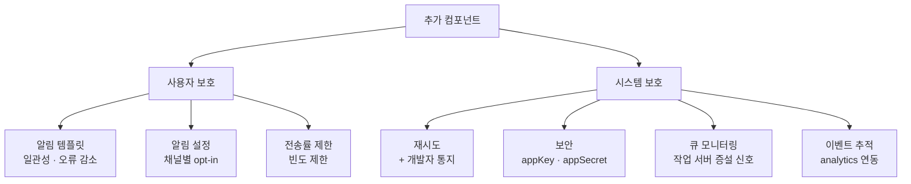
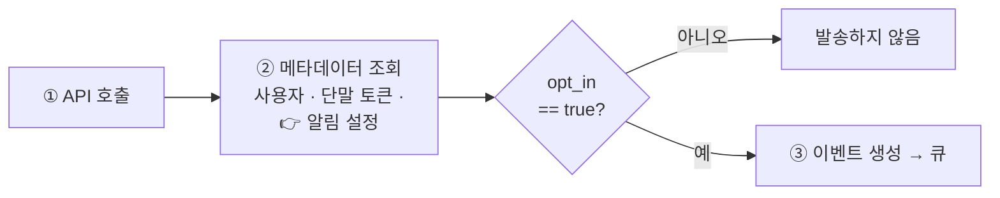
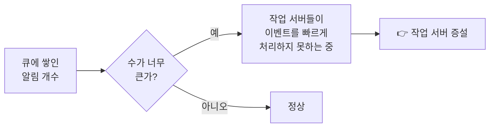
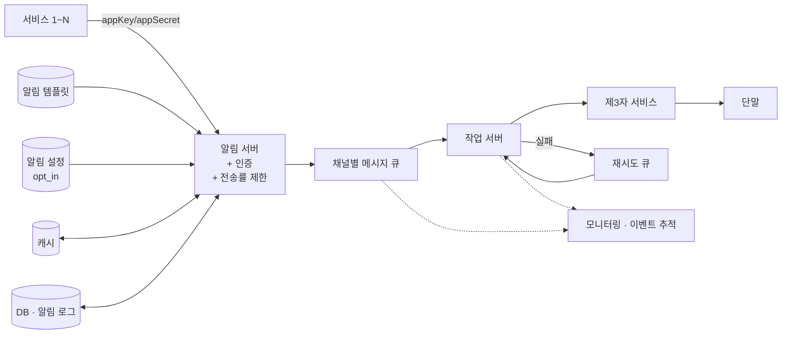

# STEP 6. 추가 컴포넌트와 수정된 설계안 — 안정적으로 보내는 건 됐는데, "적절히" 보내려면

> [STEP 5](05_STEP5_안정성_데이터손실_중복전송.md)까지 오면 **알림은 안 사라지고 잘 나간다**.
> 그런데 **알림 시스템은 사실 이보다 훨씬 복잡하다.**
> 이 STEP은 실제 운영에 필요한 **6가지 추가 컴포넌트**와, 그것을 전부 반영한 **수정된 설계안**을 정리한다.

---

## 0. 먼저: 이 STEP의 컴포넌트를 두 축으로 나눠 보기

| 축 | 목적 | 해당 컴포넌트 |
| --- | --- | --- |
| **사용자를 지키는 것** | 사용자가 알림을 끄지 않게 | 알림 템플릿, 알림 설정, 전송률 제한 |
| **시스템을 지키는 것** | 운영자가 상태를 알 수 있게 | 재시도, 보안(appKey/appSecret), 큐 모니터링, 이벤트 추적 |



> 핵심: 여기까지가 **"알림을 보낼 수 있다"** 와 **"알림 서비스를 운영할 수 있다"** 의 차이다.

---

## 1. 핵심 개념 한눈에

| 컴포넌트 | 무엇을 푸나 | 한 줄 요약 |
| --- | --- | --- |
| **알림 템플릿** | 수백만 건의 알림을 매번 처음부터 작성 | 인자·스타일·추적 링크만 바꿔 끼우는 **틀** |
| **알림 설정** | 사용자가 알림에 피로해짐 | `user_id · channel · opt_in` 테이블, **발송 전 반드시 확인** |
| **전송률 제한** | 너무 많이 보내면 기능을 아예 꺼 버림 | 사용자가 받을 수 있는 알림 **빈도 제한** |
| **재시도** | 제3자 전송 실패 | **재시도 전용 큐**, 계속 실패 시 개발자 통지 |
| **보안** | 아무나 알림을 보냄(스팸) | **appKey / appSecret** 으로 인증된 클라이언트만 |
| **큐 모니터링** | 작업 서버가 못 따라가는데 아무도 모름 | **큐에 쌓인 알림 개수** 메트릭 → 증설 신호 |
| **이벤트 추적** | 알림이 효과가 있는지 모름 | 확인율·클릭률·앱 사용 전환율 → **analytics 연동** |

---

## 2. 알림 템플릿

> 대형 알림 시스템은 하루에도 수백만 건 이상의 알림을 처리한다. 그런데 그 **알림 메시지 대부분은 형식이 비슷하다.**

**알림 템플릿**은 **인자(parameter)·스타일·추적 링크(tracking link)** 를 조정하기만 하면 사전에 지정한 형식에 맞춰 알림을 만들어 내는 틀이다.

### 2-1. 원문 예제

```text
본문:
여러분이 꿈꿔온 그 상품을 우리가 준비했습니다. [item_name]이 다시 입고
되었습니다! [date]까지만 주문 가능합니다!

타이틀(CTA: Call to Action):
지금 [item_name]을 주문 또는 예약하세요!
```

| 구성 요소 | 역할 |
| --- | --- |
| **본문** | 알림 내용 |
| **타이틀 = CTA**(Call to Action) | 사용자가 취할 **행동**을 유도 |
| **`[item_name]`, `[date]`** | 치환될 **인자** |

### 2-2. 템플릿의 3가지 이득

| 이득 | 설명 |
| --- | --- |
| ✅ **일관성** | 전송될 알림들의 **형식을 일관성 있게** 유지 |
| ✅ **오류 감소** | 매번 새로 쓰지 않으므로 **오류 가능성** 축소 |
| ✅ **시간 절약** | **알림 작성에 드는 시간** 축소 |

> 🏢 템플릿은 [STEP 4](04_STEP4_개략설계_메시지큐_결합도제거.md)의 **캐시 대상**이기도 하다 — "사용자 정보·단말 정보·**알림 템플릿**을 캐시한다".

---

## 3. 알림 설정 (opt-in / opt-out)

> **사용자는 이미 너무 많은 알림을 받고 있어서 쉽게 피곤함을 느낀다.**

### 3-1. 테이블 구조

```sql
user_id   bigInt
channel   varchar   -- 알림이 전송될 채널. 푸시 알림, 이메일, SMS 등
opt_in    boolean   -- 해당 채널로 알림을 받을 것인지의 여부
```

| 관찰 | 의미 |
| --- | --- |
| 키가 **(user_id, channel)** | **채널 단위**로 켜고 끌 수 있다 — "이메일은 받고 SMS는 안 받겠다"가 가능 |
| `opt_in`이 **boolean** | 단순 on/off. 더 세분화하려면 알림 종류 축이 추가로 필요 |

### 3-2. 발송 경로에 추가되는 필수 단계

> **이와 같은 설정을 도입한 뒤에는 특정 종류의 알림을 보내기 전에 반드시 해당 사용자가 해당 알림을 켜 두었는지 확인해야 한다.**



> ⚠️ **STEP 1의 opt-out 요구사항이 실행되는 지점이 바로 여기**다.
> [STEP 4의 작업 흐름 ② 단계](04_STEP4_개략설계_메시지큐_결합도제거.md)에서 알림 설정을 함께 조회하는 이유다.

---

## 4. 전송률 제한 (rate limiting)

> **사용자에게 너무 많은 알림을 보내지 않도록 하는 한 가지 방법은, 한 사용자가 받을 수 있는 알림의 빈도(frequency)를 제한하는 것이다.**

| 왜 중요한가 | 원문 근거 |
| --- | --- |
| **알림을 너무 많이 보내면 사용자가 알림 기능을 아예 꺼 버릴 수도 있기 때문** | 한 번 꺼지면 **되돌리기 매우 어렵다** — 채널 자체를 잃는다 |

| 부가 효과 | 설명 |
| --- | --- |
| **비용 절감** | SMS·이메일 제3자 서비스는 **유료** ([STEP 2](02_STEP2_알림채널별_전송경로.md)) |
| **중복의 최종 방어선** | [STEP 5](05_STEP5_안정성_데이터손실_중복전송.md)에서 막지 못한 중복이 사용자에게 폭주하는 것을 차단 |

> 🏢 구현은 **4장 처리율 제한 장치**와 동일한 문제다 — 토큰 버킷·이동 윈도우 등.
> 다만 **제한 대상이 "들어오는 요청"이 아니라 "나가는 알림"** 이라는 방향 차이가 있다.

---

## 5. 재시도 방법

| 단계 | 동작 |
| --- | --- |
| 1 | 제3자 서비스가 **알림 전송에 실패** |
| 2 | 해당 알림을 **재시도 전용 큐**에 넣는다 |
| 3 | **같은 문제가 계속해서 발생**하면 |
| 4 | **개발자에게 통지(alert)** |

> 상세는 [STEP 5](05_STEP5_안정성_데이터손실_중복전송.md) 참고. 여기서는 **재시도 전용 큐가 별도로 존재**한다는 점이 포인트다.

---

## 6. 푸시 알림과 보안

> iOS와 안드로이드 앱의 경우, 알림 전송 API는 **appKey**와 **appSecret**을 사용하여 보안을 유지한다.
> 따라서 **인증된(authenticated) 혹은 승인된(verified) 클라이언트만** 해당 API를 사용하여 알림을 보낼 수 있다.

| 항목 | 내용 |
| --- | --- |
| **왜 필요한가** | STEP 1에서 **클라이언트 앱도 알림을 만들 수 있다**고 했다 → 인증 없으면 **누구나 스팸 발송 가능** |
| **어디에 적용되나** | [STEP 4](04_STEP4_개략설계_메시지큐_결합도제거.md)의 **알림 전송 API** — "스팸 방지를 위해 보통 사내 서비스 또는 인증된 클라이언트만 이용 가능" |
| **수정 설계안 반영** | 알림 서버에 **인증(authentication)** 기능 추가 |

---

## 7. 큐 모니터링

> **알림 시스템을 모니터링할 때 중요한 메트릭 하나는 큐에 쌓인 알림의 개수이다.**



| 메트릭 | 해석 | 액션 |
| --- | --- | --- |
| **큐 길이(대기 알림 수)** | 크면 = 작업 서버가 **못 따라가고 있다** | **작업 서버 증설** |

> 🏢 참고문헌 [7] **Key metrics for RabbitMQ monitoring** (Datadog) — 실제 큐 모니터링 메트릭 사례.
> ⚠️ [STEP 4](04_STEP4_개략설계_메시지큐_결합도제거.md)에서 "큐가 버퍼 역할을 한다"고 했는데,
> **버퍼가 계속 차오르는 걸 아무도 모르면 그건 버퍼가 아니라 시한폭탄**이다. 그래서 이 메트릭이 필수다.

---

## 8. 이벤트 추적

> **알림 확인율, 클릭률, 실제 앱 사용으로 이어지는 비율** 같은 메트릭은 사용자를 이해하는 데 중요하다.

| 추적 메트릭 | 무엇을 알려주나 |
| --- | --- |
| **알림 확인율(open rate)** | 알림이 사용자 눈에 닿았나 |
| **클릭률(click rate)** | 알림이 행동을 유발했나 (CTA 효과) |
| **앱 사용 전환율** | 알림이 실제 가치로 이어졌나 |

- **데이터 분석 서비스(analytics)는 보통 이벤트 추적 기능도 제공**한다.
- 따라서 **알림 시스템을 만들면 데이터 분석 서비스와도 통합해야만 한다.**

> 🏢 [STEP 2](02_STEP2_알림채널별_전송경로.md)에서 Sendgrid·Mailchimp가 **analytics를 제공**한다고 한 것과 정확히 이어진다.
> 이메일 채널은 제3자가 이미 추적 기능을 갖고 있으므로, 이를 우리 시스템의 이벤트 추적과 **통합**하는 것이 자연스럽다.

---

## 9. 수정된 설계안 — 무엇이 추가되었나



| # | 종전 설계안에 없던 변화 |
| :-: | --- |
| 1 | 알림 서버에 **인증(authentication)** 과 **전송률 제한(rate limiting)** 기능이 추가되었다 |
| 2 | **전송 실패에 대응하기 위한 재시도 기능**이 추가되었다. 전송에 실패한 알림은 **다시 큐에 넣고 지정된 횟수만큼 재시도**한다 |
| 3 | **전송 템플릿**을 사용하여 알림 생성 과정을 단순화하고 알림 내용의 **일관성**을 유지한다 |
| 4 | **모니터링과 추적 시스템**을 추가하여 시스템 상태를 확인하고 추후 시스템을 개선하기 쉽도록 하였다 |

---

## 10. 4단계 마무리 — 이 장이 집중한 5가지

| 주제 | 무엇을 했나 |
| --- | --- |
| **안정성**(reliability) | 메시지 전송 실패율을 낮추기 위해 **안정적인 재시도 메커니즘** 도입 |
| **보안**(security) | 인증된 클라이언트만 알림을 보낼 수 있도록 **appKey · appSecret** 메커니즘 이용 |
| **이벤트 추적 및 모니터링** | 알림 생성 → 성공적 전송까지의 과정을 추적하고 시스템 상태를 모니터링하도록 **각 단계마다 이벤트 추적 시스템 통합** |
| **사용자 설정** | 사용자가 **알림 수신 설정을 조정**할 수 있도록 하고, 발송 전 **반드시 설정을 확인**하도록 변경 |
| **전송률 제한** | 사용자에게 알림을 보내는 **빈도를 제한** |

> **핵심 한 줄:** 이 장에서 만든 것은 **규모 확장이 쉽고, 푸시·SMS·이메일 다양한 전달 방식을 지원하며,
> 컴포넌트 간 결합도를 낮추기 위해 메시지 큐를 적극 사용한** 알림 시스템이다.

---

## 11. 요구사항 ↔ 설계 결정 매핑 (최종)

| 요구사항 | 유리한 선택 | 이유 |
| --- | --- | --- |
| opt-out 지원 | 알림 설정 테이블 + 발송 전 확인 | 요구사항 직접 대응 |
| 사용자 피로 방지 | 전송률 제한 | 알림 기능 자체를 꺼 버리는 것 방지 |
| 수백만 건의 유사한 알림 | 알림 템플릿 | 일관성 · 오류 감소 · 시간 절약 |
| 클라이언트도 알림 생성 가능 | appKey / appSecret 인증 | 스팸 방지 |
| 전송 실패 | 재시도 전용 큐 + 개발자 통지 | 소실 방지 + 운영 개입 |
| 작업 서버 처리량 부족 | 큐 길이 모니터링 | 증설 시점 판단 |
| 알림 효과 측정 | 이벤트 추적 + analytics 연동 | 확인율·클릭률·전환율 |
| SMS/이메일 비용 | 전송률 제한 | 제3자 서비스는 유료 |

---

## ✅ STEP 6 체크리스트

- [ ] 추가 컴포넌트 **7가지**를 나열할 수 있다 (템플릿·설정·전송률 제한·재시도·보안·큐 모니터링·이벤트 추적)
- [ ] 알림 템플릿이 무엇이고 **3가지 이득**(일관성·오류 감소·시간 절약)을 말할 수 있다
- [ ] 알림 설정 테이블의 세 컬럼(`user_id`·`channel`·`opt_in`)과, 발송 전 **반드시 확인**해야 한다는 규칙을 안다
- [ ] **전송률 제한이 필요한 진짜 이유**(사용자가 알림 기능을 아예 꺼 버림)를 말할 수 있다
- [ ] appKey/appSecret이 **어느 API를 지키는지** 설명할 수 있다
- [ ] **큐 길이 메트릭**이 무엇을 뜻하고 어떤 액션으로 이어지는지 말할 수 있다
- [ ] 이벤트 추적 메트릭 3가지(확인율·클릭률·앱 사용 전환율)를 말할 수 있다
- [ ] **수정된 설계안의 4가지 변화**를 말할 수 있다
- [ ] 4단계 마무리의 **5가지 집중 주제**를 나열할 수 있다

---

## 💬 예상 면접 질문

**Q1. 알림 템플릿이 왜 필요한가?**
> 대형 알림 시스템은 하루 수백만 건을 보내는데 **메시지 대부분은 형식이 비슷하다.** 인자·스타일·추적 링크만 바꿔 끼우면 되도록 틀을 두면 **형식 일관성**을 유지하고 **오류 가능성과 작성 시간**을 줄일 수 있다.

**Q2. opt-out은 어떻게 구현하나?**
> `user_id`·`channel`·`opt_in` 컬럼을 가진 **알림 설정 테이블**을 두고, **특정 종류의 알림을 보내기 전에 반드시 해당 사용자가 그 채널을 켜 두었는지 확인**한다. 이 조회는 발송 경로의 메타데이터 조회 단계에 포함되고, 빈번하므로 **캐시** 대상이다.

**Q3. 왜 전송률 제한이 필요한가?**
> **알림을 너무 많이 보내면 사용자가 알림 기능을 아예 꺼 버릴 수 있기 때문**이다. 한 번 꺼지면 그 사용자와의 채널을 통째로 잃는다. 부가적으로 **SMS·이메일 제3자 서비스 비용 절감**과 **중복 발송의 최종 방어선** 역할도 한다.

**Q4. 알림 시스템에서 무엇을 모니터링하겠나?**
> 가장 중요한 메트릭은 **큐에 쌓인 알림의 개수**다. 이 수가 너무 크면 **작업 서버들이 이벤트를 빠르게 처리하지 못한다**는 뜻이므로 **작업 서버를 증설**한다. 여기에 전송 성공/실패율, 재시도 횟수, 채널별 지연을 함께 본다.

**Q5. 알림이 효과가 있는지 어떻게 아나?**
> **알림 확인율·클릭률·실제 앱 사용으로 이어지는 전환율**을 추적한다. 데이터 분석 서비스가 보통 이벤트 추적 기능을 제공하므로, 알림 시스템을 만들면 **analytics 서비스와 통합**하는 것이 일반적이다.

**Q6. 아무나 알림을 보내면 안 되는데 어떻게 막나?**
> iOS·안드로이드 앱의 알림 전송 API는 **appKey와 appSecret**으로 보안을 유지해, **인증된 혹은 승인된 클라이언트만** 알림을 보낼 수 있게 한다. 알림 전송 API 자체도 보통 **사내 서비스 또는 인증된 클라이언트**로 접근을 제한한다.

**Q7. 최종 설계안을 한 문장으로 요약해 보라.**
> **인증과 전송률 제한을 갖춘 알림 서버**가 템플릿·설정·사용자 정보를 조회해 **채널별 메시지 큐**에 이벤트를 넣고, **작업 서버**가 제3자 서비스로 전달하며, **실패 시 재시도 큐로 되돌리고**, 전 과정을 **알림 로그·모니터링·이벤트 추적**으로 관측하는 시스템이다.

---

## 🔚 이 장 전체 복습

| STEP | 한 줄 |
| :---: | --- |
| [1](01_STEP1_요구사항_규모추정.md) | 3채널 · 연성 실시간 · opt-out · 하루 1,600만 건으로 범위를 확정한다 |
| [2](02_STEP2_알림채널별_전송경로.md) | 실제 전달은 APNS·FCM·Twilio·Sendgrid 같은 **제3자**가 한다 |
| [3](03_STEP3_연락처정보수집_데이터모델.md) | `user_id` → 단말 토큰·번호·주소 변환을 위해 user·device를 1:N으로 저장한다 |
| [4](04_STEP4_개략설계_메시지큐_결합도제거.md) | 서버 1대의 SPOF·확장성·병목을 **DB/캐시 분리 · 수평 확장 · 채널별 큐**로 푼다 |
| [5](05_STEP5_안정성_데이터손실_중복전송.md) | 알림 로그 + 재시도로 **소실을 막고**, 이벤트 ID로 **중복을 줄인다**(exactly-once 불가) |
| 6 | 템플릿·설정·전송률 제한·인증·모니터링·이벤트 추적으로 **운영 가능한 시스템**을 만든다 |

➡️ 돌아가기: [00_인덱스](00_인덱스.md) · [00_왜_무엇_어떻게](00_왜_무엇_어떻게.md)
